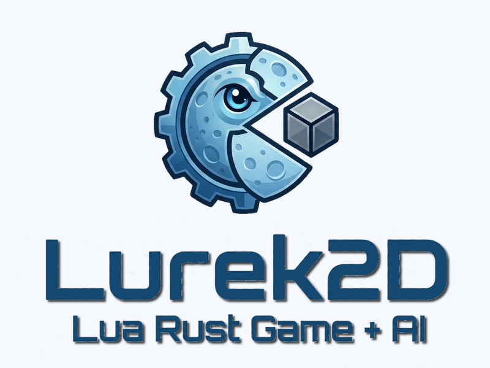

<p align="center">
  
</p>

<p align="center">
  <strong>A ~15 MB 2D game engine.</strong> Rust core · Lua scripting · wgpu GPU rendering · AI-first design.
</p>

---

One binary. One scripting language. Drop `lurek2d` next to `main.lua` — your game runs. No installer, no DLLs, no months-long learning curve.

---

## Quick Start

```bash
cargo run                                # Splash screen (no game)
cargo run -- content/demos/hello_world   # Run a demo
```

Create `main.lua` anywhere:

```lua
function lurek.init()
    lurek.render.setBackgroundColor(0.1, 0.1, 0.2)
end

function lurek.render()
    lurek.render.print("Hello, Lurek2D!", 100, 100)
end
```

```bash
cargo run -- path/to/your/game   # No project files. No config required.
```

An empty `main.lua` is valid. With no game argument, the engine shows a built-in splash screen — drag-and-drop a folder onto the window to load it.

---

## Engine Subsystems

Lurek2D ships 46 Rust modules organized in four tiers. All are MIT-licensed first-party code.

### Baseline

| Module | Description |
|---|---|
| `engine` | App lifecycle, `Config`, `SharedState`, `EngineError`, typed resource pools (`SlotMap`) |
| `math` | `Vec2` / `Mat3` / `Rect`, easing (22 functions), noise (Perlin/simplex/fBm), Bezier, triangulation |

### Tier 1 — Core Subsystems

| Module | Description |
|---|---|
| `render` | GPU rendering via wgpu (Vulkan / DX12 / Metal): sprites, batches, meshes, canvases, WGSL shaders, blend modes, stencils, transform stack |
| `audio` | Sound loading and playback (WAV / OGG / MP3 / FLAC), streaming, buses, volume / pitch / pan |
| `sound` | Audio source types and lifecycle management |
| `physics` | 2D rigid-body simulation via rapier2d: bodies, shapes, 11 joint types, raycasting, collision events |
| `input` | Keyboard, mouse, gamepad (gilrs), touch — state queries and event callbacks |
| `camera` | 2D camera with viewport, zoom, screen↔world transforms |
| `animation` | Keyframe animation, sprite-sheet playback |
| `image` | Image loading, pixel manipulation, format conversion |
| `timer` | Frame clock, delta-time, fixed-step ticker |
| `window` | Display management, DPI scaling, multi-monitor info |
| `filesystem` | Sandboxed game I/O, virtual FS, archive mounting |
| `data` | Binary buffers, compression (deflate / gzip / lz4 / zlib), hashing (MD5 / SHA-1 / SHA-256), encoding (base64 / hex) |
| `serial` | Serialization to TOML, JSON, and binary formats |
| `event` | Typed event queue and signal bus |
| `ecs` | Lightweight ECS: bitmap-tag queries, blueprint instantiation |
| `thread` | Background Rust workers, typed MPMC channels, isolated per-thread Lua VMs |
| `compute` | GPU compute shaders via wgpu |
| `automation` | Lua-scriptable task runners and build automation |
| `log` | Structured engine logging facade |

### Tier 2 — Engine Extensions

| Module | Description |
|---|---|
| `particle` | Configurable emitter system: 35+ parameters, keyframed size / color |
| `tilemap` | Tile layers, tilesets, procedural map generation, coordinate helpers |
| `scene` | Scene stack with push / pop / replace and transition hooks |
| `save` | Slot-based save / load with versioning |
| `mods` | Mod loader with sandboxed per-mod Lua VMs |
| `graph` | General graph data structures and traversal algorithms |
| `pathfind` | Navigation grids, A★, HPA★, flow fields |
| `ai` | FSMs, behaviour trees, GOAP planner, steering behaviours, influence maps, shared blackboard |
| `dataframe` | Tabular data structure, CSV I/O, column-oriented query API |
| `ui` | Immediate-mode UI widget toolkit |
| `minimap` | Minimap rendering from world state |
| `effect` | Screen-space HUD layer |
| `fx` | Pre-built visual effects (trails, screen-shake, flash) |
| `postfx` | Full-screen post-processing: bloom, blur, colour-grade, distortion, CRT |
| `light` | Dynamic 2D lighting and shadow casting |
| `pipeline` | Custom multi-pass render pipeline builder |
| `raycaster` | Raycasting-based pseudo-3D renderer |
| `spine` | Spine 2D skeletal animation runtime |
| `network` | Networking via ENet: UDP sessions, channels, packet types |
| `procgen` | Procedural content generation (dungeons, noise maps, L-systems) |
| `patterns` | Reusable game-design pattern implementations |
| `i18n` | String-table i18n with plural rules and locale detection |
| `tween` | Tween / timeline system: chained, parallel, and looping sequences |
| `terminal` | In-game developer console / REPL with widget toolkit |
| `devtools` | In-engine performance overlay and inspector |
| `debugbridge` | Remote debug bridge for external tooling |
| `docs` | In-engine interactive documentation viewer |

### Lua API

All bindings live under `lurek.*`:

```
lurek.render       lurek.audio      lurek.sound     lurek.physics    lurek.input
lurek.input.keyboard  lurek.input.mouse      lurek.input.gamepad   lurek.input.touch      lurek.camera
lurek.anim      lurek.particle   lurek.tilemap   lurek.scene      lurek.ai
lurek.path      lurek.ecs     lurek.thread    lurek.event      lurek.event
lurek.filesystem        lurek.data       lurek.serial    lurek.image        lurek.compute
lurek.math      lurek.timer       lurek.window    lurek.tween      lurek.ui
lurek.terminal  lurek.effect    lurek.light     lurek.effect     lurek.fx
lurek.minimap   lurek.network    lurek.mods   lurek.save   lurek.procgen
lurek.runtime  lurek.locale     lurek.patterns  lurek.devtools   lurek.log
```

Every callback is optional. An empty `main.lua` is a valid Lurek2D program.

```lua
-- Core callbacks (all optional)
function lurek.init()        end  -- once at startup
function lurek.ready()       end  -- after first frame is ready
function lurek.process(dt)   end  -- every frame (game logic)
function lurek.render()      end  -- every frame (draw calls)
function lurek.render_ui()   end  -- every frame (HUD layer)
-- Input, physics, window, and error callbacks also available (22 total)
```

---

## Architecture

```
Lua game scripts
        ▼
content/library/   ← Tier 3: Lunasome — pure-Lua game mechanics (no Rust internals)
        ▼
src/lua_api/       ← Bridge: registers the lurek.* namespace
        ▼
Tier 2 extensions  ← particle, tilemap, scene, ai, pathfinding, gui, …
        ▼
Tier 1 core        ← graphics, audio, physics, input, timer, filesystem, …
        ▼
Baseline           ← math (leaf, no deps) · engine (lifecycle, SharedState)
```

**Rules**: tiers only import downward. No cross-imports within the same tier. Domain modules never import `lua_api`. See [docs/architecture/engine-architecture.md](docs/architecture/engine-architecture.md) for the full spec.

**Rendering**: `RenderCommand` variants are pushed into a queue during `lurek.render()` and `lurek.render_ui()`. After the callback returns, `GpuRenderer` processes the queue in wgpu render passes — no GPU calls inside Lua closures.

**State**: Resources (textures, fonts, meshes, canvases, …) live in typed `SlotMap` pools in `SharedState`. Keys are opaque typed handles — no string lookups at runtime.

**Boot**: `conf.lua` → `Config` → winit window + wgpu device + rodio mixer → LuaJIT VM → `main.lua` → event loop.

**AI-first contributor workflow**: this repo is built by humans prompting agents. The CAG layer (`.github/`) defines the agents, skills, and prompts that drive that work — see [docs/architecture/cag-system.md](docs/architecture/cag-system.md) for the full reference.

---

## What Ships

| Component | Location | Description |
|---|---|---|
| **Engine binary** | `src/` | The `lurek2d` executable — the entire runtime |
| **Lua API reference** | `docs/lua-api.md` | Full `lurek.*` function signatures and descriptions |
| **Rust API reference** | `docs/reports/rust-api.md` | Engine internals for contributors |
| **VS Code extension** | `extensions/vscode/` | IntelliSense, MCP server, CAG tooling, debug workflows |
| **Demos** | `content/demos/` | Playable examples across 8 genres (action, arcade, RPG, strategy, …) |
| **API examples** | `content/examples/` | Single-file scripts demonstrating one `lurek.*` module each |
| **Lua libraries** | `content/library/` | Pure-Lua game-mechanics modules: inventory, quest, dialog, combat, economy, … |
| **Plugins** | `content/plugins/` | In-progress third-party plugin layer (future) |
| **CAG system** | `.github/` | 20 Copilot agents, 30 skills, and prompts for AI-assisted development |

### VS Code Extension

[`extensions/vscode/`](extensions/vscode/README.md) provides:
- IntelliSense and hover docs for all `lurek.*` functions
- One-click demo runner
- MCP server exposing engine context to Copilot
- CAG layer (agents, skills, prompts) for AI-first game development

### Lua Libraries (Lunasome)

`content/library/` ships production-ready pure-Lua modules — no Rust required:

| Library | Description |
|---|---|
| `battle` | Turn-based battle system |
| `cardgame` | Card game mechanics and deck management |
| `combat` | Real-time combat: hit detection, damage, status effects |
| `crafting` | Recipe-based crafting system |
| `dialog` | Branching dialogue trees with conditions and triggers |
| `doll` | Paper-doll character equipment and layered rendering |
| `economy` | Market simulation, shop, pricing |
| `inventory` | Inventory slots, stacks, drag-and-drop |
| `item` | Item definitions, properties, and rarity |
| `province_map` | Province-based strategy map |
| `quest` | Quest tracker with objectives, stages, and rewards |
| `stats` | Attribute and derived-stat system |

### CAG — AI-First Development

Lurek2D's `.github/` layer is a complete Copilot Agent Graph (CAG):

- **20 agents** cover every role: Manager, Developer, Renderer, Physicist, Audio-Eng, Tester, Reviewer, Doc-Writer, Security, and more
- **30+ skills** provide domain knowledge: GPU programming, Lua API design, physics, audio, threading, testing, …
- **Prompts and instructions** ensure every agent uses the engine correctly without clarifying questions

If you develop with GitHub Copilot, the CAG turns your AI assistant into a specialized Lurek2D co-developer.

---

## Tech Stack

| Component | Library | Version |
|---|---|---|
| Language | Rust stable | ≥ 1.78 |
| Scripting | LuaJIT via mlua | 0.9 |
| Rendering | wgpu | 22 |
| Windowing + input | winit | 0.30 |
| Physics | rapier2d | 0.32 |
| Audio | rodio | 0.17 |
| Font rasterization | fontdue | 0.9 |
| Gamepad | gilrs | 0.11 |
| Networking | rusty_enet | 0.4 |

---

## License

Lurek2D is **MIT-licensed**. All first-party code, docs, demos, examples, and tools are covered by the root [LICENSE](LICENSE).

| Artifact | License |
|---|---|
| Engine (`src/`) | MIT |
| Lua libraries (`content/library/`) | MIT |
| Demos and examples (`content/demos/`, `content/examples/`) | MIT |
| VS Code extension (`extensions/vscode/`) | MIT |
| Tools and docs (`tools/`, `docs/`) | MIT |

### Cargo Dependency Licenses

All direct Cargo dependencies are permissive (MIT, Apache-2.0, Zlib, or Unlicense). No GPL, LGPL, or AGPL dependency is present.

| Crate | Version | License |
|---|---:|---|
| winit | 0.30.13 | Apache-2.0 |
| bytemuck | 1.25.0 | Zlib OR Apache-2.0 OR MIT |
| pollster | 0.3.0 | Apache-2.0 OR MIT |
| mlua | 0.9.9 | MIT |
| image | 0.24.9 | MIT OR Apache-2.0 |
| ddsfile | 0.5.2 | MIT |
| rodio | 0.17.3 | MIT OR Apache-2.0 |
| fontdue | 0.9.3 | MIT OR Apache-2.0 OR Zlib |
| log | 0.4.29 | MIT OR Apache-2.0 |
| env_logger | 0.10.2 | MIT OR Apache-2.0 |
| thiserror | 1.0.69 | MIT OR Apache-2.0 |
| fastrand | 2.3.0 | Apache-2.0 OR MIT |
| rapier2d | 0.32.0 | Apache-2.0 |
| gilrs | 0.11.1 | Apache-2.0 OR MIT |
| rusty_enet | 0.4.0 | MIT |
| slotmap | 1.1.1 | Zlib |
| flate2 | 1.1.9 | MIT OR Apache-2.0 |
| lz4_flex | 0.11.6 | MIT |
| sha2 | 0.10.9 | MIT OR Apache-2.0 |
| sha1 | 0.10.6 | MIT OR Apache-2.0 |
| md-5 | 0.10.6 | MIT OR Apache-2.0 |
| base64 | 0.22.1 | MIT OR Apache-2.0 |
| hex | 0.4.3 | MIT OR Apache-2.0 |
| roxmltree | 0.20.0 | MIT OR Apache-2.0 |
| serde | 1.0.228 | MIT OR Apache-2.0 |
| serde_json | 1.0.149 | MIT OR Apache-2.0 |
| csv | 1.4.0 | Unlicense OR MIT |
| indexmap | 2.13.0 | Apache-2.0 OR MIT |
| toml | 0.8.23 | MIT OR Apache-2.0 |
| directories | 5.0.1 | MIT OR Apache-2.0 |
| sysinfo | 0.30.13 | MIT |
| sys-locale | 0.3.2 | MIT OR Apache-2.0 |
| arboard | 3.6.1 | MIT OR Apache-2.0 |
| rfd | 0.14.1 | MIT |
| zip | 2.4.2 | MIT |
| tempfile | 3.27.0 | MIT OR Apache-2.0 |
| wgpu | 22.1.0 | MIT OR Apache-2.0 |
| windows-sys | 0.59.0 | MIT OR Apache-2.0 |
| winresource | 0.1.31 | MIT |
| @modelcontextprotocol/sdk | 1.29.0 | MIT |

> **Note**: `gilrs` bundles SDL_GameControllerDB internally. The crate license is permissive; confirm notice handling for release packaging.

---

## Project Identity

Lurek2D's visual identity tells a story:

- **🌙 Moon** — Lua means "moon" in Portuguese. The crescent represents the scripting layer.
- **⚙️ Gear** — The Rust engine core. Industrial-strength, memory-safe.
- **🟡 Pacman shape** — The gear eats game scripts and runs them.
- **🧊 Cube** — The industry giants orbit Lurek2D, not the reverse.

---

[Contributing](CONTRIBUTING.md) · [Security](SECURITY.md) · [License](LICENSE)

