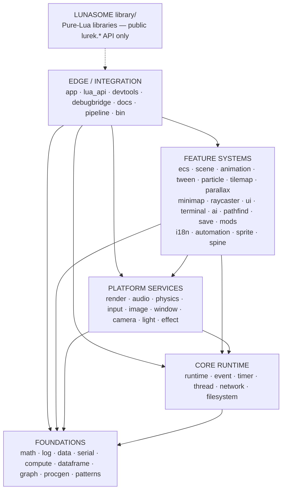
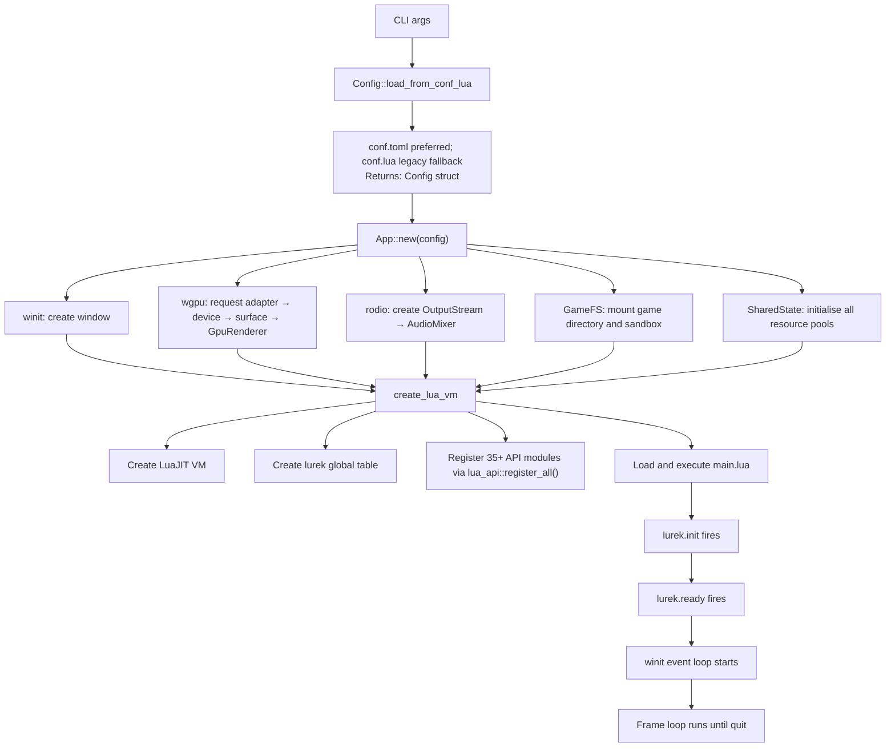
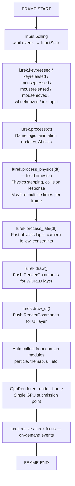
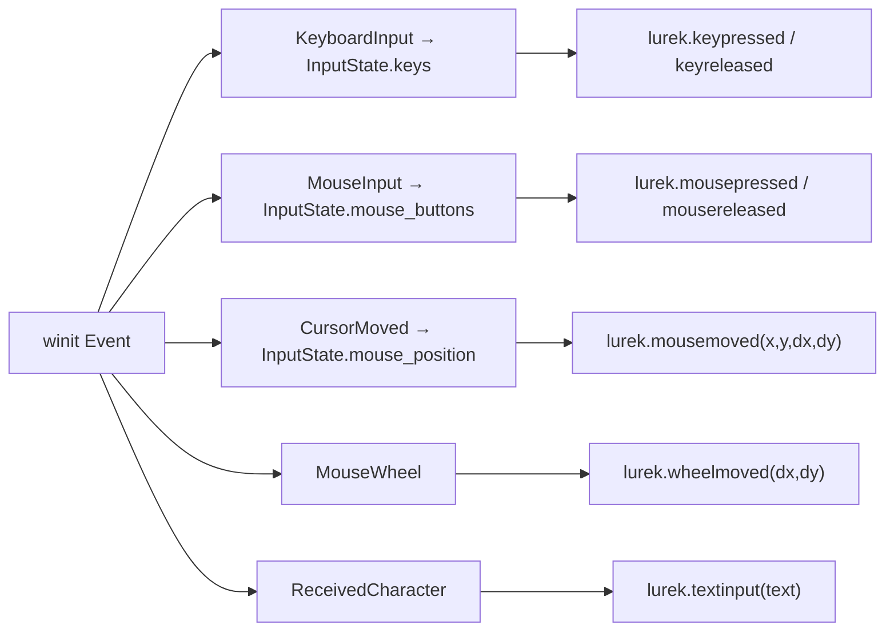
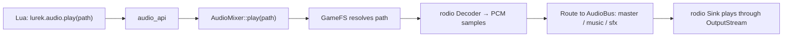
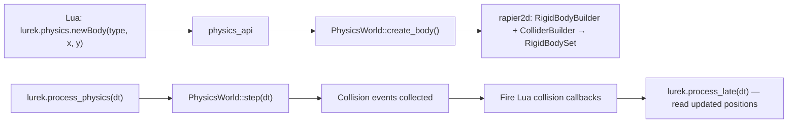
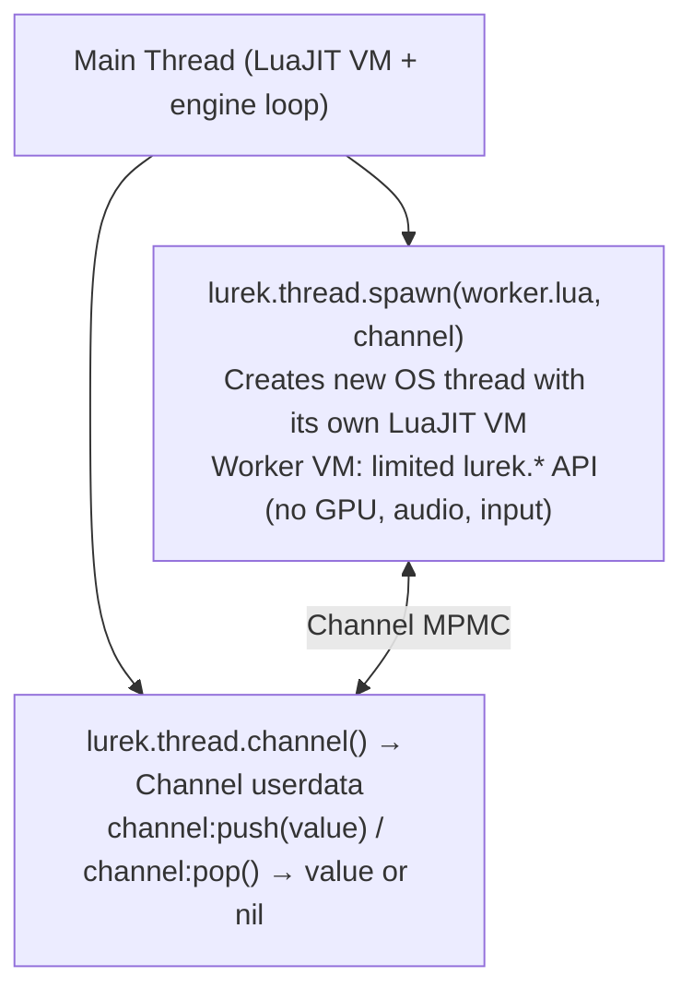

# Lurek2D — Engine Architecture

Source of truth for runtime module structure, boot sequence, frame model, state management, and subsystem pipelines.

Companion documents: [philosophy.md](philosophy.md) · [render-command-architecture.md](render-command-architecture.md) · [test-framework.md](test-framework.md)

`philosophy.md` defines *why* and *what constraints*. This document defines *how the engine is structured*. `render-command-architecture.md` defines the rendering pipeline in detail. All four documents must remain in sync.

---

## Table of Contents

1. [Overview](#overview)
2. [Module Group Model](#module-group-model)
3. [Complete Module Inventory](#complete-module-inventory)
4. [Module Internal File Structure](#module-internal-file-structure)
5. [Boot Sequence](#boot-sequence)
6. [Game Loop and Frame Model](#game-loop-and-frame-model)
7. [Callback Contract](#callback-contract)
8. [State Architecture](#state-architecture)
9. [Resource Management](#resource-management)
10. [Rendering Pipeline](#rendering-pipeline)
11. [Lua Binding Architecture](#lua-binding-architecture)
12. [Input Pipeline](#input-pipeline)
13. [Audio Pipeline](#audio-pipeline)
14. [Physics Pipeline](#physics-pipeline)
15. [Threading Model](#threading-model)
16. [Filesystem and Virtual FS](#filesystem-and-virtual-fs)
17. [Window Management](#window-management)
18. [Configuration System](#configuration-system)
19. [Error Handling](#error-handling)
20. [Quality Gates](#quality-gates)
21. [Technology Stack](#technology-stack)
22. [Repository File Structure](#repository-file-structure)

---

## Overview

Lurek2D is a 2D game engine written in Rust that loads and executes Lua game scripts. A game is a `main.lua` file. The engine owns the GPU, the physics solver, the audio mixer, and the threading model. The developer writes Lua; the engine handles everything else.

Key design principles (from [philosophy.md](philosophy.md)):

- Runtime only — no embedded visual editor (A-01)
- Desktop only — Windows / Linux / macOS (A-02)
- 2D graphics only — no 3D scene graph (A-03)
- LuaJIT scripting (B-01), wgpu 22 rendering (B-02)
- Module import graph is always a DAG — no cycles (Zen Rule 1)
- Lua bindings are thin and one-directional (Zen Rule 12)
- Every public item has a doc comment (Zen Rule 15)

---

## Module Group Model

Lurek2D organises Rust source into five responsibility groups. The binding invariant is **no cycles, ever** — the module import graph must be a DAG (T-03). Same-group imports are allowed when stable and acyclic (Zen Rule 6).



| Group | Responsibility | May Import | Must NOT Import |
|-------|---------------|------------|----------------|
| **Foundations** | Pure algorithms, data structures, math, serialisation | Nothing (leaf modules) | render, audio, input, physics, Lua, any higher group |
| **Core Runtime** | Engine lifecycle, resource registry, I/O, timing, events, concurrency | Foundations | Platform Services, Feature Systems, Edge |
| **Platform Services** | OS-facing backends behind pure-Rust contracts (GPU, audio, physics, input, windowing) | Foundations, Core Runtime | Feature Systems, Edge |
| **Feature Systems** | Game-domain services: sprites, scenes, particles, UI, AI, tilemaps | Foundations, Core Runtime, Platform Services | Edge/Integration |
| **Edge/Integration** | Composition root (`app`), scripting bridge (`lua_api`), devtools | Everything below | (top of the DAG) |
| **Lunasome** | Pure-Lua gameplay libraries | Public `lurek.*` API only | Rust engine internals |

The binding dependency constraints **T-01 through T-08** are defined in [philosophy.md § Active Module Group Constraints](philosophy.md#active-module-group-constraints). Consult `philosophy.md` directly — this document does not restate them.

---

## Complete Module Inventory

### Foundations

| Module | Responsibility | Key Types |
|--------|---------------|-----------|
| `math` | Vectors, matrices, rects, color, interpolation, easing, RNG | `Vec2`, `Vec3`, `Vec4`, `Mat3`, `Mat4`, `Rect`, `Color`, `Transform2D` |
| `log` | Logging facade, RUST_LOG filtering | Log macros re-export |
| `data` | Generic data containers, bin-packing, data views | `DataView`, `BinPack` |
| `serial` | Serialisation: TOML, JSON, CSV | `toml::from_str`, `json::parse` |
| `compute` | GPU-free numerical computation | Compute pipelines |
| `dataframe` | Tabular data, SQL-like queries, column operations | `DataFrame`, `Column` |
| `graph` | Graph data structures, traversal algorithms | `Graph`, `Node`, `Edge` |
| `procgen` | Procedural generation: noise, Voronoi, L-systems | `Noise`, `Voronoi` |
| `patterns` | Design patterns: state machines, observer, command | `StateMachine`, `Observer` |

### Core Runtime

| Module | Responsibility | Key Types |
|--------|---------------|-----------|
| `runtime` | Engine lifecycle, shared state, config, resource keys, error types | `SharedState`, `Config`, `EngineError` |
| `event` | Event bus, typed event dispatch | `EventBus`, `EventId` |
| `timer` | Frame timing, delta time, fixed timestep, timers | `Timer`, `TimerHandle` |
| `thread` | Thread pool, worker VMs, Channel for inter-VM comms | `ThreadPool`, `Channel` |
| `network` | HTTP client, WebSocket, networking utilities | `HttpRequest`, `HttpResponse` |
| `filesystem` | GameFS sandbox, virtual filesystem, path traversal guards | `GameFS`, `VirtualPath` |

### Platform Services

| Module | Responsibility | Key Types |
|--------|---------------|-----------|
| `render` | GPU rendering: wgpu pipelines, render passes, RenderCommand contract | `GpuRenderer`, `RenderCommand`, `DrawMode`, `BlendMode`, `Mesh`, `Font`, `Canvas`, `Shader` |
| `audio` | Audio playback: rodio integration, mixer, sources | `AudioMixer`, `AudioSource`, `AudioBus` |
| `physics` | Physics simulation: rapier2d, rigid bodies, colliders, raycasts | `PhysicsWorld`, `RigidBody`, `Collider` |
| `input` | Keyboard, mouse, gamepad input state and events | `InputState`, `Key`, `MouseButton` |
| `image` | CPU image loading/decoding, pixel operations, texture data, atlas packing | `ImageData`, `Texture`, `TextureAtlas` |
| `window` | Window management: winit integration, fullscreen, cursor | `WindowConfig`, `WindowHandle` |
| `camera` | Viewport transforms, scale modes, coordinate mapping | `Camera2D`, `ScaleMode` |
| `light` | 2D lighting data: light descriptors, occluder polygons | `Light2D`, `Occluder`, `ShadowFilter` |
| `effect` | Post-processing effect descriptors, overlay systems | `PostFxEffect`, `PostFxEffectType`, `ShaderPassDescriptor` |

### Feature Systems

| Module | Responsibility | Key Types |
|--------|---------------|-----------|
| `ecs` | Entity-component-system: entities with components, queries | `Entity`, `Component`, `System` |
| `scene` | Scene stack: push/pop/switch scene management | `Scene`, `SceneManager`, `Transition` |
| `animation` | Sprite animation: frame sequences, playback control | `Animation`, `AnimationPlayer` |
| `tween` | Value interpolation: tweens, easing, sequencing | `Tween`, `Easing`, `TweenSequence` |
| `particle` | Particle systems: emitters, instances, render command generation | `ParticleSystem`, `ParticleInstance`, `ParticleShape` |
| `tilemap` | Tile-based maps: tile layers, tile sets, collision | `TileMap`, `TileLayer`, `TileSet` |
| `parallax` | Parallax scrolling: multi-layer backgrounds | `ParallaxLayer` |
| `minimap` | Minimap rendering: terrain, fog-of-war, markers | `Minimap`, `MinimapObject` |
| `raycaster` | 2.5D raycasting: DDA traversal, textured-quad scene generation | `Raycaster2D`, `RayHit`, `RaycasterScene`, `WallQuad`, `FloorQuad`, `CeilingQuad`, `BillboardSprite` |
| `ui` | GUI widgets: buttons, panels, text, layout | `Widget`, `GuiContext`, `WidgetBase` |
| `terminal` | In-game terminal: command history, text rendering | `Terminal`, `TerminalState` |
| `ai` | Game AI: FSM, behaviour trees, steering, blackboard | `FSM`, `BehaviourTree`, `Blackboard` |
| `pathfind` | Pathfinding: A\*, graph search, HPA | `AStar`, `PathResult` |
| `save` | Save/load game state: serialisation, slots | `SaveManager`, `SaveSlot` |
| `mods` | Mod loading: mod manifests, sandboxed execution | `ModManager`, `Mod` |
| `i18n` | Internationalisation: string tables, locale switching | `I18n`, `Locale` |
| `automation` | Test automation: simulated input, scripted sequences | `Simulator`, `AutoAction` |
| `sprite` | CPU sprite data: sprite sheets, batches, nine-slice (planned) | `Sprite`, `SpriteSheet`, `SpriteBatch`, `NineSlice` |
| `spine` | Spine animation runtime integration | `SpineInstance` |

### Edge / Integration

| Module | Responsibility | Key Types |
|--------|---------------|-----------|
| `app` | Composition root: boot, winit event loop, frame orchestration | `App`, `AppBuilder` |
| `lua_api` | Scripting bridge: registers all `lurek.*` Lua APIs | `register()` per sub-module |
| `devtools` | Developer overlay: FPS counter, debug draw, inspector | `DevTools` |
| `debugbridge` | Remote debug server: TCP/WebSocket debug protocol | `DebugBridge`, `DebugServer` |
| `docs` | Documentation generation support | `DocEntry`, `DocReport` |
| `pipeline` | Asset pipeline utilities | Pipeline stages |
| `bin` | Binary entry points, CLI arg parsing | `main()` |

### Lunasome (library/)

Pure-Lua gameplay libraries, each consuming only public `lurek.*` APIs:

`battle` · `cardgame` · `combat` · `crafting` · `dialog` · `doll` · `economy` · `inventory` · `item` · `province_map` · `quest` · `stats`

---

## Module Internal File Structure

Every `src/<module>/` directory follows a standard internal structure. This is a binding requirement, not a suggestion. It flows from Philosophy Rules 7, 12, 13, and 15.

### Required Files

| File | Purpose | Rule |
|------|---------|------|
| `mod.rs` | Module declaration + re-exports | Thin only: `pub mod`, `pub use`, `//!` doc comment. No functions, no struct definitions, no logic. Target: ≤ 30 lines. |

### Standard Optional Files

Use these names when needed. Do not invent alternatives (`helpers.rs`, `utils.rs`, `misc.rs` are banned).

| File | Purpose | When to Use |
|------|---------|-------------|
| `<primary>.rs` | Main logic — algorithms, state, methods | Always, unless `mod.rs` alone is sufficient. Named after the module's primary concept (e.g. `emitter.rs`, `dda.rs`). |
| `types.rs` | Public data types (structs, enums, traits) | When the module exports 5+ public types. |
| `draw.rs` | `draw_to_image()` debug/test CPU pixel utilities | Only for modules that need CPU-side pixel rendering for testing or evidence. Not the production render path. |
| `builder.rs` | Builder pattern for complex construction | When a primary type has 5+ fields with defaults. |

### Key Rules

1. `mod.rs` is a switchboard, not a workshop — only `pub mod`, `pub use`, `//!` doc.
2. No `impl LuaUserData` in domain modules — all Lua bindings live in `src/lua_api/`.
3. No `use wgpu::*` in domain modules — only `src/render/gpu_renderer.rs` and `src/render/shader.rs` touch wgpu.
4. Every `pub` item has a `///` doc comment (constraint Q-05).
5. Private helpers tested inline in the source file where the helper is defined.
6. Integration and contract tests live in `tests/`.

### Anti-Patterns

| Problem | Fix |
|---------|-----|
| Fat `mod.rs` (functions, structs, > 30 lines) | Move to `<primary>.rs`, keep `mod.rs` as re-export |
| Business logic in `lua_api` (> 10 lines per method) | Extract to domain module, call from `lua_api` |
| `impl LuaUserData` in `src/<module>/` | Move to `src/lua_api/<module>_api.rs` |
| Missing docstrings | Add `///` — violation of Q-05 |
| `use wgpu::*` in non-render module | Domain modules are GPU-free (Zen Rules 3, 9) |
| Invented file names (`helpers.rs`, `utils.rs`) | Use standard names: `types.rs`, `draw.rs`, `builder.rs` |

---

## Boot Sequence



**Boot invariants:**
- No GPU draw calls before `GpuRenderer` is fully initialised
- No Lua execution before all `lurek.*` modules are registered
- `conf.toml` is read first; if absent, `conf.lua` runs in a temporary sandboxed Lua VM
- If neither config file is present, defaults apply (800×600 window, all modules enabled)
- If no game directory is provided, the engine shows the splash screen

---

## Game Loop and Frame Model

Every frame follows a fixed callback sequence. All callbacks are optional — an empty `main.lua` is a valid game.



**Timing:** `dt` is wall-clock delta time in seconds (f64). `process_physics` uses fixed timestep accumulation and may fire 0, 1, or multiple times per frame. Frame limiting is handled by wgpu present mode (VSync) or manual cap.

---

## Callback Contract

Every callback is optional. The engine checks whether the Lua global function exists before calling it.

| Callback | Signature | When Called | Purpose |
|----------|-----------|-------------|---------|
| `lurek.init` | `(config)` | Once, after VM creation | Game initialisation: load assets, set up state |
| `lurek.ready` | `()` | Once, after init | First-frame resources are ready |
| `lurek.process` | `(dt)` | Every frame | Game logic, animation, AI |
| `lurek.process_physics` | `(dt)` | Fixed timestep (0..N per frame) | Physics stepping, collision response |
| `lurek.process_late` | `(dt)` | Every frame, after physics | Camera follow, constraint resolution |
| `lurek.draw` | `()` | Every frame | Push RenderCommands for world layer |
| `lurek.draw_ui` | `()` | Every frame | Push RenderCommands for UI layer |
| `lurek.keypressed` | `(key, scancode, isrepeat)` | On key down | Keyboard input |
| `lurek.keyreleased` | `(key, scancode)` | On key up | Keyboard release |
| `lurek.mousepressed` | `(x, y, button)` | On mouse button down | Mouse click |
| `lurek.mousereleased` | `(x, y, button)` | On mouse button up | Mouse release |
| `lurek.mousemoved` | `(x, y, dx, dy)` | On mouse movement | Mouse tracking |
| `lurek.wheelmoved` | `(dx, dy)` | On scroll wheel | Scroll input |
| `lurek.textinput` | `(text)` | On text entry | Text input (IME-aware) |
| `lurek.resize` | `(w, h)` | On window resize | Layout recalculation |
| `lurek.focus` | `(focused)` | On focus change | Pause/resume |
| `lurek.quit` | `() → bool` | On close request | Return `true` to cancel quit |

Callback ordering within a frame: input callbacks → `process(dt)` → `process_physics(dt)` → `process_late(dt)` → `draw()` → `draw_ui()`. Resize and focus callbacks fire between frames when the relevant winit event occurs.

---

## State Architecture

All engine state is centralised in a single `SharedState` struct, shared between Lua closures and the engine loop.

**Design rules (from Zen Rule 10):**
- Serialisable game state must not require a GPU handle, OS window, or VM reference. State types belong in domain modules; runtime resources belong in `SharedState` resource pools.
- No GPU handles in `SharedState` fields. The renderer accesses GPU resources through its own internal state. `SharedState` holds CPU-side descriptors and resource keys (handles into the renderer's pools).

**SharedState contains:**
- Configuration: `config: Config`
- Resource pools: typed SlotMaps for textures, fonts, meshes, canvases, shaders, sprite batches, particles
- Subsystem state: `input`, `audio_mixer`, `physics`, `timer_state`, `scene_stack`
- Rendering data (CPU side): `camera`, `lights`, `occluders`, `postfx_stack`
- Game filesystem: `game_fs: GameFS`

**Borrow rules:** Never hold a borrow across a Lua callback invocation — this will panic due to re-entrant borrowing.

---

## Resource Management

All engine resources (textures, fonts, meshes, canvases, shaders, sprite batches, particle systems) are stored in typed SlotMap pools inside `SharedState`.

| Key Type | Resource | Stored In |
|----------|---------|-----------|
| `TextureKey` | GPU texture handle + CPU metadata | `SharedState::textures` |
| `FontKey` | Font atlas + glyph metrics | `SharedState::fonts` |
| `MeshKey` | Vertex + index buffers | `SharedState::meshes` |
| `CanvasKey` | Off-screen render target | `SharedState::canvases` |
| `ShaderKey` | Custom WGSL shader | `SharedState::shaders` |
| `SpriteBatchKey` | Batched sprite collection | `SharedState::sprite_batches` |
| `ParticleKey` | Particle emitter system | `SharedState::particles` |

**Resource lifecycle:** Create → Lua loads via API → stored in SlotMap → key returned to Lua. Use → key passed to draw functions → `RenderCommand` stores key → renderer resolves at draw time. Destroy → Lua drops key → SlotMap slot freed, GPU resource released next frame.

**Stale key safety:** SlotMap keys include a generation counter. If a key is used after its resource was freed, the SlotMap returns `None` rather than a dangling reference. The engine logs a warning and skips the draw call.

---

## Rendering Pipeline

The rendering pipeline is defined in full detail in [render-command-architecture.md](render-command-architecture.md).

**Summary — Three-Layer Model:**

1. **Layer 1 — CPU Domain Modules**: Prepare data and push `RenderCommand` variants into a queue. No GPU calls.
2. **Layer 2 — App Coordinator** (`src/app/`): Orchestrates the frame — polls input, runs callbacks, collects commands, passes everything to the renderer.
3. **Layer 3 — GPU Renderer** (`src/render/gpu_renderer.rs`): The only code that issues wgpu draw calls. Receives `Vec<RenderCommand>` plus structured data (lights, post-FX) and produces the frame.

Key facts:
- `RenderCommand` is a flat enum with 46+ variants (draw primitives, transform stack, batching, stencil, post-FX, etc.)
- GPU code is confined to `src/render/gpu_renderer.rs` and `src/render/shader.rs` — no other module imports wgpu
- Light data (`Light2D`, `Occluder`) and post-FX data (`PostFxEffect`) flow as structured data alongside the command list — they are not `RenderCommand` variants
- `camera/`, `effect/`, `light/` are top-level CPU domain modules, not subdirectories of `src/render/`

---

## Lua Binding Architecture

**Design rules (from Zen Rule 12, constraints C-01 through C-06):**

- All bindings under `lurek.*` — no bare globals (C-01)
- One register function per module with a standard signature (C-02)
- Sensible defaults — never require params a beginner always passes the same value (C-03)
- All callbacks optional — empty `main.lua` is valid (C-04)
- Synchronous from Lua's perspective — async work in Rust threads via `Channel` (C-05)
- Callback names must not shadow API module keys (C-06)

**File organisation:**

| Location | Contains | Must NOT Contain |
|----------|---------|-----------------|
| `src/<module>/` | Pure Rust: algorithms, data types, state | mlua imports, `impl LuaUserData`, Lua types |
| `src/lua_api/<module>_api.rs` | `pub fn register()`, Lua wrapper structs, `impl LuaUserData` | Business logic (> 10 lines), algorithms |

**Thin wrapper rule:** If a closure body exceeds ~10 lines, the logic belongs in the domain module. Extract a `pub fn` on the domain type and call it.

**Registration flow:** On boot, `lua_api::register_all()` calls each sub-module's `register()` function in sequence, installing all `lurek.*` namespaces into the global Lua table. 35+ modules are registered before `main.lua` is executed.

**Lua API docstring format:** Lua API files use inline `@param` / `@return` annotations in standard Rust `///` comments. See `src/lua_api/timer_api.rs` as the gold standard.

---

## Input Pipeline

Input events arrive from winit and are routed through `InputState`. The `InputState` stores current-frame and previous-frame state for every key and mouse button — enabling `isDown()`, `isPressed()` (just pressed this frame), and `isReleased()` queries from Lua. Gamepad input uses the same pattern: poll → update state → fire callbacks.



---

## Audio Pipeline

Audio is loaded from the game filesystem, decoded by rodio, and routed through a named bus system.



**Key concepts:**
- **AudioBus**: Named output channel (master, music, sfx, voice). Each has independent volume. Master bus applies final gain.
- **Static source**: Fully decoded in memory — for short SFX.
- **Streaming source**: Decoded on-the-fly — for music and ambient audio.
- Volume, pitch, and pan are per-source controls, composited with bus volume.

---

## Physics Pipeline

Physics runs through rapier2d at a fixed timestep with collision events surfaced back to Lua.



**Key concepts:**
- Body types: Static (immovable), Dynamic (simulated), Kinematic (script-controlled)
- Collider shapes: Circle, Rectangle, Polygon, Capsule, Segment
- Joints: RevoluteJoint, PrismaticJoint, FixedJoint, SpringJoint
- Raycasting: `lurek.physics.raycast(x1, y1, x2, y2)` returns hit results
- Collision events: `lurek.physics.onCollision(callback)` fires on begin/end

---

## Threading Model



**Rules (from B-04):**
- LuaJIT VMs are single-threaded — never share VM state across threads
- Worker VMs get their own fresh `Lua::new()` with limited API surface
- `Channel` is the only communication mechanism between VMs
- Values sent through Channel must be Lua-serialisable (no userdata, no functions)
- Main thread polls channels during `process(dt)` — no blocking

---

## Filesystem and Virtual FS

All file operations go through `GameFS`, never raw filesystem access.

**Mount structure:**
- `/game/` — game directory (where `main.lua` lives)
- `/engine/` — engine embedded assets (splash, fonts)
- `/save/` — per-game save directory
- `/temp/` — temporary files (cleared on exit)

**Security (path traversal guards):**
- All paths are normalised and validated — `../` traversal is rejected
- Writes are restricted to `/save/` and `/temp/` — game code cannot write to `/game/` or `/engine/`
- Symlinks are not followed outside the sandbox

---

## Window Management

Window is created from the `conf.toml` / `conf.lua` window settings at boot. The title, size, resizable flag, fullscreen mode, and icon are all set at creation time. Runtime changes are possible through `lurek.window.*` API.

**Scale modes (Camera):**

| Mode | Behaviour |
|------|-----------|
| `stretch` | Fill window, ignore aspect ratio |
| `letterbox` | Fit to window, black bars to preserve aspect ratio |
| `pixel_perfect` | Integer scaling only, centred |
| `expand` | Design resolution fills, extra space visible |

Scale mode is set via `conf.toml` or `lurek.camera.setScaleMode()`.

---

## Configuration System

**conf.toml** (preferred) or **conf.lua** (legacy) is read at engine startup. It drives window setup, module enablement, render settings, and physics parameters. If neither is found, defaults apply: 800×600 window, all modules enabled, 60 FPS target.

Configuration fields:
- `window` — title, width, height, fullscreen, vsync, resizable, min_size
- `modules` — boolean flags for optional subsystems (physics, audio, network, etc.)
- `render` — MSAA samples, max texture size, target FPS
- `physics` — gravity, fixed timestep, iterations

**Format rule (B-05):** TOML for human-authored config and project manifests. JSON for external interop. No YAML.

---

## Error Handling

**Error types** defined in `src/runtime/`:
- `Lua(mlua::Error)` — Lua runtime error
- `Render(wgpu::Error)` — GPU/wgpu error
- `Audio(rodio::Error)` — audio playback error
- `Physics(String)` — physics engine error
- `Io(std::io::Error)` — file I/O error
- `Config(String)` — configuration error
- `Asset(String)` — asset loading error

**Error flow:**
1. Domain modules return `Result<T, EngineError>` or domain-specific errors
2. `lua_api` converts to `LuaError` at the boundary
3. Lua scripts receive error as a Lua error (pcall-catchable)
4. Uncaught Lua errors are logged and the frame continues — the engine does not crash on a single Lua error

**Rules:** Never `panic!` in engine code — convert to `Result` or log + skip. Never `unwrap()` on fallible operations. Every `unsafe` block requires a `// SAFETY:` comment. Error messages must include the failing path, key, or value.

---

## Quality Gates

Binding constraints from [philosophy.md](philosophy.md) § Quality Gate Constraints:

| ID | Gate | Command |
|----|------|---------|
| **Q-01** | All tests pass | `cargo test` |
| **Q-02** | No clippy warnings | `cargo clippy -- -D warnings` |
| **Q-03** | New public Rust API → integration test | Manual review |
| **Q-04** | New `lurek.*` function → Lua BDD test | Manual review |
| **Q-05** | No undocumented public items | `python tools/docs/collect_docs.py --report-missing` |

Both `cargo test` and `cargo clippy -- -D warnings` must pass before every merge.

---

## Technology Stack

| Component | Crate | Version | Purpose |
|-----------|-------|---------|---------|
| Language | Rust | stable ≥ 1.78 | Engine implementation |
| Scripting | mlua | 0.9 | LuaJIT binding (primary), Lua 5.4 fallback |
| Rendering | wgpu | 22 | GPU abstraction (Vulkan / DX12 / Metal) |
| Windowing | winit | 0.30 | Window creation and event loop |
| Physics | rapier2d | 0.32 | 2D rigid body simulation |
| Audio | rodio | 0.17 | Audio playback and mixing |
| Font rendering | fontdue | 0.9 | Font rasterisation |
| Image loading | image | latest | PNG / JPEG / GIF decode |

**Cargo feature flags:**

| Flag | Effect |
|------|--------|
| `lua-jit` (default) | Link LuaJIT via mlua — primary runtime |
| `lua54` | Link Lua 5.4 via mlua — non-shipping CI fallback |

---

## Repository File Structure

```
lurek2d/
├── src/                    Rust source — all five module groups
│   ├── lib.rs              Crate root
│   ├── main.rs             Binary entry point
│   ├── <module>/           One directory per module
│   └── lua_api/            Scripting bridge (one <module>_api.rs per module)
├── content/
│   ├── examples/           Single-file API usage scripts (documentation only)
│   ├── games/              Playable game demos (must all pass CI)
│   ├── layouts/            TOML UI layout files
│   └── plugins/            Plugin examples
├── tests/
│   ├── rust/               Rust tests (unit, stress, golden, config, security, ext)
│   └── lua/                Lua BDD tests (unit, integration, content, stress, security)
├── docs/
│   ├── architecture/       Architecture documentation
│   ├── specs/              One <module>.md per src/<module>/
│   ├── api/                Generated API references (never edit by hand)
│   └── CHANGELOG.md        Version history
├── library/                Lunasome — pure-Lua standard libraries
├── tools/                  CLI scripts (docs, audit, fix, validate, dist)
├── assets/                 Engine assets (splash, icon, fonts)
├── extensions/vscode/      VS Code extension (MCP, IntelliSense, webview)
├── .github/                CAG layer (agents, skills, prompts, system prompt)
├── work/                   Session folders (current + archive)
├── Cargo.toml              Crate manifest
└── build.rs                Build script (asset watching)
```
