# Block Simulator — Before/After Analytics

> **Design document for the Phase 4 analytics layer that consumes monitoring data, computes
> KPIs, and produces before/after comparison reports for simulation scenarios.**
> Analytics are declarable in playbook YAML alongside nodes, edges, anomalies, and monitors.
> For core mechanics see `docs/BLOCK-DESIGN.md`. For anomaly mechanics see `docs/ANOMALY-MECHANICS.md`.
> For monitoring mechanics see `docs/MONITORING-MECHANICS.md`. For engine source see `src/engine.py`.

---

## 1. Philosophy

### 1.1 Why before/after analytics?

The simulator tells you **how a process works** (Phase 1). Anomalies tell you **what breaks
it** (Phase 2). Monitors tell you **what's happening right now** (Phase 3). But no phase
answers the question operators actually care about: **how much worse did things get, and why?**

Before/after analytics answers that question quantitatively. Run a baseline simulation
without anomalies. Run the same simulation with anomalies active. Compare the two using
defined KPIs. The result is a structured report showing exactly which metrics degraded,
by how much, and which blocks were most affected.

This is the analytical surface operators, managers, and engineers use to make decisions:
which anomalies matter most, where to invest in resilience, and whether a proposed change
actually improves the system.

### 1.2 Design principles

**Monitoring data is the only input.** Analytics never reads raw event JSONL directly. It
consumes the structured `_monitors.jsonl` files produced by Phase 3 monitors. If a metric
isn't monitored, it can't be analyzed. This forces operators to think about what they want
to measure before they run simulations.

**Declarative, not procedural.** Analytics are declared in playbook YAML — KPIs, comparison
rules, and report formats. The analytics engine reads these declarations and produces
outputs automatically. No ad-hoc scripts required for standard analyses.

**Paired runs.** Every comparison requires exactly two runs: a **baseline** (no anomalies)
and a **comparison** (anomalies active). Same graph, same monitors, same tick count. The
analytics engine refuses to compare runs with different graph topologies or monitor
configurations.

**Statistical rigor.** Raw differences are not enough. The analytics engine computes
confidence intervals, effect sizes, and significance indicators. A 2% throughput drop in a
turbulent simulation is noise; a 40% drop is a finding. The analytics engine tells you which.

**Composable KPIs.** Simple KPIs (throughput, latency) combine into composite KPIs
(resilience score, flow efficiency). Operators can define custom KPIs from monitor data
using formulas in YAML.

### 1.3 Where analytics fits in the pipeline

Analytics is a **post-simulation** process. It runs after both baseline and comparison
simulations are complete, reading their monitor log files:

```
Phase 1: Engine          Phase 2: Anomalies       Phase 3: Monitors        Phase 4: Analytics
─────────────────        ────────────────────      ─────────────────        ──────────────────
Playbook YAML       →    Anomaly injection    →    Monitor sampling    →    KPI computation
  ↓                        ↓                        ↓                        ↓
tick loop                pre/post-tick hooks      end-of-tick pass         post-simulation
  ↓                        ↓                        ↓                        ↓
event JSONL              ANOMALY_* events         _monitors.jsonl          _analytics.json
```

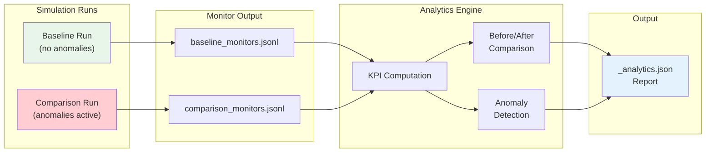

### 1.4 The analytics engine loop

```
analytics_engine.run(baseline_log, comparison_log, analytics_config):
  1. load baseline monitor samples
  2. load comparison monitor samples
  3. validate pairing (same graph, same monitors, same tick count)
  4. for each KPI definition:
       a. compute KPI from baseline samples
       b. compute KPI from comparison samples
       c. compute delta, percent change, significance
  5. run anomaly detection rules on comparison samples
  6. generate report (JSON + optional dashboard data)
  7. write _analytics.json
```

---

## 2. Analytics Playbook Schema

### 2.1 Top-level structure

Analytics are declared in a top-level `analytics` key alongside `nodes`, `edges`,
`anomalies`, and `monitors`:

```yaml
simulation:
  ticks: 500
  context:
    scenario: "resilience_test"

nodes:
  # ... block definitions ...

edges:
  # ... edge definitions ...

anomalies:
  # ... anomaly definitions (s14.x) ...

monitors:
  # ... monitor definitions (s15.x) ...

analytics:
  baseline:
    run_id: baseline_001
    anomalies_enabled: false

  comparison:
    run_id: comparison_001
    anomalies_enabled: true

  kpis:
    - id: kpi_throughput
      type: throughput_rate
      source_monitor: watch_throughput
      config:
        window: 50

    - id: kpi_latency
      type: average_latency
      source_monitor: watch_latency

    - id: kpi_cost
      type: cost_per_item
      source_monitors:
        - watch_cost
        - watch_throughput

  comparisons:
    - kpi: kpi_throughput
      method: percent_change
      significance_threshold: 5.0

    - kpi: kpi_latency
      method: percent_change
      significance_threshold: 10.0

  detection:
    - rule: threshold
      monitor: watch_assembly_queue
      condition: "> 12"
      label: "queue_overflow_detected"

    - rule: trend
      monitor: watch_throughput
      condition: "declining 10"
      label: "throughput_decay"

  report:
    format: json
    include:
      - summary
      - block_breakdown
      - comparison_table
      - timeline
      - anomaly_detection
    output_path: "logs/"
```

### 2.2 Field definitions — `analytics.baseline` and `analytics.comparison`

| Field | Type | Required | Default | Description |
|---|---|---|---|---|
| `run_id` | string | yes | — | Identifier for the run, used to name log files |
| `anomalies_enabled` | bool | yes | — | Whether anomalies from the `anomalies` key are active |
| `overrides` | dict | no | `{}` | Per-run parameter overrides (tick count, context) |

### 2.3 Field definitions — `analytics.kpis`

| Field | Type | Required | Default | Description |
|---|---|---|---|---|
| `id` | string | yes | — | Unique KPI identifier for report correlation |
| `type` | string | yes | — | KPI type matching one of the 18 defined KPIs (s16.x) |
| `source_monitor` | string | conditional | — | Monitor ID providing input data (single source) |
| `source_monitors` | list | conditional | — | Multiple monitor IDs for composite KPIs |
| `target` | string | no | — | Block ID for block-level KPIs (overrides monitor target) |
| `config` | dict | no | `{}` | Type-specific parameters (window size, percentile, etc.) |

### 2.4 Field definitions — `analytics.comparisons`

| Field | Type | Required | Default | Description |
|---|---|---|---|---|
| `kpi` | string | yes | — | KPI ID to compare between baseline and comparison |
| `method` | string | no | `percent_change` | Comparison method (see §4) |
| `significance_threshold` | float | no | `5.0` | Minimum percent change to flag as significant |
| `direction` | string | no | `any` | `increase`, `decrease`, or `any` |

### 2.5 Field definitions — `analytics.detection`

| Field | Type | Required | Default | Description |
|---|---|---|---|---|
| `rule` | string | yes | — | Detection rule type: `threshold`, `trend`, `correlation` |
| `monitor` | string | yes | — | Monitor ID to analyze |
| `condition` | string | yes | — | Rule-specific condition expression |
| `label` | string | yes | — | Human-readable label for detected anomalies |
| `config` | dict | no | `{}` | Rule-specific parameters |

### 2.6 Field definitions — `analytics.report`

| Field | Type | Required | Default | Description |
|---|---|---|---|---|
| `format` | string | no | `json` | Output format: `json` |
| `include` | list | no | all sections | Report sections to include |
| `output_path` | string | no | `logs/` | Directory for report output |
| `filename` | string | no | auto-generated | Custom report filename |

### 2.7 Minimal analytics example

The simplest useful analytics configuration — one KPI, one comparison:

```yaml
analytics:
  baseline:
    run_id: base
    anomalies_enabled: false
  comparison:
    run_id: test
    anomalies_enabled: true
  kpis:
    - id: kpi_throughput
      type: throughput_rate
      source_monitor: watch_throughput
  comparisons:
    - kpi: kpi_throughput
      method: percent_change
  report:
    format: json
```

---

## 3. KPI Summary Table

| ID | Name | Category | Source Monitor(s) | One-liner |
|---|---|---|---|---|
| s16.1 | Throughput Rate | Throughput | throughput_monitor | Items processed per tick or window |
| s16.2 | Average Latency | Latency | latency_monitor | Mean time from item creation to sink arrival |
| s16.3 | P95 Latency | Latency | latency_monitor | 95th percentile processing latency |
| s16.4 | Queue Time Ratio | Latency | queue_depth_monitor, latency_monitor | Fraction of total time spent waiting in queues |
| s16.5 | Cost Per Item | Cost | cost_monitor, throughput_monitor | Total accumulated cost divided by items produced |
| s16.6 | Revenue Per Tick | Cost | revenue_monitor | Total value output divided by elapsed ticks |
| s16.7 | Error Rate | Quality | error_rate_monitor | Failed items as a fraction of total items |
| s16.8 | DLQ Rate | Quality | dlq_monitor | Items routed to dead letter queue as a fraction of total |
| s16.9 | Block Utilization | Utilization | state_monitor | Fraction of ticks a block spends in PROCESSING state |
| s16.10 | Resource Utilization | Utilization | resource_pool_monitor | Resource units used divided by total capacity |
| s16.11 | Anomaly Impact Score | Reliability | any KPI | Relative change in a KPI between baseline and comparison |
| s16.12 | Recovery Time | Reliability | any time-series monitor | Ticks from anomaly onset to KPI returning to baseline |
| s16.13 | Cascade Depth | Reliability | anomaly_monitor, state_monitor | Number of blocks affected by a single anomaly event |
| s16.14 | System Resilience Score | Reliability | composite | Weighted composite of impact, recovery, and cascade KPIs |
| s16.15 | Flow Efficiency | Throughput | throughput_monitor (multi-block) | Ratio of items out to items in across a block chain |
| s16.16 | Cost of Quality | Cost | cost_monitor, error_rate_monitor | Rework cost plus reject cost as fraction of total cost |
| s16.17 | Bottleneck Score | Throughput | bottleneck_monitor | Queue growth rate of a block relative to its peers |
| s16.18 | Signal Propagation Delay | Latency | signal_monitor | Ticks between signal emission and downstream effect |

---

## 4. Before/After Comparison Engine

### 4.1 Pairing rules

The analytics engine enforces strict pairing between baseline and comparison runs:

| Rule | Validation |
|---|---|
| Same graph topology | Node IDs and edge connections must match |
| Same monitor configuration | Monitor IDs and types must match |
| Same tick count | Both runs must execute the same number of ticks |
| Different anomaly state | Baseline has `anomalies_enabled: false` |

If validation fails, the analytics engine emits an error and refuses to compare. This
prevents meaningless comparisons between structurally different simulations.

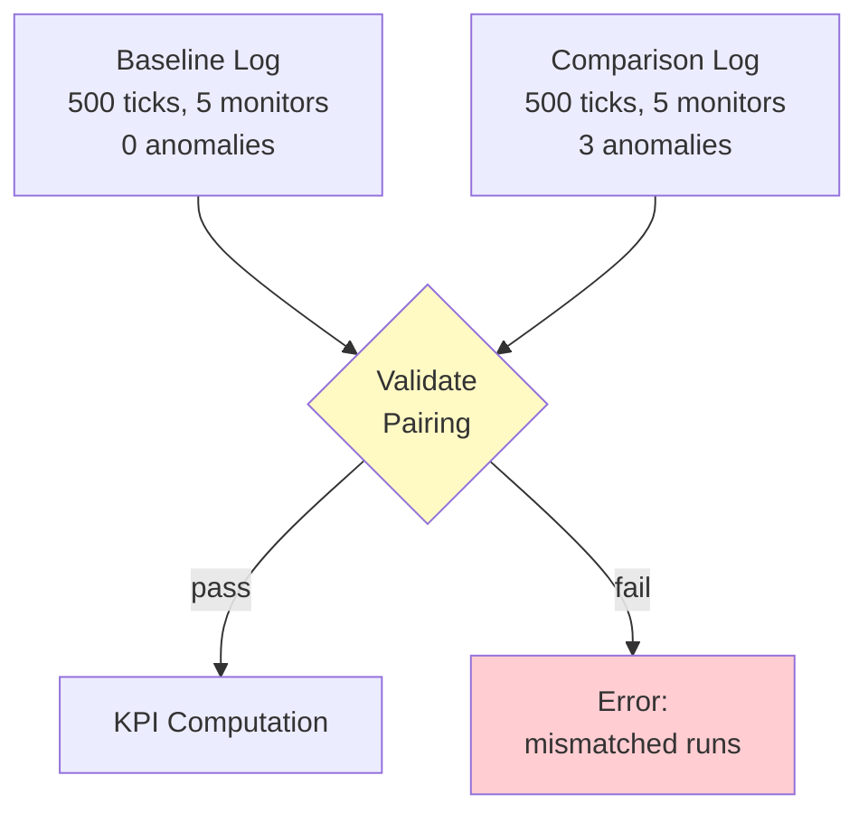

### 4.2 Comparison methods

Five comparison methods are available for pairing KPI values:

| Method | Formula | Use case |
|---|---|---|
| `percent_change` | `(comparison - baseline) / baseline × 100` | General-purpose relative comparison |
| `absolute_change` | `comparison - baseline` | When percentage is misleading (near-zero baselines) |
| `ratio` | `comparison / baseline` | Multiplier interpretation (2.0 = doubled) |
| `z_score` | `(comparison - baseline_mean) / baseline_stddev` | Statistical distance from baseline distribution |
| `effect_size` | `(comparison_mean - baseline_mean) / pooled_stddev` | Cohen's d for practical significance |

### 4.3 Statistical methods

For each KPI, the analytics engine computes a full statistical profile from monitor samples:

```yaml
kpi_result:
  kpi_id: kpi_throughput
  run: baseline
  stats:
    mean: 4.2
    median: 4.0
    stddev: 0.8
    min: 2.0
    max: 7.0
    p5: 2.5
    p25: 3.5
    p75: 5.0
    p95: 5.8
    count: 500          # number of samples
    sum: 2100.0         # total across all samples
```

### 4.4 Significance testing

Not every difference between baseline and comparison is meaningful. The analytics engine
applies a two-stage significance test:

**Stage 1: Threshold check.** If `|percent_change| < significance_threshold`, the change
is classified as `not_significant` regardless of statistical properties.

**Stage 2: Statistical test.** If the threshold is exceeded, a Welch's t-test is applied
to the sample distributions. This handles unequal variances between baseline and comparison.

```
significance_level = 0.05
t_stat = (mean_comparison - mean_baseline) / sqrt(var_c/n_c + var_b/n_b)
p_value = t_distribution_cdf(t_stat, degrees_of_freedom)

if p_value < significance_level:
    result = "significant"
else:
    result = "not_significant"  # difference may be random noise
```

| Classification | Criteria |
|---|---|
| `not_significant` | Below threshold or p-value ≥ 0.05 |
| `significant` | Above threshold and p-value < 0.05 |
| `highly_significant` | Above threshold and p-value < 0.001 |

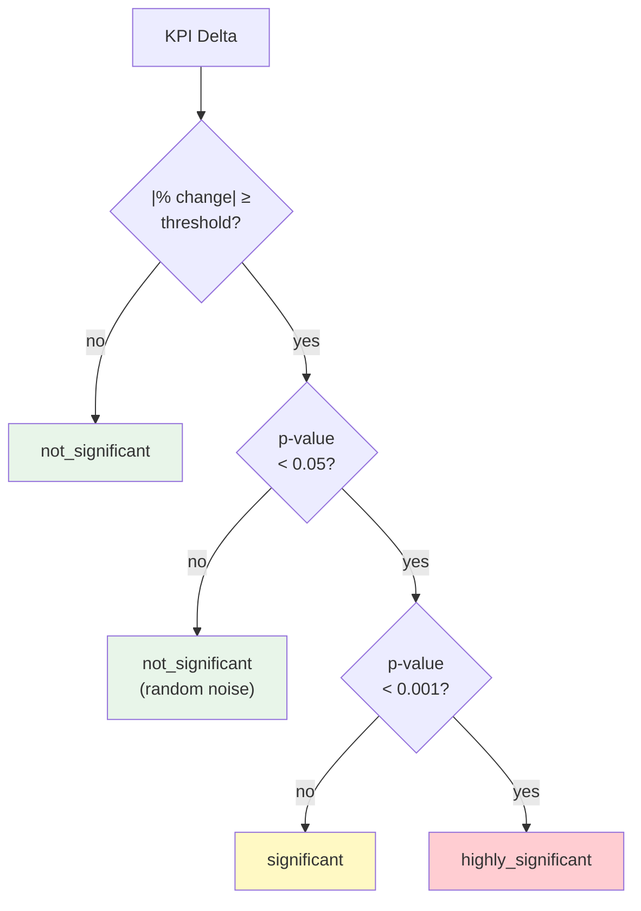

### 4.5 Comparison output format

Each KPI comparison produces a structured result:

```json
{
  "kpi_id": "kpi_throughput",
  "kpi_type": "throughput_rate",
  "baseline": {
    "mean": 4.2,
    "median": 4.0,
    "stddev": 0.8,
    "p95": 5.8
  },
  "comparison": {
    "mean": 2.8,
    "median": 2.5,
    "stddev": 1.2,
    "p95": 4.5
  },
  "delta": {
    "absolute": -1.4,
    "percent": -33.3,
    "ratio": 0.667,
    "z_score": -1.75,
    "effect_size": -1.37
  },
  "significance": "highly_significant",
  "p_value": 0.00012,
  "direction": "decrease",
  "interpretation": "Throughput dropped 33.3% under anomaly conditions"
}
```

---

## 5. KPI Mechanics — Detailed Reference

---

### s16.1: Throughput Rate

> **Category:** Throughput
> **Mechanic ID:** s16.1

**What it measures**

The number of items successfully processed by a block (or the entire system) per tick or
per window of ticks. This is the most fundamental performance metric — how fast is work
getting done?

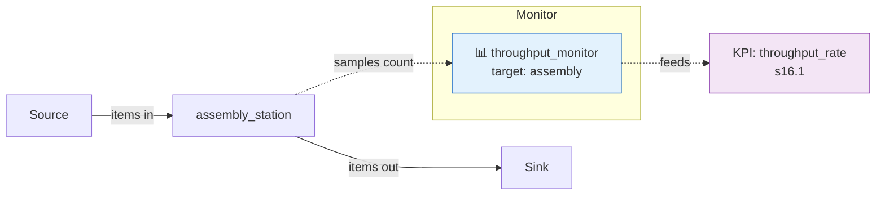

**Formula**

```
throughput_rate = sum(throughput_monitor.value) / number_of_windows
```

Where `throughput_monitor.value` is the count of items processed in each window.

**YAML config**

```yaml
analytics:
  kpis:
    - id: kpi_system_throughput
      type: throughput_rate
      source_monitor: watch_throughput
      config:
        window: 50                  # aggregate over 50-tick windows
        scope: block                # block | system
```

**Before/after comparison**

| Metric | Baseline | Comparison | Delta |
|---|---|---|---|
| Mean throughput | 4.2 items/window | 2.8 items/window | −33.3% |
| Peak throughput | 7.0 items/window | 5.0 items/window | −28.6% |
| Throughput stability (σ) | 0.8 | 1.2 | +50.0% |

A decrease in mean throughput with an increase in standard deviation is a strong signal
that anomalies are disrupting flow consistency.

---

### s16.2: Average Latency

> **Category:** Latency
> **Mechanic ID:** s16.2

**What it measures**

The mean time an item spends from creation (emitted by a source) to completion (absorbed
by a sink or processed by the target block). High latency means items are waiting too long
in queues or processing is too slow.

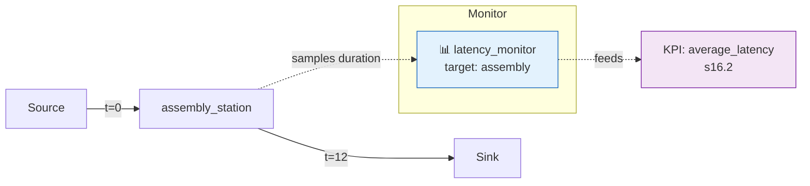

**Formula**

```
average_latency = mean(latency_monitor.value)
```

Where `latency_monitor.value` is the processing duration for each observed item.

**YAML config**

```yaml
analytics:
  kpis:
    - id: kpi_avg_latency
      type: average_latency
      source_monitor: watch_latency
      config:
        unit: ticks                 # ticks | sim_time
```

**Before/after comparison**

| Metric | Baseline | Comparison | Delta |
|---|---|---|---|
| Mean latency | 5.2 ticks | 8.7 ticks | +67.3% |
| Median latency | 5.0 ticks | 7.0 ticks | +40.0% |
| Latency variance (σ²) | 1.4 | 6.8 | +385.7% |

A large increase in variance alongside increased mean latency indicates intermittent
processing stalls — characteristic of turbulence (s14.3) or heat buildup (s14.7).

---

### s16.3: P95 Latency

> **Category:** Latency
> **Mechanic ID:** s16.3

**What it measures**

The 95th percentile of processing latency. While average latency masks outliers, P95
captures the worst-case experience for 1 in 20 items. This is the metric SLA targets
are built on.

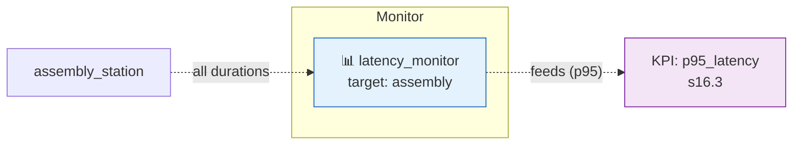

**Formula**

```
p95_latency = percentile(latency_monitor.value, 95)
```

**YAML config**

```yaml
analytics:
  kpis:
    - id: kpi_p95_latency
      type: p95_latency
      source_monitor: watch_latency
      config:
        percentile: 95              # configurable: 90, 95, 99
```

**Before/after comparison**

| Metric | Baseline | Comparison | Delta |
|---|---|---|---|
| P95 latency | 8.0 ticks | 18.5 ticks | +131.3% |
| P99 latency | 10.0 ticks | 32.0 ticks | +220.0% |

P95 and P99 are more sensitive to anomalies than mean latency because anomalies create
long-tail distributions. A 2× increase in P95 while mean only increases 1.5× is a classic
sign of intermittent failures.

---

### s16.4: Queue Time Ratio

> **Category:** Latency
> **Mechanic ID:** s16.4

**What it measures**

The fraction of an item's total lifecycle spent waiting in queues rather than being actively
processed. A ratio near 1.0 means items spend almost all their time waiting — the system is
queue-dominated and processing capacity is the bottleneck.

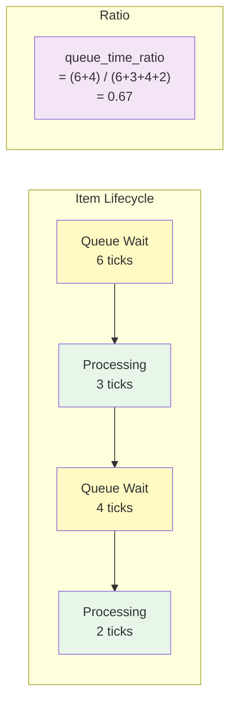

**Formula**

```
queue_time_ratio = total_queue_time / total_lifecycle_time
```

Derived from `queue_depth_monitor` (for queue occupancy) and `latency_monitor` (for total time).

**YAML config**

```yaml
analytics:
  kpis:
    - id: kpi_queue_ratio
      type: queue_time_ratio
      source_monitors:
        - watch_queue
        - watch_latency
```

**Before/after comparison**

| Metric | Baseline | Comparison | Delta |
|---|---|---|---|
| Queue time ratio | 0.35 | 0.72 | +105.7% |

When anomalies cause processing slowdowns, queue time ratio rises sharply — items
accumulate in buffers as downstream blocks stall.

---

### s16.5: Cost Per Item

> **Category:** Cost
> **Mechanic ID:** s16.5

**What it measures**

The total accumulated cost (from `cost_monitor`) divided by the number of items successfully
processed (from `throughput_monitor`). This captures how expensive each unit of output is —
anomalies that reduce throughput without reducing cost will spike this metric.

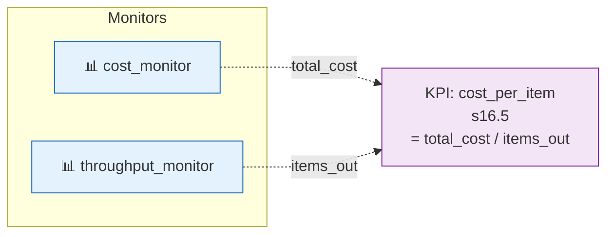

**Formula**

```
cost_per_item = sum(cost_monitor.value) / sum(throughput_monitor.value)
```

**YAML config**

```yaml
analytics:
  kpis:
    - id: kpi_unit_cost
      type: cost_per_item
      source_monitors:
        - watch_cost
        - watch_throughput
```

**Before/after comparison**

| Metric | Baseline | Comparison | Delta |
|---|---|---|---|
| Cost per item | $12.50 | $19.80 | +58.4% |
| Total cost | $5,250 | $5,544 | +5.6% |
| Total items | 420 | 280 | −33.3% |

Cost per item amplifies small cost increases with throughput decreases. A 5.6% cost increase
combined with a 33.3% throughput drop produces a 58.4% unit cost increase.

---

### s16.6: Revenue Per Tick

> **Category:** Cost
> **Mechanic ID:** s16.6

**What it measures**

The total value output (`value_out` from processed items as tracked by `revenue_monitor`)
divided by elapsed ticks. This measures the earning rate of the system — how much value the
process generates per unit time.

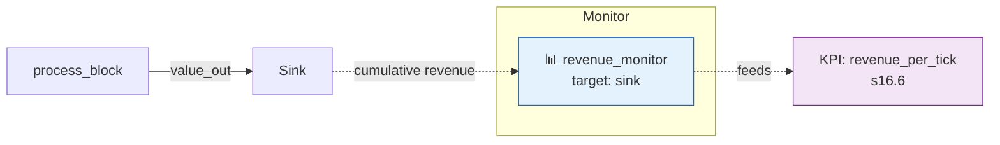

**Formula**

```
revenue_per_tick = max(revenue_monitor.value) / total_ticks
```

**YAML config**

```yaml
analytics:
  kpis:
    - id: kpi_revenue_rate
      type: revenue_per_tick
      source_monitor: watch_revenue
      config:
        cumulative: true            # revenue_monitor tracks cumulative totals
```

**Before/after comparison**

| Metric | Baseline | Comparison | Delta |
|---|---|---|---|
| Revenue per tick | $8.40 | $5.60 | −33.3% |
| Total revenue | $4,200 | $2,800 | −33.3% |

Revenue per tick is directly proportional to throughput when item value is constant. When
anomalies degrade throughput, revenue drops at the same rate.

---

### s16.7: Error Rate

> **Category:** Quality
> **Mechanic ID:** s16.7

**What it measures**

The fraction of items that fail processing (trigger `fail_chance`, get rejected, or produce
errors) out of all items that entered the block. This is the fundamental quality metric.

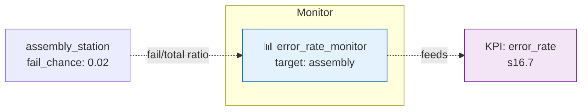

**Formula**

```
error_rate = mean(error_rate_monitor.value)
```

Where `error_rate_monitor.value` is the fail/total ratio over each sliding window.

**YAML config**

```yaml
analytics:
  kpis:
    - id: kpi_error_rate
      type: error_rate
      source_monitor: watch_errors
      config:
        window: 20                  # sliding window for smoothing
```

**Before/after comparison**

| Metric | Baseline | Comparison | Delta |
|---|---|---|---|
| Mean error rate | 2.0% | 14.5% | +625.0% |
| Peak error rate | 5.0% | 45.0% | +800.0% |

Error rate is highly sensitive to anomalies like byzantine failure (s14.23), entropy
increase (s14.8), and heat buildup (s14.7). A jump from 2% to 14.5% represents a
catastrophic quality degradation.

---

### s16.8: DLQ Rate

> **Category:** Quality
> **Mechanic ID:** s16.8

**What it measures**

The fraction of items routed to the dead letter queue (DLQ) out of all items processed.
Items reach the DLQ after exhausting retry attempts. A rising DLQ rate means the system's
error handling itself is overwhelmed.

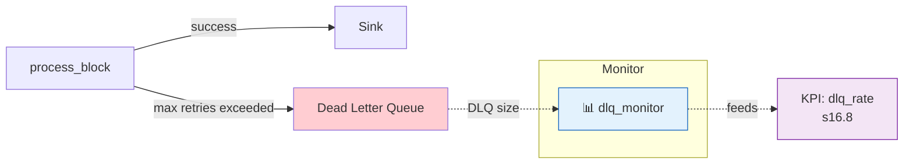

**Formula**

```
dlq_rate = dlq_items / total_items_processed
```

Derived from `dlq_monitor.value` (DLQ size over time) and a throughput or source count.

**YAML config**

```yaml
analytics:
  kpis:
    - id: kpi_dlq_rate
      type: dlq_rate
      source_monitors:
        - watch_dlq
        - watch_throughput
```

**Before/after comparison**

| Metric | Baseline | Comparison | Delta |
|---|---|---|---|
| DLQ rate | 0.5% | 8.2% | +1540.0% |
| DLQ total items | 2 | 23 | +1050.0% |

DLQ rate is a lagging indicator — items reach DLQ only after multiple retries. A spike
in DLQ rate follows error rate increases with a delay proportional to `max_retries`.

---

### s16.9: Block Utilization

> **Category:** Utilization
> **Mechanic ID:** s16.9

**What it measures**

The fraction of ticks a block spends in PROCESSING state versus idle, waiting, or failed
states. High utilization means the block is busy doing useful work. Low utilization during
anomalies may indicate starvation (upstream failures) or repeated failures (the block keeps
failing and restarting).

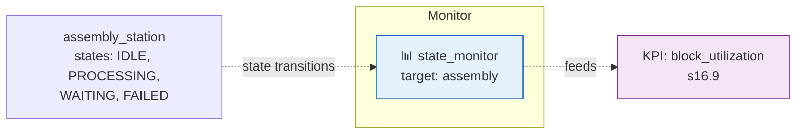

**Formula**

```
block_utilization = ticks_in_PROCESSING / total_ticks
```

Computed by counting state_monitor samples where value is `PROCESSING`.

**YAML config**

```yaml
analytics:
  kpis:
    - id: kpi_utilization
      type: block_utilization
      source_monitor: watch_state
      config:
        active_states:              # states that count as "utilized"
          - PROCESSING
          - BATCH_PROCESSING
```

**Before/after comparison**

| Metric | Baseline | Comparison | Delta |
|---|---|---|---|
| Utilization | 82% | 51% | −37.8% |
| Idle time | 15% | 22% | +46.7% |
| Failed time | 3% | 27% | +800.0% |

A drop in utilization with a corresponding rise in failed time is the signature of
reliability anomalies (heat buildup, corrosion, byzantine failure).

---

### s16.10: Resource Utilization

> **Category:** Utilization
> **Mechanic ID:** s16.10

**What it measures**

The fraction of a shared resource pool that is currently allocated. Resources include
operators, machines, tools, and licenses — any pooled capacity that blocks must acquire
before processing.

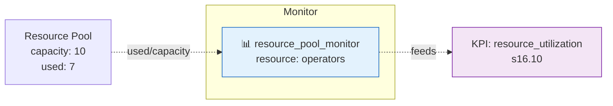

**Formula**

```
resource_utilization = mean(resource_pool_monitor.value / resource_capacity)
```

**YAML config**

```yaml
analytics:
  kpis:
    - id: kpi_operator_util
      type: resource_utilization
      source_monitor: watch_operators
      config:
        capacity: 10                # pool capacity for ratio computation
```

**Before/after comparison**

| Metric | Baseline | Comparison | Delta |
|---|---|---|---|
| Mean utilization | 70% | 45% | −35.7% |
| Peak utilization | 95% | 60% | −36.8% |

Decreased resource utilization during anomalies indicates blocks are failing before they
can acquire resources, or upstream starvation means fewer blocks need resources at all.

---

### s16.11: Anomaly Impact Score

> **Category:** Reliability
> **Mechanic ID:** s16.11

**What it measures**

The relative degradation of any KPI between baseline and comparison runs. This is a
meta-KPI — it operates on other KPI results, not on raw monitor data. It answers: "How
badly did this anomaly scenario hurt metric X?"

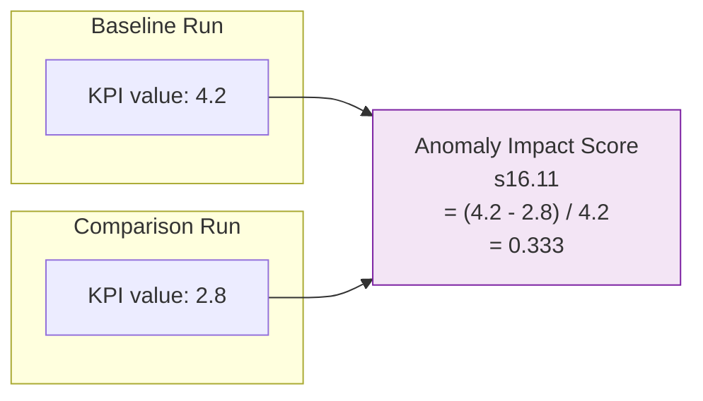

**Formula**

```
anomaly_impact_score = (baseline_kpi - comparison_kpi) / baseline_kpi
```

A score of 0.0 means no impact. A score of 1.0 means complete loss. Negative scores
indicate the anomaly scenario improved the metric (possible with catalyst, s14.19).

**YAML config**

```yaml
analytics:
  kpis:
    - id: kpi_throughput_impact
      type: anomaly_impact_score
      config:
        source_kpi: kpi_throughput  # references another KPI by ID
```

**Before/after comparison**

| Source KPI | Baseline | Comparison | Impact Score | Interpretation |
|---|---|---|---|---|
| Throughput | 4.2 | 2.8 | 0.333 | 33.3% degradation |
| Latency | 5.2 | 8.7 | −0.673 | 67.3% worse (inverted — higher is worse) |
| Error rate | 0.02 | 0.145 | −6.25 | 625% worse (inverted) |

For KPIs where higher is worse (latency, error rate), the score is inverted:
`impact = (comparison_kpi - baseline_kpi) / baseline_kpi`.

---

### s16.12: Recovery Time

> **Category:** Reliability
> **Mechanic ID:** s16.12

**What it measures**

The number of ticks from an anomaly's activation to when a KPI returns to its baseline
level (within a tolerance). Short recovery time means the system is resilient — it absorbs
the shock and bounces back. Long recovery time (or no recovery) means the anomaly caused
lasting damage.

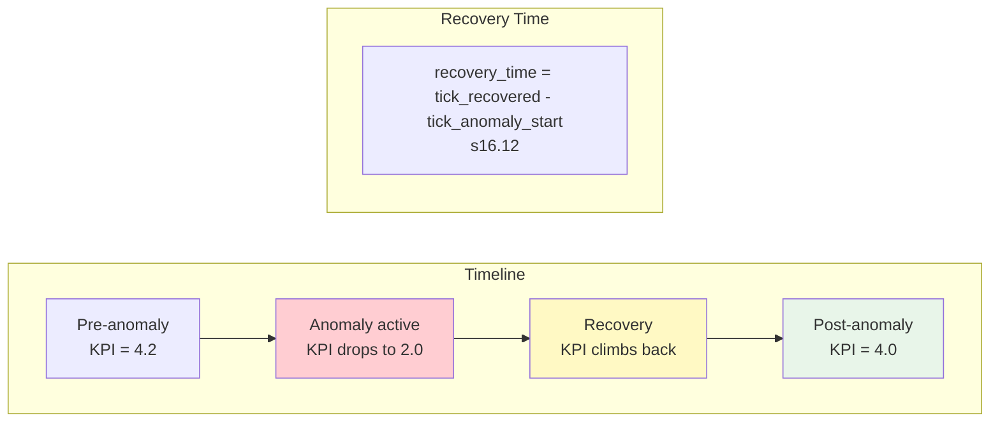

**Formula**

```
recovery_time = first_tick_where(kpi >= baseline_mean * (1 - tolerance)) - anomaly_start_tick
```

If the KPI never recovers within the simulation, `recovery_time = null` (no recovery).

**YAML config**

```yaml
analytics:
  kpis:
    - id: kpi_recovery
      type: recovery_time
      config:
        source_kpi: kpi_throughput
        tolerance: 0.1             # within 10% of baseline counts as "recovered"
        anomaly_id: anomaly_heat   # which anomaly to measure recovery from
```

**Before/after comparison**

| Anomaly | KPI | Recovery Time | Classification |
|---|---|---|---|
| heat_buildup | throughput | 45 ticks | Moderate — recovers after cooldown |
| leakage | throughput | 12 ticks | Fast — stops immediately when anomaly ends |
| corrosion | throughput | null | No recovery — permanent degradation |

---

### s16.13: Cascade Depth

> **Category:** Reliability
> **Mechanic ID:** s16.13

**What it measures**

The number of blocks downstream (or upstream) of an anomaly target that show degraded
performance. A high cascade depth means the anomaly's effects propagate through the graph.
A low cascade depth means the anomaly is contained.

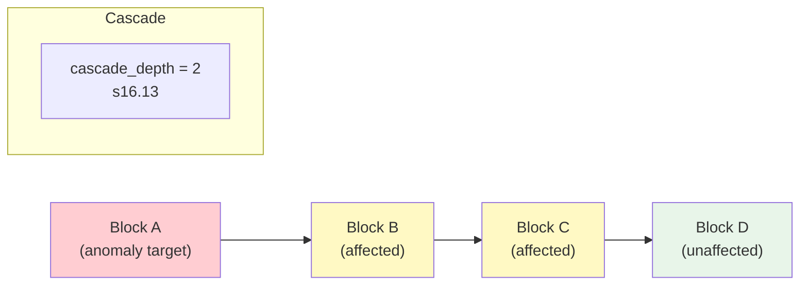

**Formula**

```
cascade_depth = count(blocks where block_kpi degraded > threshold AND block is downstream of anomaly target)
```

Uses `state_monitor` and `anomaly_monitor` data to trace which blocks show performance
drops correlated with the anomaly activation.

**YAML config**

```yaml
analytics:
  kpis:
    - id: kpi_cascade
      type: cascade_depth
      config:
        anomaly_id: anomaly_chain_reaction
        degradation_threshold: 0.2  # 20% KPI drop counts as "affected"
        direction: downstream       # downstream | upstream | both
```

**Before/after comparison**

| Anomaly | Target | Cascade Depth | Affected Blocks |
|---|---|---|---|
| chain_reaction | furnace | 4 | cooling, assembly, qc, shipping |
| heat_buildup | assembly | 1 | qc (downstream) |
| leakage | conveyor | 0 | contained to target |

---

### s16.14: System Resilience Score

> **Category:** Reliability
> **Mechanic ID:** s16.14

**What it measures**

A composite metric combining anomaly impact, recovery time, and cascade depth into a single
0–100 score. High resilience means the system absorbs anomalies gracefully. Low resilience
means anomalies cause widespread, lasting damage.

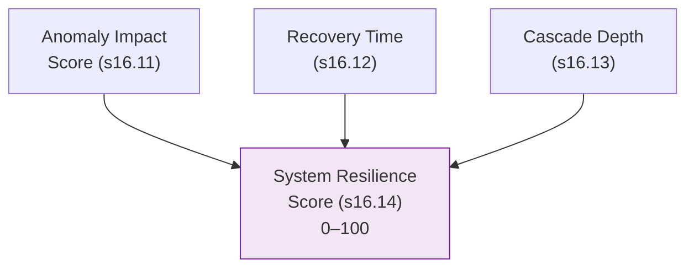

**Formula**

```
impact_component   = (1 - avg_anomaly_impact_score) * 40     # 0–40 points
recovery_component = (1 - recovery_time / max_ticks) * 35    # 0–35 points
cascade_component  = (1 - cascade_depth / total_blocks) * 25 # 0–25 points

resilience_score = impact_component + recovery_component + cascade_component
```

| Score Range | Classification | Meaning |
|---|---|---|
| 80–100 | Highly resilient | Anomalies have minimal, short-lived impact |
| 60–79 | Moderately resilient | Some degradation, but system recovers |
| 40–59 | Fragile | Significant impact, slow recovery |
| 0–39 | Brittle | Widespread, lasting damage from anomalies |

**YAML config**

```yaml
analytics:
  kpis:
    - id: kpi_resilience
      type: system_resilience_score
      config:
        impact_weight: 40
        recovery_weight: 35
        cascade_weight: 25
        source_kpis:
          - kpi_throughput_impact
          - kpi_recovery
          - kpi_cascade
```

**Before/after comparison**

| Component | Score | Weight | Contribution |
|---|---|---|---|
| Impact (avg 0.33) | 26.8 | /40 | Low-moderate impact |
| Recovery (45/500 ticks) | 31.9 | /35 | Reasonable recovery time |
| Cascade (2/10 blocks) | 20.0 | /25 | Limited propagation |
| **Total** | **78.7** | **/100** | **Moderately resilient** |

---

### s16.15: Flow Efficiency

> **Category:** Throughput
> **Mechanic ID:** s16.15

**What it measures**

The ratio of items exiting a block chain to items entering it. A flow efficiency of 1.0
means every item that enters eventually exits. Below 1.0, items are being lost (leakage,
DLQ, failures). Above 1.0, items are being duplicated (fork, batch expansion).

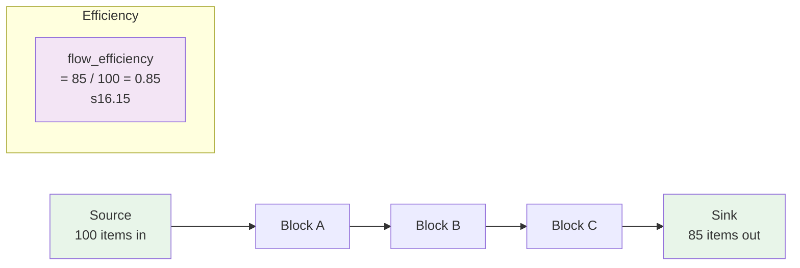

**Formula**

```
flow_efficiency = items_out_at_sink / items_in_at_source
```

Uses `throughput_monitor` at source and sink blocks to compute the ratio.

**YAML config**

```yaml
analytics:
  kpis:
    - id: kpi_flow_eff
      type: flow_efficiency
      source_monitors:
        - watch_source_throughput
        - watch_sink_throughput
      config:
        source_block: order_source
        sink_block: shipping_sink
```

**Before/after comparison**

| Metric | Baseline | Comparison | Delta |
|---|---|---|---|
| Flow efficiency | 0.95 | 0.72 | −24.2% |
| Items lost | 5 | 28 | +460.0% |

Flow efficiency drops when anomalies cause leakage (s14.4), DLQ routing, or processing
failures that reject items.

---

### s16.16: Cost of Quality

> **Category:** Cost
> **Mechanic ID:** s16.16

**What it measures**

The total cost attributable to quality failures — rework, rejects, DLQ handling, and retry
overhead — as a fraction of total processing cost. This is the price the system pays for
its error rate.

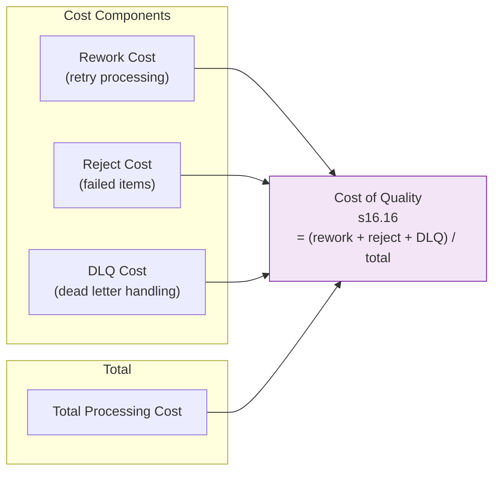

**Formula**

```
cost_of_quality = (retry_cost + reject_cost + dlq_cost) / total_cost
```

Derived from `cost_monitor` (total costs), `error_rate_monitor` (reject rate), and
`dlq_monitor` (DLQ volumes).

**YAML config**

```yaml
analytics:
  kpis:
    - id: kpi_coq
      type: cost_of_quality
      source_monitors:
        - watch_cost
        - watch_errors
        - watch_dlq
      config:
        retry_cost_per_item: 5.0
        reject_cost_per_item: 12.0
        dlq_cost_per_item: 20.0
```

**Before/after comparison**

| Metric | Baseline | Comparison | Delta |
|---|---|---|---|
| Cost of quality | 4.2% | 28.5% | +578.6% |
| Rework cost | $105 | $680 | +547.6% |
| Reject cost | $120 | $960 | +700.0% |
| DLQ cost | $40 | $460 | +1050.0% |

Cost of quality amplifies error rate increases because each error carries a fixed cost.
A 7× increase in error rate produces a roughly 7× increase in quality cost.

---

### s16.17: Bottleneck Score

> **Category:** Throughput
> **Mechanic ID:** s16.17

**What it measures**

How fast a block's queue grows relative to its peers. A block with a high bottleneck score
is accumulating items faster than it can process them — it's the system's constraint. This
KPI identifies where to focus improvement efforts.

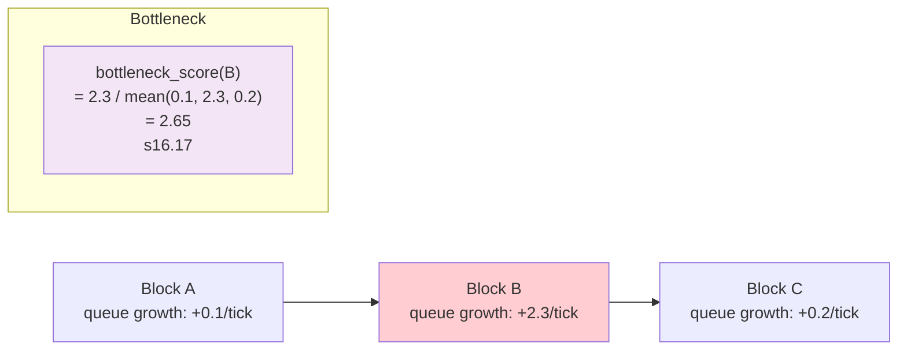

**Formula**

```
bottleneck_score(block) = queue_growth_rate(block) / mean(queue_growth_rate(all_blocks))
```

A score of 1.0 means average. Above 2.0 is a likely bottleneck. Below 0.5 means this block
has excess capacity.

**YAML config**

```yaml
analytics:
  kpis:
    - id: kpi_bottleneck
      type: bottleneck_score
      source_monitor: watch_bottleneck
      config:
        threshold: 2.0              # score above this flags as bottleneck
```

**Before/after comparison**

| Block | Baseline Score | Comparison Score | Delta | Bottleneck? |
|---|---|---|---|---|
| assembly | 1.8 | 4.2 | +133.3% | Yes (was borderline, now definite) |
| qc_station | 0.9 | 0.7 | −22.2% | No |
| shipping | 1.1 | 3.5 | +218.2% | Yes (emerged under anomaly) |

Anomalies often create new bottlenecks or intensify existing ones. Comparing bottleneck
scores reveals which blocks become system constraints under stress.

---

### s16.18: Signal Propagation Delay

> **Category:** Latency
> **Mechanic ID:** s16.18

**What it measures**

The number of ticks between a signal being emitted by one block and the corresponding
effect (state change, gate toggle, trigger) in the receiving block. In a perfect system
this is 1 tick. Signal attenuation (s14.11), clock drift (s14.24), and network congestion
can increase this delay.

```mermaid
graph LR
    A["Block A<br/>emits signal<br/>tick 50"] -->|"signal edge"| B["Block B<br/>receives signal<br/>tick 53"]
    subgraph "Delay"
        SPD["signal_propagation_delay<br/>= 53 - 50 = 3 ticks<br/>s16.18"]
    end
    style SPD fill:#f3e5f5
```

**Formula**

```
signal_propagation_delay = tick_of_effect - tick_of_emission
```

Derived from `signal_monitor` samples that record both emission and reception ticks.

**YAML config**

```yaml
analytics:
  kpis:
    - id: kpi_signal_delay
      type: signal_propagation_delay
      source_monitor: watch_signals
      config:
        signal_type: circuit_breaker  # filter by signal type, or "*" for all
```

**Before/after comparison**

| Signal Path | Baseline Delay | Comparison Delay | Delta |
|---|---|---|---|
| sensor → controller | 1 tick | 1 tick | 0% |
| controller → assembly | 1 tick | 4 ticks | +300% |
| assembly → qc | 1 tick | 8 ticks | +700% |

Signal propagation delay increases are characteristic of signal attenuation (s14.11) and
clock drift (s14.24). When signals arrive late, the system reacts late — and anomaly
damage accumulates before corrective action takes effect.

---

## 6. Anomaly Detection from Monitoring Data

### 6.1 Purpose

Anomaly detection complements playbook-defined anomalies. While Phase 2 anomalies are
**injected intentionally**, the analytics engine can also **detect unknown anomalies** —
unusual patterns in monitoring data that indicate something has gone wrong, even if no
anomaly was explicitly configured.

This is valuable for:
- Validating that injected anomalies produce the expected monitoring signatures
- Discovering emergent anomalies — cascading effects that weren't predicted
- Building anomaly detection rules for production monitoring systems

```mermaid
graph TD
    subgraph "Known Anomalies"
        INJ["Injected via playbook<br/>(s14.1–s14.24)"]
    end
    subgraph "Unknown Anomalies"
        DET["Detected from<br/>monitoring patterns"]
    end
    subgraph "Monitor Data"
        MD["_monitors.jsonl"]
    end
    MD --> INJ
    MD --> DET
    INJ --> RPT["Analytics Report"]
    DET --> RPT
    style INJ fill:#e8f5e9
    style DET fill:#fff9c4
    style RPT fill:#e3f2fd
```

### 6.2 Detection rules

Three detection rule types are supported, each operating on time-series monitor data:

#### 6.2.1 Threshold detection

Fires when a monitor value crosses a static boundary. Similar to monitor alerts (§5 of
MONITORING-MECHANICS.md) but processed post-simulation for analytical classification rather
than real-time alerting.

```yaml
analytics:
  detection:
    - rule: threshold
      monitor: watch_assembly_queue
      condition: "> 12"
      label: "queue_overflow_detected"
      config:
        min_duration: 5            # must exceed threshold for 5+ consecutive ticks
```

**Detection logic:**
```
for each tick in monitor_samples:
    if value matches condition:
        consecutive_count += 1
    else:
        consecutive_count = 0
    if consecutive_count >= min_duration:
        emit detection event
```

#### 6.2.2 Trend detection

Fires when a monitor value shows a sustained increasing or decreasing trend over a window.
This catches gradual degradation that threshold checks miss — a queue that grows by 0.5 per
tick never spikes above a threshold, but after 100 ticks it's overflowing.

```yaml
analytics:
  detection:
    - rule: trend
      monitor: watch_throughput
      condition: "declining 10"
      label: "throughput_decay"
      config:
        slope_threshold: -0.1      # minimum slope to flag (negative = declining)
```

**Detection logic:**
```
window = last N samples from monitor
slope = linear_regression_slope(window)
if condition == "declining" and slope < slope_threshold:
    emit detection event
if condition == "rising" and slope > abs(slope_threshold):
    emit detection event
```

Supported conditions: `declining N`, `rising N`, `unstable N` (high variance).

#### 6.2.3 Correlation detection

Fires when two monitors show correlated changes — one block's degradation coincides with
another block's degradation. This reveals causal chains and cascade effects.

```yaml
analytics:
  detection:
    - rule: correlation
      monitors:
        - watch_assembly_queue
        - watch_qc_errors
      condition: "positive > 0.7"
      label: "assembly_queue_drives_qc_errors"
      config:
        lag: 5                     # allow 5-tick lag between cause and effect
```

**Detection logic:**
```
series_a = monitor_samples[monitors[0]]
series_b = monitor_samples[monitors[1]]
if lag > 0:
    series_b = shift(series_b, -lag)   # align for time-delayed correlation
correlation = pearson_r(series_a, series_b)
if condition == "positive" and correlation > threshold:
    emit detection event
if condition == "negative" and correlation < -threshold:
    emit detection event
```

### 6.3 Detection output

Each detection event produces a structured record in the analytics report:

```json
{
  "detection_id": "det_001",
  "rule": "trend",
  "monitor": "watch_throughput",
  "label": "throughput_decay",
  "tick_range": [120, 250],
  "evidence": {
    "slope": -0.23,
    "r_squared": 0.87,
    "start_value": 4.1,
    "end_value": 1.2
  },
  "severity": "critical",
  "correlated_anomalies": ["anomaly_heat_assembly"]
}
```

### 6.4 Correlating detections with injected anomalies

The analytics engine cross-references detection events with the anomaly activation timeline.
Anomalies are condition-triggered (not pre-scheduled); the engine records
`ANOMALY_ACTIVATED` and `ANOMALY_EXPIRED` events each carrying an `activation_tick`. If a
detection's `tick_range` overlaps with an anomaly's active window
(`activation_tick` → `expiry_tick`), the detection is tagged with `correlated_anomalies`.

```mermaid
graph LR
    subgraph "Anomaly Timeline"
        AT["heat_buildup<br/>ticks 50–250"]
    end
    subgraph "Detection"
        DT["throughput_decay<br/>detected ticks 120–250"]
    end
    AT -->|"overlap: 120–250"| COR["Correlated:<br/>heat_buildup caused<br/>throughput_decay"]
    style COR fill:#e3f2fd
```

Uncorrelated detections — those with no overlapping injected anomaly — are flagged as
**emergent anomalies** and highlighted in the report for operator review.

---

## 7. Report Output Format

### 7.1 Report file naming

Analytics reports are written alongside simulation logs:

```
logs/
  sim_20260310_180000.jsonl               # baseline event log
  sim_20260310_180000_monitors.jsonl       # baseline monitor log
  sim_20260310_180100.jsonl               # comparison event log
  sim_20260310_180100_monitors.jsonl       # comparison monitor log
  sim_20260310_180100_analytics.json       # analytics report
```

The report filename uses the **comparison** run's timestamp with an `_analytics.json` suffix.

### 7.2 Report JSON structure

```json
{
  "report_id": "analytics_20260310_180100",
  "generated_at": "2026-03-10T18:05:00Z",
  "baseline": {
    "run_id": "baseline_001",
    "log_file": "sim_20260310_180000_monitors.jsonl",
    "ticks": 500,
    "anomalies_enabled": false
  },
  "comparison": {
    "run_id": "comparison_001",
    "log_file": "sim_20260310_180100_monitors.jsonl",
    "ticks": 500,
    "anomalies_enabled": true,
    "anomalies_active": ["anomaly_heat_assembly", "anomaly_leak_pipe"]
  },
  "summary": { ... },
  "kpi_results": [ ... ],
  "block_breakdown": [ ... ],
  "comparison_table": [ ... ],
  "timeline": [ ... ],
  "detections": [ ... ]
}
```

### 7.3 Summary section

The summary provides a high-level overview of the comparison:

```json
{
  "summary": {
    "total_kpis": 8,
    "significant_changes": 5,
    "highly_significant_changes": 2,
    "overall_impact": "moderate",
    "resilience_score": 78.7,
    "worst_kpi": {
      "kpi_id": "kpi_error_rate",
      "percent_change": 625.0,
      "direction": "increase"
    },
    "best_kpi": {
      "kpi_id": "kpi_signal_delay",
      "percent_change": 0.0,
      "direction": "unchanged"
    },
    "anomalies_injected": 2,
    "anomalies_detected": 3,
    "emergent_anomalies": 1
  }
}
```

### 7.4 KPI results section

Full statistical results for each KPI:

```json
{
  "kpi_results": [
    {
      "kpi_id": "kpi_throughput",
      "kpi_type": "throughput_rate",
      "baseline": {
        "mean": 4.2, "median": 4.0, "stddev": 0.8,
        "min": 2.0, "max": 7.0, "p5": 2.5, "p95": 5.8
      },
      "comparison": {
        "mean": 2.8, "median": 2.5, "stddev": 1.2,
        "min": 0.0, "max": 5.0, "p5": 0.5, "p95": 4.5
      },
      "delta": {
        "absolute": -1.4, "percent": -33.3,
        "ratio": 0.667, "effect_size": -1.37
      },
      "significance": "highly_significant",
      "p_value": 0.00012,
      "direction": "decrease"
    }
  ]
}
```

### 7.5 Block breakdown section

Per-block impact analysis showing which blocks were most affected:

```json
{
  "block_breakdown": [
    {
      "block_id": "assembly_station",
      "anomalies_targeting": ["anomaly_heat_assembly"],
      "kpi_impacts": {
        "throughput": { "baseline": 4.2, "comparison": 2.1, "percent": -50.0 },
        "utilization": { "baseline": 0.82, "comparison": 0.45, "percent": -45.1 },
        "error_rate": { "baseline": 0.02, "comparison": 0.18, "percent": 800.0 }
      },
      "cascade_source": true,
      "cascade_targets": ["qc_station", "shipping_dock"]
    },
    {
      "block_id": "qc_station",
      "anomalies_targeting": [],
      "kpi_impacts": {
        "throughput": { "baseline": 4.0, "comparison": 3.2, "percent": -20.0 },
        "utilization": { "baseline": 0.78, "comparison": 0.65, "percent": -16.7 }
      },
      "cascade_source": false,
      "cascade_targets": []
    }
  ]
}
```

### 7.6 Comparison table section

A tabular summary designed for dashboard display:

```json
{
  "comparison_table": [
    {
      "kpi": "Throughput Rate",
      "baseline": "4.2 items/window",
      "comparison": "2.8 items/window",
      "change": "-33.3%",
      "significance": "highly_significant",
      "indicator": "▼▼"
    },
    {
      "kpi": "Average Latency",
      "baseline": "5.2 ticks",
      "comparison": "8.7 ticks",
      "change": "+67.3%",
      "significance": "significant",
      "indicator": "▲"
    },
    {
      "kpi": "Error Rate",
      "baseline": "2.0%",
      "comparison": "14.5%",
      "change": "+625.0%",
      "significance": "highly_significant",
      "indicator": "▲▲"
    }
  ]
}
```

Indicators: `▲▲` highly significant increase, `▲` significant increase, `—` not significant,
`▼` significant decrease, `▼▼` highly significant decrease.

### 7.7 Timeline section

Tick-by-tick narrative of anomaly activations and their observed effects:

```json
{
  "timeline": [
    {
      "tick": 50,
      "event": "anomaly_activated",
      "anomaly_id": "anomaly_heat_assembly",
      "details": "heat_buildup activated on assembly_station"
    },
    {
      "tick": 75,
      "event": "kpi_degradation_detected",
      "kpi_id": "kpi_throughput",
      "details": "Throughput dropped below baseline mean (4.2 → 3.5)"
    },
    {
      "tick": 100,
      "event": "anomaly_activated",
      "anomaly_id": "anomaly_leak_pipe",
      "details": "leakage activated on conveyor_belt"
    },
    {
      "tick": 120,
      "event": "detection_triggered",
      "detection_id": "det_001",
      "details": "Declining throughput trend detected (slope: -0.23)"
    },
    {
      "tick": 250,
      "event": "anomaly_expired",
      "anomaly_id": "anomaly_heat_assembly",
      "details": "heat_buildup expiry conditions satisfied on assembly_station"
    },
    {
      "tick": 295,
      "event": "kpi_recovered",
      "kpi_id": "kpi_throughput",
      "details": "Throughput returned to within 10% of baseline (4.0)"
    }
  ]
}
```

### 7.8 Detections section

All anomaly detections from the detection engine:

```json
{
  "detections": [
    {
      "detection_id": "det_001",
      "rule": "trend",
      "monitor": "watch_throughput",
      "label": "throughput_decay",
      "tick_range": [120, 250],
      "severity": "critical",
      "correlated_anomalies": ["anomaly_heat_assembly"],
      "emergent": false
    },
    {
      "detection_id": "det_002",
      "rule": "correlation",
      "monitors": ["watch_assembly_queue", "watch_qc_errors"],
      "label": "assembly_queue_drives_qc_errors",
      "tick_range": [80, 300],
      "severity": "warning",
      "correlated_anomalies": ["anomaly_heat_assembly"],
      "emergent": false
    },
    {
      "detection_id": "det_003",
      "rule": "threshold",
      "monitor": "watch_shipping_queue",
      "label": "shipping_backup",
      "tick_range": [180, 350],
      "severity": "warning",
      "correlated_anomalies": [],
      "emergent": true
    }
  ]
}
```

Detection `det_003` is an **emergent anomaly** — no injected anomaly directly targets the
shipping block, but cascading effects from upstream anomalies caused a shipping backup.

---

## 8. Integration with Engine

### 8.1 Architecture

The analytics engine is a **post-processing module** that runs after simulation completes.
It does not modify the engine's tick loop or alter simulation behavior. It reads monitor
log files and analytics configuration, computes results, and writes a report.

```mermaid
graph TD
    subgraph "Simulation Phase"
        ENG["GraphEngine<br/>src/engine.py"]
        MON["MonitorEngine<br/>(Phase 3)"]
        ENG --> MON
        MON --> ML["_monitors.jsonl"]
    end
    subgraph "Analytics Phase"
        AE["AnalyticsEngine<br/>src/analytics.py"]
        ML -->|"reads"| AE
        CFG["analytics config<br/>(from playbook)"] -->|"reads"| AE
        AE --> RPT["_analytics.json"]
    end
    subgraph "API Layer"
        API["Flask API<br/>app.py"]
        RPT -->|"serves"| API
    end
    style AE fill:#f3e5f5,stroke:#7b1fa2
    style RPT fill:#e3f2fd
```

### 8.2 Module structure

The analytics code lives in `src/analytics.py` with these components:

```
src/analytics.py
  ├── AnalyticsEngine        # orchestrator: load, compute, compare, report
  ├── KPIComputer            # computes individual KPIs from monitor samples
  ├── ComparisonEngine       # pairs baseline/comparison KPI results
  ├── DetectionEngine        # runs anomaly detection rules
  ├── ReportGenerator        # produces the JSON report
  └── StatsHelper            # statistical functions (mean, percentile, t-test)
```

### 8.3 Reading monitor JSONL

The analytics engine reads `_monitors.jsonl` files using line-by-line JSON parsing:

```python
def load_monitor_samples(path: str) -> dict[str, list[MonitorSample]]:
    """Load monitor samples grouped by monitor_id."""
    samples: dict[str, list] = {}
    with open(path, encoding="utf-8") as f:
        for line in f:
            record = json.loads(line)
            mid = record["monitor_id"]
            samples.setdefault(mid, []).append(record)
    return samples
```

### 8.4 Running paired simulations

When a playbook contains an `analytics` key, the simulation runner executes two runs:

```
sim_runner.py --playbook scenario.yaml
  1. Parse playbook YAML
  2. If analytics.baseline defined:
       a. Run simulation with anomalies_enabled=false
       b. Save baseline logs
  3. If analytics.comparison defined:
       a. Run simulation with anomalies_enabled=true
       b. Save comparison logs
  4. If analytics.kpis defined:
       a. Create AnalyticsEngine
       b. Load both monitor logs
       c. Compute KPIs for both runs
       d. Run comparisons
       e. Run detection rules
       f. Generate report
       g. Write _analytics.json
```

### 8.5 API endpoints

The Flask API exposes analytics results through these routes:

| Method | Path | Description |
|---|---|---|
| `GET` | `/api/analytics/reports` | List available analytics reports |
| `GET` | `/api/analytics/reports/<id>` | Get a specific report by ID |
| `GET` | `/api/analytics/reports/<id>/summary` | Get summary section only |
| `GET` | `/api/analytics/reports/<id>/kpis` | Get KPI results only |
| `GET` | `/api/analytics/reports/<id>/comparison` | Get comparison table |
| `GET` | `/api/analytics/reports/<id>/timeline` | Get timeline events |
| `GET` | `/api/analytics/reports/<id>/detections` | Get detection results |
| `POST` | `/api/analytics/run` | Trigger analytics on existing logs |

All routes return JSON. The `POST /api/analytics/run` endpoint accepts:

```json
{
  "baseline_log": "logs/sim_20260310_180000_monitors.jsonl",
  "comparison_log": "logs/sim_20260310_180100_monitors.jsonl",
  "analytics_config": { ... }
}
```

### 8.6 DuckDB integration

For large-scale analytics across multiple simulation runs, DuckDB provides the analytical
layer. The analytics engine can optionally write results to DuckDB for cross-run queries:

```sql
-- Compare KPI impact across multiple anomaly scenarios
SELECT
    r.comparison->>'anomalies_active' AS anomalies,
    k.kpi_id,
    k.delta->>'percent'              AS percent_change,
    k.significance
FROM read_json_auto('logs/*_analytics.json') r,
     UNNEST(r.kpi_results) AS k
WHERE k.significance IN ('significant', 'highly_significant')
ORDER BY ABS(CAST(k.delta->>'percent' AS FLOAT)) DESC;
```

```sql
-- Find which blocks are most vulnerable to anomalies
SELECT
    b.block_id,
    COUNT(*)                                    AS scenarios_affected,
    AVG(ABS(CAST(b.kpi_impacts->'throughput'->>'percent' AS FLOAT))) AS avg_throughput_impact
FROM read_json_auto('logs/*_analytics.json') r,
     UNNEST(r.block_breakdown) AS b
WHERE b.kpi_impacts->'throughput'->>'percent' IS NOT NULL
GROUP BY b.block_id
ORDER BY avg_throughput_impact DESC;
```

```sql
-- Identify emergent anomalies across all simulation runs
SELECT
    d.label,
    d.tick_range,
    d.severity,
    r.comparison->>'run_id' AS run_id
FROM read_json_auto('logs/*_analytics.json') r,
     UNNEST(r.detections) AS d
WHERE d.emergent = true
ORDER BY d.severity DESC, r.comparison->>'run_id';
```

---

## 9. Complete Playbook Example

A full playbook demonstrating all analytics features working together:

```yaml
simulation:
  ticks: 500
  context:
    scenario: "manufacturing_resilience_test"
    description: "Test assembly line resilience to heat and leakage anomalies"

nodes:
  - id: order_source
    type: source
    trigger_mode: auto
    trigger_interval: 2
    item_template:
      type: work_order
      priority: 1

  - id: assembly_station
    type: process
    processing_ticks: 3
    container:
      capacity: 15
    fail_chance: 0.02
    retry: { max_retries: 2, delay: 1 }

  - id: qc_station
    type: process
    processing_ticks: 2
    container:
      capacity: 10
    fail_chance: 0.01

  - id: shipping_sink
    type: sink

edges:
  - from: order_source
    to: assembly_station
  - from: assembly_station
    to: qc_station
  - from: qc_station
    to: shipping_sink

anomalies:
  - id: anomaly_heat_assembly
    type: heat_buildup
    target: assembly_station
    trigger:
      conditions:
        - type: probability
          chance: 1.0
      logic: any
    effect:
      system: script
      mutation: processing_slowdown
    expiry:
      type: time_elapsed
      ticks: 200
    config:
      slowdown_per_tick: 0.02
      max_slowdown_factor: 3.0
      cooldown_rate: 0.01

  - id: anomaly_leak_conveyor
    type: leakage
    target: assembly_station
    trigger:
      conditions:
        - type: tick_range
          from_tick: 100
          to_tick: 180
        - type: probability
          chance: 1.0
      logic: and
    effect:
      system: data
      mutation: loss_in_transit
    expiry:
      type: tick_range
      to_tick: 180
    config:
      loss_probability: 0.05

monitors:
  - id: watch_throughput
    type: throughput_monitor
    target: assembly_station
    window: 10

  - id: watch_latency
    type: latency_monitor
    target: assembly_station
    interval: 1

  - id: watch_assembly_queue
    type: queue_depth_monitor
    target: assembly_station
    interval: 1

  - id: watch_qc_errors
    type: error_rate_monitor
    target: qc_station
    window: 20

  - id: watch_state
    type: state_monitor
    target: assembly_station
    interval: 1

  - id: watch_cost
    type: cost_monitor
    target: assembly_station
    interval: 10

  - id: watch_dlq
    type: dlq_monitor
    interval: 5

  - id: watch_src_throughput
    type: throughput_monitor
    target: order_source
    window: 10

  - id: watch_sink_throughput
    type: throughput_monitor
    target: shipping_sink
    window: 10

analytics:
  baseline:
    run_id: mfg_baseline
    anomalies_enabled: false

  comparison:
    run_id: mfg_anomaly_test
    anomalies_enabled: true

  kpis:
    - id: kpi_throughput
      type: throughput_rate
      source_monitor: watch_throughput
      config:
        window: 50

    - id: kpi_avg_latency
      type: average_latency
      source_monitor: watch_latency

    - id: kpi_p95_latency
      type: p95_latency
      source_monitor: watch_latency

    - id: kpi_error_rate
      type: error_rate
      source_monitor: watch_qc_errors

    - id: kpi_utilization
      type: block_utilization
      source_monitor: watch_state

    - id: kpi_cost_per_item
      type: cost_per_item
      source_monitors:
        - watch_cost
        - watch_throughput

    - id: kpi_flow_eff
      type: flow_efficiency
      source_monitors:
        - watch_src_throughput
        - watch_sink_throughput

    - id: kpi_dlq_rate
      type: dlq_rate
      source_monitors:
        - watch_dlq
        - watch_throughput

    - id: kpi_throughput_impact
      type: anomaly_impact_score
      config:
        source_kpi: kpi_throughput

    - id: kpi_recovery
      type: recovery_time
      config:
        source_kpi: kpi_throughput
        tolerance: 0.1
        anomaly_id: anomaly_heat_assembly

    - id: kpi_cascade
      type: cascade_depth
      config:
        anomaly_id: anomaly_heat_assembly
        degradation_threshold: 0.2

    - id: kpi_resilience
      type: system_resilience_score
      config:
        impact_weight: 40
        recovery_weight: 35
        cascade_weight: 25
        source_kpis:
          - kpi_throughput_impact
          - kpi_recovery
          - kpi_cascade

  comparisons:
    - kpi: kpi_throughput
      method: percent_change
      significance_threshold: 5.0

    - kpi: kpi_avg_latency
      method: percent_change
      significance_threshold: 10.0

    - kpi: kpi_p95_latency
      method: percent_change
      significance_threshold: 10.0

    - kpi: kpi_error_rate
      method: percent_change
      significance_threshold: 20.0

    - kpi: kpi_utilization
      method: percent_change
      significance_threshold: 5.0

    - kpi: kpi_cost_per_item
      method: percent_change
      significance_threshold: 10.0

    - kpi: kpi_flow_eff
      method: absolute_change
      significance_threshold: 0.05

    - kpi: kpi_dlq_rate
      method: percent_change
      significance_threshold: 50.0

  detection:
    - rule: threshold
      monitor: watch_assembly_queue
      condition: "> 12"
      label: "assembly_queue_overflow"
      config:
        min_duration: 5

    - rule: trend
      monitor: watch_throughput
      condition: "declining 10"
      label: "throughput_decay"
      config:
        slope_threshold: -0.1

    - rule: correlation
      monitors:
        - watch_assembly_queue
        - watch_qc_errors
      condition: "positive > 0.7"
      label: "assembly_congestion_causes_qc_errors"
      config:
        lag: 5

    - rule: trend
      monitor: watch_cost
      condition: "rising 20"
      label: "cost_escalation"
      config:
        slope_threshold: 0.5

  report:
    format: json
    include:
      - summary
      - block_breakdown
      - comparison_table
      - timeline
      - anomaly_detection
    output_path: "logs/"
```

---

## 10. Overall Analytics Pipeline

The complete data flow from playbook definition to analytics report:

```mermaid
graph TD
    PB["Playbook YAML<br/>(nodes, edges, anomalies,<br/>monitors, analytics)"]

    subgraph "Run 1: Baseline"
        R1["GraphEngine<br/>anomalies OFF"]
        M1["MonitorEngine"]
        L1["baseline_monitors.jsonl"]
        R1 --> M1 --> L1
    end

    subgraph "Run 2: Comparison"
        R2["GraphEngine<br/>anomalies ON"]
        M2["MonitorEngine"]
        L2["comparison_monitors.jsonl"]
        R2 --> M2 --> L2
    end

    PB --> R1
    PB --> R2

    subgraph "Analytics Engine"
        LOAD["Load & Validate<br/>monitor logs"]
        KPI["KPI Computer<br/>(s16.1–s16.18)"]
        CMP["Comparison Engine<br/>(stats, significance)"]
        DET["Detection Engine<br/>(threshold, trend,<br/>correlation)"]
        RPT["Report Generator"]
        LOAD --> KPI --> CMP --> RPT
        LOAD --> DET --> RPT
    end

    L1 --> LOAD
    L2 --> LOAD
    PB -->|"analytics config"| LOAD

    RPT --> OUT["_analytics.json"]
    RPT --> API["Flask API<br/>/api/analytics/*"]
    RPT --> DUCK["DuckDB<br/>cross-run queries"]

    style PB fill:#e8f5e9
    style OUT fill:#e3f2fd
    style API fill:#e3f2fd
    style DUCK fill:#e3f2fd
```

---

## 11. Design Decisions and Constraints

### 11.1 Why monitor data only?

The analytics engine intentionally avoids reading raw event JSONL. This ensures:
- **Consistency**: monitors produce predictable, typed samples. Raw events vary by engine
  version and configuration.
- **Performance**: monitor logs are orders of magnitude smaller than event logs. A 500-tick
  simulation with 5 monitors sampling every tick produces 2,500 monitor records vs. potentially
  100,000+ event records.
- **Intent**: if an operator didn't ask to monitor something, they shouldn't see analytics
  for it. This forces thoughtful monitoring design.

### 11.2 Why paired runs?

Single-run analytics can compute KPI values, but they can't answer "how much worse?"
without a reference point. The baseline run provides that reference. Without pairing:
- An error rate of 5% is meaningless — is that normal or catastrophic?
- A throughput of 3 items/window could be great or terrible depending on the graph.
- Recovery time has no meaning without knowing when the anomaly started.

### 11.3 Why statistical significance?

Simulations with stochastic elements (fail_chance, turbulence, random source intervals)
produce different results on each run. A 3% throughput difference between two runs might
be random variation, not an anomaly effect. Significance testing prevents false conclusions.

### 11.4 What analytics does NOT do

- **Modify the simulation.** Analytics is purely observational post-processing.
- **Auto-tune parameters.** Analytics reports findings; operators decide what to change.
- **Replace monitoring.** Analytics needs monitors; it doesn't replace them.
- **Run indefinitely.** Analytics processes finite log files. It is not a streaming system.
- **Guarantee causation.** Correlation detection finds co-occurrence, not causation. The
  report flags correlations for human review.

---

## 12. Appendix: KPI Quick Reference

| ID | Name | Category | Formula | Direction |
|---|---|---|---|---|
| s16.1 | Throughput Rate | Throughput | `Σ(throughput) / windows` | Higher is better |
| s16.2 | Average Latency | Latency | `mean(latency)` | Lower is better |
| s16.3 | P95 Latency | Latency | `percentile(latency, 95)` | Lower is better |
| s16.4 | Queue Time Ratio | Latency | `queue_time / total_time` | Lower is better |
| s16.5 | Cost Per Item | Cost | `total_cost / items_out` | Lower is better |
| s16.6 | Revenue Per Tick | Cost | `total_revenue / ticks` | Higher is better |
| s16.7 | Error Rate | Quality | `mean(fail_ratio)` | Lower is better |
| s16.8 | DLQ Rate | Quality | `dlq_items / total_items` | Lower is better |
| s16.9 | Block Utilization | Utilization | `processing_ticks / total_ticks` | Higher is better |
| s16.10 | Resource Utilization | Utilization | `used / capacity` | Context-dependent |
| s16.11 | Anomaly Impact Score | Reliability | `(baseline - comparison) / baseline` | Lower is better |
| s16.12 | Recovery Time | Reliability | `tick_recovered - tick_anomaly_start` | Lower is better |
| s16.13 | Cascade Depth | Reliability | `count(affected_blocks)` | Lower is better |
| s16.14 | System Resilience Score | Reliability | Weighted composite (0–100) | Higher is better |
| s16.15 | Flow Efficiency | Throughput | `items_out / items_in` | Higher is better |
| s16.16 | Cost of Quality | Cost | `quality_cost / total_cost` | Lower is better |
| s16.17 | Bottleneck Score | Throughput | `block_growth / mean_growth` | Lower is better |
| s16.18 | Signal Propagation Delay | Latency | `tick_effect - tick_emit` | Lower is better |
