# Block Simulator — Anomaly & Chaos Mechanics

> **Design document for 24 anomaly mechanics that model real-world failures, disruptions,
> and unexpected behaviors in simulation graphs.**
> Each anomaly is configurable via YAML playbooks and integrates with existing engine mechanics
> (circuit breakers, backpressure, DLQ, signals, value system).
> For core mechanics see `docs/BLOCK-DESIGN.md`. For engine source see `src/engine.py`.

---

## 1. Philosophy

### 1.1 Why anomalies?

The block simulator models business processes as networks of blocks connected by edges —
a physical system where items flow left-to-right through containers, scripts, and gates.
Core mechanics (s4–s13.33) describe **how things work when they work**. Anomaly mechanics
describe **what happens when they don't**.

Real-world systems fail in complex, overlapping ways. A machine overheats. A network link
degrades. A clerk submits corrupted data. A supplier silently stops shipping. These failures
don't happen in isolation — they cascade, interact, and compound. The anomaly system brings
this reality into the simulator.

### 1.2 Design principles

**Injection, not replacement.** Anomalies are layered on top of existing mechanics. The normal
tick loop runs first; anomalies modify its inputs, outputs, or timing. Remove the anomaly
config and the simulation returns to baseline.

**Condition-triggered, not pre-scheduled.** Anomalies are declared as *potential* events.
Each anomaly defines conditions that, when met, give it a probability of activating.
Operators configure *what might happen and under what circumstances* — not *what will happen
at tick X*. This reflects reality: a machine breakdown isn't a calendar entry.

**System-referential.** Every anomaly effect must be expressed through the existing system
vocabulary: block state, script parameters, data items, signals, values, filters, containers,
or ports. Anomalies cannot do arbitrary things — they perturb the same handles that operators
configure during normal setup. This constrains the possibility space to what the simulator
already understands and logs.

**Observable.** Every anomaly action is logged as an `ANOMALY_*` event in JSONL. Detection
patterns are documented so monitoring dashboards can surface anomalies automatically.

**Expiry by condition.** Anomalies end when their expiry conditions are met — not on a fixed
countdown. An employee recovering from illness ends when they return to work (a block-state
transition), not when a timer expires. Expiry may be time-elapsed, signal-triggered,
state-based, or a computed expression.

### 1.3 The graph as a physical system

Think of the simulation graph as a plumbing system:

```
  [Source] ══╦══ pipe ══╦══ [Process A] ══╦══ pipe ══╦══ [Process B] ══╦══ [Sink]
             ║          ║                 ║          ║                 ║
           pressure    flow            container   friction          drain
```

- **Blocks** are machines, valves, tanks, and workstations.
- **Edges** are pipes, wires, and conveyor belts.
- **Items** are fluid, parcels, signals, and work orders.
- **Containers** are reservoirs, buffers, and waiting rooms.

Anomalies model what happens when pipes corrode, machines overheat, wires get noisy,
valves stick, and operators make mistakes.

### 1.4 How anomalies activate

Anomalies are **potential events**, not pre-scheduled blocks of time. Each anomaly definition
has three parts:

```
DEFINITION ┌────────────────────────────────────────────────────────────────┐
           │  trigger:  WHEN is this anomaly eligible to activate?         │
           │  effect:   WHAT does it change? (via existing systems only)   │
           │  expiry:   WHEN does it end?                                  │
           └────────────────────────────────────────────────────────────────┘
```

**Trigger evaluation (every tick):**

For each inactive anomaly, the engine evaluates its `trigger.conditions`. If all conditions
(or any, depending on `logic`) are satisfied, the anomaly activates with the given probability.
A `probability` condition controls non-deterministic failure:

```yaml
trigger:
  conditions:
    - type: time_window          # only evaluate at 09:00 each simulated day
      time: "09:00"
    - type: probability
      chance: 0.01               # 1% chance per morning check
  logic: and
```

**Effect: expressed through existing systems only**

Every anomaly maps onto a system already present in the simulator:

| `effect.system` | What it perturbs |
|---|---|
| `block_state` | Operational state (UNAVAILABLE, DEGRADED, …) |
| `script` | Processing parameters (duration, fail_chance, batch_size) |
| `data` | Item fields and quantities in the container |
| `signal` | Signal delivery (suppress, inject, delay) |
| `value` | Cost and revenue emissions |
| `filter` | Gate thresholds and filter conditions |
| `container` | Capacity and overflow behavior |
| `port` | Edge connectivity and flow rates |

This constraint is intentional: anomalies speak the same language as the rest of the
playbook. If you cannot describe what an anomaly does in terms of these systems,
you need a different mechanic or a new system extension.

**Expiry: ends on conditions, not timers**

Anomalies deactivate when their `expiry` conditions are met:

```yaml
expiry:
  type: time_elapsed          # N ticks after activation
  ticks: 120
  # or: type: signal_received — when a named signal arrives
  # or: type: condition       — when an expression becomes true
  # or: type: never           — active for entire simulation run
```

---

## 2. Anomaly Summary Table

| ID | Name | Category | Physics Analogy | One-liner |
|---|---|---|---|---|
| s14.1 | Flow Resistance | Fluid | Pipe friction | Adds processing delay proportional to throughput |
| s14.2 | Pressure Buildup | Fluid | Hydraulic pressure | Upstream blocks slow down when downstream queues fill |
| s14.3 | Turbulence | Fluid | Chaotic flow | Random variation in processing time each tick |
| s14.4 | Leakage | Fluid | Pipe leak | Items randomly disappear from containers |
| s14.5 | Cavitation | Fluid | Vacuum bubble | Block stalls when input suddenly drops to zero |
| s14.6 | Thermal Noise | Thermal | Brownian motion | Random jitter applied to all timing parameters |
| s14.7 | Heat Buildup | Thermal | Overheating | Block gets progressively slower with continuous use |
| s14.8 | Entropy Increase | Thermal | Data decay | Item data fields randomly corrupt over time |
| s14.9 | Phase Transition | Thermal | State change | Block behavior changes abruptly at a threshold |
| s14.10 | Impedance Mismatch | Electrical | Wave reflection | Mismatched processing rates cause item bounce-back |
| s14.11 | Signal Attenuation | Electrical | Signal loss | Signal probability decreases with edge hops |
| s14.12 | Crosstalk | Electrical | EMI | Parallel flows interfere, injecting items into wrong paths |
| s14.13 | Short Circuit | Electrical | Direct bypass | Items skip intermediate blocks entirely |
| s14.14 | Brownout | Electrical | Voltage sag | Resource pool capacity temporarily drops |
| s14.15 | Quantum Tunneling | Quantum | Barrier tunneling | Items bypass a block with tiny probability |
| s14.16 | Superposition | Quantum | Wave collapse | Item exists in multiple outcome states until observed |
| s14.17 | Entanglement | Quantum | Correlated states | Two blocks' failure/success states become linked |
| s14.18 | Observer Effect | Quantum | Measurement disturbance | Tap/observation edges alter block performance |
| s14.19 | Catalyst | Chemistry | Reaction catalyst | Block speeds up neighbors without consuming items |
| s14.20 | Corrosion | Chemistry | Metal corrosion | Edge reliability degrades over time |
| s14.21 | Chain Reaction | Chemistry | Cascade | One block failure triggers failures in connected blocks |
| s14.22 | Saturation | Chemistry | Diminishing returns | Processing throughput plateaus above a threshold |
| s14.23 | Byzantine Failure | Chaos | Byzantine fault | Block produces incorrect output instead of failing |
| s14.24 | Clock Drift | Chaos | Oscillator drift | Block's internal tick counter desynchronizes |

---

## 3. Anomaly Definition System

### 3.1 YAML structure

Anomalies are declared in a top-level `anomalies` key in the playbook. Each entry defines
a *potential failure scenario* — not a pre-scheduled event. The engine evaluates trigger
conditions every tick and activates the anomaly only when conditions are satisfied.

```yaml
simulation:
  ticks: 500
  context:
    scenario: "stress_test"

anomalies:
  # Example 1: employee illness — 1% chance per morning check
  - id: anom_employee_sick
    type: phase_transition       # block changes its behavioral mode
    target: senior_analyst
    trigger:
      conditions:
        - type: time_window
          time: "09:00"          # only check at 09:00 each simulated day
        - type: probability
          chance: 0.01           # 1% chance per morning check
      logic: and
    effect:
      system: block_state
      mutation: unavailable      # block becomes UNAVAILABLE while sick
    expiry:
      type: time_elapsed
      ticks: 120                 # sick for 5 simulated days (24 ticks/day)

  # Example 2: machine overload — activates under sustained high load
  - id: anom_machine_heat
    type: heat_buildup
    target: assembly_line
    trigger:
      conditions:
        - type: queue_overflow
          threshold: 0.75        # queue at 75%+ of capacity
        - type: time_elapsed_in_state
          ticks: 10              # sustained high load for 10 ticks
        - type: probability
          chance: 0.20           # 20% chance once threshold sustained
      logic: and
    effect:
      system: script
      mutation: slowdown         # processing duration increases each tick
    expiry:
      type: condition
      expression: "queue_depth(assembly_line) < 0.3"
    config:
      slowdown_per_tick: 0.02
      max_slowdown_factor: 3.0
      cooldown_rate: 0.01

  # Example 3: data corruption — triggered by an incoming signal
  - id: anom_data_corrupt
    type: entropy_increase
    target: data_pipeline
    trigger:
      conditions:
        - type: signal_received
          signal: corruption_alert
      logic: any
    effect:
      system: data
      mutation: corrupt_fields
    expiry:
      type: signal_received
      signal: restore_complete
    config:
      corruption_rate: 0.30
      affected_fields: [quality, metadata]
```

### 3.2 Trigger field definitions

```yaml
trigger:
  conditions:          # list of condition objects — each evaluated every tick
    - type: ...
  logic: and           # and | or — how conditions are combined
```

**Condition types:**

| Type | Description | Key fields |
|---|---|---|
| `probability` | Random chance per eligible tick | `chance` (0.0–1.0) |
| `time_window` | Only evaluate at a specific simulated time each day | `time` ("HH:MM") |
| `tick_range` | Only evaluate within a tick number range | `from_tick`, `to_tick` |
| `queue_overflow` | Target container exceeds a fill ratio | `threshold` (0.0–1.0) |
| `queue_empty` | Target container drops below a fill ratio | `threshold` (0.0–1.0) |
| `data_threshold` | A custom data metric crosses a value | `metric`, `operator`, `value` |
| `signal_received` | A named signal arrives at the target block | `signal` |
| `block_state` | Target block is in a specific operational state | `state` |
| `value_threshold` | Cumulative cost or revenue crosses a limit | `metric`, `operator`, `value` |
| `time_elapsed_in_state` | Block has been in current state for N ticks | `ticks` |

**Logic combinators:** `and` — all conditions must match; `or` — any single condition suffices.
Nest conditions under a `group` object with its own `logic` for compound expressions.

### 3.3 Effect field definitions

Every anomaly effect must reference an existing simulator system. It cannot sidestep the
normal mechanics — it can only change values and states that the mechanics already expose.

```yaml
effect:
  system: block_state    # which existing system is affected
  mutation: unavailable  # how that system is mutated
```

**Effect systems and mutation catalogue:**

| System | Mutation | What it does |
|---|---|---|
| `block_state` | `unavailable` | Block stops processing; items queue up |
| `block_state` | `degraded` | Block processes at reduced capacity |
| `script` | `slowdown` | Multiplies processing duration by a factor |
| `script` | `fail_chance_increase` | Raises `fail_chance` by a configurable delta |
| `script` | `batch_size_reduction` | Forces smaller than configured batch sizes |
| `script` | `extra_processing_ticks` | Adds fixed extra ticks per processing cycle |
| `data` | `corrupt_fields` | Randomises payload field values on queued items |
| `data` | `quantity_reduction` | Reduces item quantities by a random fraction |
| `data` | `type_substitution` | Replaces item type with a degraded alternative |
| `signal` | `suppress` | Blocks signal delivery on one or more edges |
| `signal` | `inject` | Injects a spurious signal to a block |
| `signal` | `delay` | Adds latency ticks to signal delivery |
| `value` | `cost_inflation` | Multiplies VALUE_COST emissions by a factor |
| `value` | `revenue_reduction` | Reduces VALUE_OUT emissions by a factor |
| `value` | `penalty_injection` | Adds a fixed penalty charge each active tick |
| `filter` | `threshold_shift` | Changes filter gate thresholds |
| `filter` | `disable` | Disables filter gate (all or no items pass) |
| `container` | `capacity_reduction` | Reduces container max capacity |
| `container` | `overflow_strategy_change` | Changes overflow handling mode |
| `port` | `throttle` | Reduces item flow rate on a specific edge |
| `port` | `disconnect` | Severs a data edge for the anomaly's active duration |

### 3.4 Expiry field definitions

```yaml
expiry:
  type: ...     # see types below
```

| Expiry type | Description | Key fields |
|---|---|---|
| `time_elapsed` | Deactivates after N ticks from activation | `ticks` |
| `signal_received` | Deactivates when a named signal arrives at the target | `signal` |
| `block_state` | Deactivates when target enters a specific state | `state` |
| `condition` | Deactivates when an expression becomes true | `expression` |
| `data_threshold` | Deactivates when a container metric crosses a value | `metric`, `operator`, `value` |
| `never` | Stays active for the entire simulation run | — |

**Expression syntax** for `condition` expiry:

```
queue_depth(block_id)              → fill ratio 0.0–1.0
block_state(block_id)              → state string ("idle", "processing", "unavailable", ...)
signal_count(block_id, signal_id)  → cumulative deliveries
value_total(block_id, cost|revenue)→ running total
data_count(block_id, type)         → items of a type in container
```

### 3.5 Multi-target anomalies

Anomalies that cascade across blocks use `targets` (list) instead of `target`.
The engine evaluates each target independently against the shared trigger:

```yaml
anomalies:
  - id: anom_cascade_failure
    type: chain_reaction
    targets:
      - furnace
      - cooling_station
      - assembly_line
    trigger:
      conditions:
        - type: block_state        # watch the upstream block specifically
          block: furnace
          state: unavailable
        - type: probability
          chance: 0.60             # 60% chance of cascade per tick furnace is down
      logic: and
    effect:
      system: block_state
      mutation: unavailable
    expiry:
      type: signal_received
      signal: maintenance_complete
    config:
      propagation_delay: 3         # N ticks between each successive target failing
      cascade_probability: 0.70
```

### 3.6 Engine integration

Anomaly evaluation runs at the **start of every tick** in `_do_tick()`:

```
_do_tick():
  1. advance particles
  2. ─── ANOMALY EVALUATION ───
       for each INACTIVE anomaly:
         evaluate trigger.conditions against current engine state
         if logic satisfied and probability check passes:
           ACTIVATE anomaly → log ANOMALY_ACTIVATED
       for each ACTIVE anomaly:
         apply effect to target system  → log ANOMALY_EFFECT
         evaluate expiry.conditions
         if expiry met:
           DEACTIVATE anomaly           → log ANOMALY_EXPIRED
  3. tick every block (sorted by priority)
  4. drain signals
  5. source auto-trigger
  6. backpressure propagation
  7. monitor pass
  8. periodic tick summary
```

An anomaly can activate, produce effects, and expire all in different ticks.
Effects are applied **only while the anomaly is in ACTIVE state**.

### 3.7 Anomaly lifecycle events

| Event | When |
|---|---|
| `ANOMALY_ACTIVATED` | Trigger conditions met and probability check passed |
| `ANOMALY_EFFECT` | Each tick the active anomaly applies its effect to the target system |
| `ANOMALY_EXPIRED` | Expiry conditions satisfied — effect removed, system returns to baseline |
| `ANOMALY_CASCADE` | An anomaly triggers a secondary anomaly on a connected block |
| `ANOMALY_BLOCKED` | Conditions met but probability check failed (useful for trigger debugging) |

---

## 4. Anomaly Mechanics — Detailed Reference

> **Schema note:** Every anomaly entry uses the `trigger` / `effect` / `expiry` structure
> defined in §3. The mechanics below document the physics, engine behavior, and **`config`
> parameters** for each type. Examples marked ★ show a complete definition; others show
> config parameters only — wrap them in the appropriate trigger/effect/expiry envelope
> for your scenario.

---

### s14.1: Flow Resistance

> **Category:** Fluid dynamics
> **Mechanic ID:** s14.1

**Physics analogy**

Friction in a pipe. The faster fluid flows, the more resistance builds at the walls. In a
factory, this is the effect of running a conveyor at max speed — vibration increases, jams
become more frequent, and effective throughput drops even as you push harder.

**What it does**

Adds extra processing ticks to a block proportional to its current queue depth or throughput
rate. The busier the block, the slower it gets — modeling friction, congestion, and
diminishing returns from pushing a system hard.

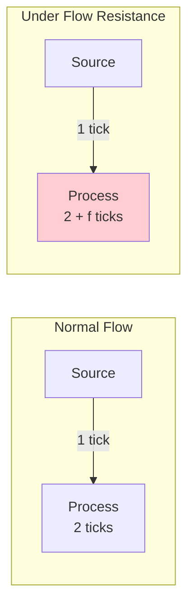

**YAML config**

★ **Complete definition** (trigger + effect + expiry + config)

```yaml
anomalies:
  - id: friction_assembly
    type: flow_resistance
    target: assembly_line
    trigger:
      conditions:
        - type: queue_overflow
          threshold: 0.40        # activates when queue is 40%+ full
        - type: probability
          chance: 0.30           # 30% chance per tick when conditions met
      logic: and
    effect:
      system: script
      mutation: extra_processing_ticks
    expiry:
      type: condition
      expression: "queue_depth(assembly_line) < 0.15"
    config:
      friction_factor: 0.1      # extra ticks = queue_depth * friction_factor
      max_extra_ticks: 5        # cap on added delay
```

**Engine behavior**

1. Each tick during the anomaly window, check the target block's `container.size`.
2. Compute `extra = min(floor(queue_depth * friction_factor), max_extra_ticks)`.
3. If the block is about to start processing (`state → PROCESSING`), add `extra` to `_proc_ticks_left`.
4. Log `ANOMALY_EFFECT` with `type=flow_resistance`, `extra_ticks=extra`.

**Detection pattern**

- `ANOMALY_EFFECT` events with `type=flow_resistance`.
- Increasing `processing_duration` in `ITEM_PROCESSING_STARTED` events compared to configured `processing_ticks`.
- `TICK_SUMMARY` shows declining throughput with constant input rate.

---

### s14.2: Pressure Buildup

> **Category:** Fluid dynamics
> **Mechanic ID:** s14.2

**Physics analogy**

Hydraulic pressure in a sealed system. When the outflow is restricted, pressure builds
behind every upstream component. In business, this is the "silent slowdown" — when
a downstream department stops processing, every upstream team gradually grinds to a halt,
even without explicit backpressure signals.

**What it does**

Unlike standard backpressure (s13.13), which is a binary gate, pressure buildup adds a
**graduated slowdown** to upstream blocks. The fuller the downstream container, the slower
upstream blocks process — a smooth degradation curve instead of an on/off switch.

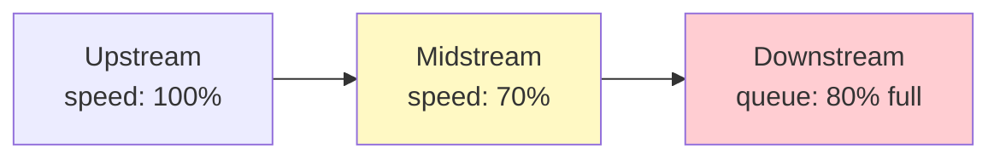

**YAML config**

★ **Complete definition** (trigger + effect + expiry + config)

```yaml
anomalies:
  - id: pressure_downstream
    type: pressure_buildup
    target: shipping_dock
    trigger:
      conditions:
        - type: queue_overflow
          threshold: 0.70        # downstream dock at 70%+ capacity
        - type: time_elapsed_in_state
          ticks: 5               # sustained for 5 ticks before activating
      logic: and
    effect:
      system: script
      mutation: upstream_slowdown
    expiry:
      type: condition
      expression: "queue_depth(shipping_dock) < 0.40"
    config:
      propagation_hops: 3       # how many upstream blocks affected
      slowdown_curve: linear    # linear | exponential
      max_slowdown: 0.5         # at max pressure, speed * 0.5
```

**Engine behavior**

1. Each tick, compute the downstream target's queue fill ratio: `fill = container.size / capacity`.
2. Walk upstream along incoming data edges for `propagation_hops` levels.
3. For each upstream block, compute slowdown: `factor = 1.0 - (fill * max_slowdown / hop_distance)`.
4. Multiply the upstream block's effective `processing_ticks` by `1 / factor` (adding delay).
5. Log `ANOMALY_EFFECT` with `type=pressure_buildup`, `affected_blocks=[...]`, `fill_ratio=fill`.

**Detection pattern**

- Upstream blocks show increasing `ITEM_PROCESSING_STARTED` durations without local queue growth.
- Downstream `container.size` approaching capacity before upstream slowdown begins.
- `ANOMALY_EFFECT` events trace the propagation chain.

---

### s14.3: Turbulence

> **Category:** Fluid dynamics
> **Mechanic ID:** s14.3

**Physics analogy**

Turbulent flow in a pipe. Instead of smooth laminar flow where every molecule follows a
predictable path, turbulence introduces chaotic eddies and vortices. Processing time
fluctuates randomly — sometimes faster, sometimes much slower.

**What it does**

Replaces a block's fixed `processing_ticks` with a random value drawn from a distribution
centered on the original value. Each processing cycle gets a different duration. This models
inconsistent worker performance, variable machine cycle times, and unpredictable network
latency.

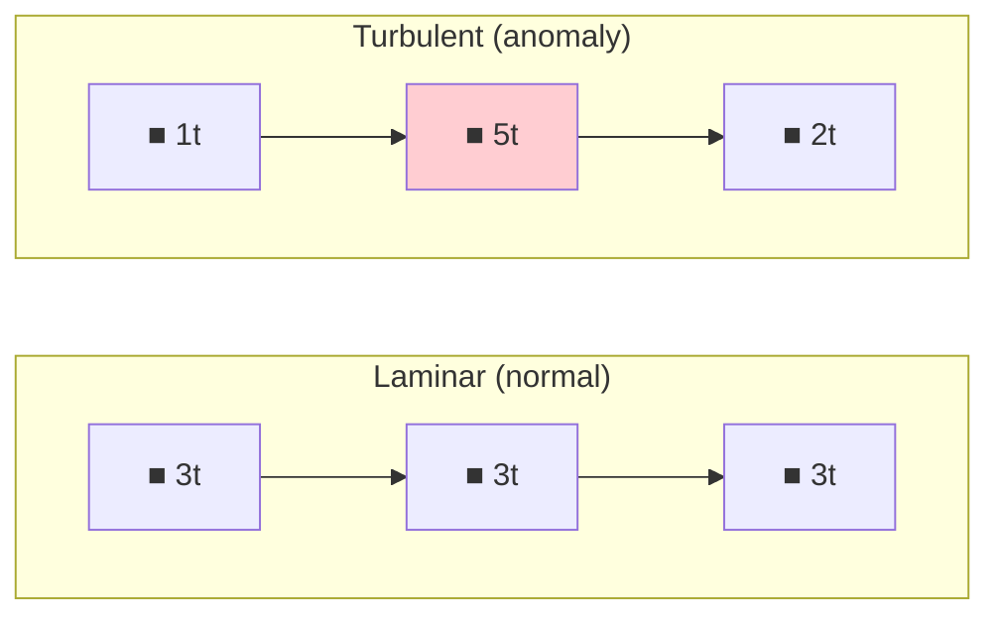

**YAML config**

```yaml
anomalies:
  - id: turbulence_machining
    type: turbulence
    target: cnc_machine
    trigger:
      conditions:
        - type: probability
          chance: 0.08            # 8% chance per tick of onset
      logic: any
    effect:
      system: script
      mutation: random_duration_variance
    expiry:
      type: time_elapsed
      ticks: 30                   # turbulence episode lasts 30 ticks
    config:
      distribution: normal    # normal | uniform | exponential
      stddev_factor: 0.3      # stddev = processing_ticks * factor
      min_ticks: 1            # floor
```

**Engine behavior**

1. When the target block transitions to PROCESSING, intercept `_proc_ticks_left`.
2. Draw a random value: `new_ticks = max(min_ticks, round(random.gauss(processing_ticks, processing_ticks * stddev_factor)))`.
3. Set `_proc_ticks_left = new_ticks`.
4. Log `ANOMALY_EFFECT` with `type=turbulence`, `original_ticks`, `actual_ticks`.

**Detection pattern**

- High variance in `duration_ticks` across `ITEM_PROCESSING_STARTED` events for the same block.
- Standard deviation of processing time exceeds configured `processing_ticks * 0.1`.

---

### s14.4: Leakage

> **Category:** Fluid dynamics
> **Mechanic ID:** s14.4

**Physics analogy**

A leak in a pipe or tank. Some fluid never reaches the destination — it drips out and is lost.
In business, this is shrinkage: inventory that disappears, emails that never arrive, orders
that fall through the cracks with no error and no trace.

**What it does**

Each tick, items in the target block's container have a small probability of vanishing entirely.
Unlike `reject_rate` (which routes items to reject edges) or `fail_chance` (which triggers
retry/DLQ), leaked items simply disappear — no event except the anomaly log.

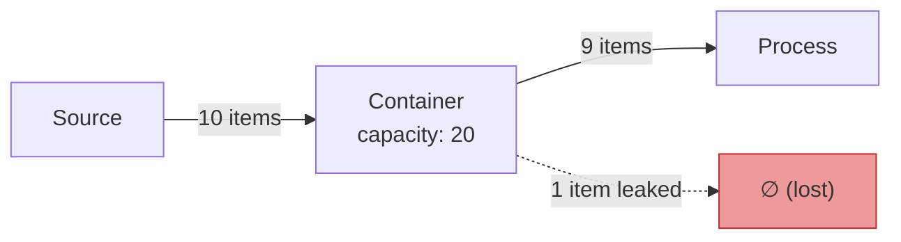

**YAML config**

```yaml
anomalies:
  - id: leak_warehouse
    type: leakage
    target: warehouse_buffer
    trigger:
      conditions:
        - type: data_threshold
          metric: data_count
          operator: ">"
          value: 50              # activate when container holds 50+ items
        - type: probability
          chance: 0.25
      logic: and
    effect:
      system: container
      mutation: item_loss
    expiry:
      type: time_elapsed
      ticks: 150
    config:
      loss_probability: 0.03   # per item per tick
      loss_type: silent        # silent | logged
```

**Engine behavior**

1. Each tick, iterate through the target block's `container._items`.
2. For each item, roll `random.random() < loss_probability`.
3. If true, remove the item from the container.
4. If `loss_type: logged`, emit `ANOMALY_EFFECT` with `lost_item_id`. If `silent`, emit only the anomaly effect count.
5. Lost items are NOT sent to DLQ (they are truly lost).

**Detection pattern**

- Item count discrepancy: `source.processed - sink.processed > expected_in_transit`.
- `ANOMALY_EFFECT` events with `type=leakage` and `items_lost > 0`.
- DLQ does not grow (distinguishing leakage from failures).

---

### s14.5: Cavitation

> **Category:** Fluid dynamics
> **Mechanic ID:** s14.5

**Physics analogy**

Cavitation occurs when fluid flow suddenly stops and a vacuum bubble forms in the pipe. When flow
resumes, the bubble collapses violently, causing damage. In systems, this is the "cold start
penalty" — when a block that was running at full speed suddenly gets no input, restarting is
expensive.

**What it does**

When an active block's input drops to zero for N consecutive ticks, it enters a stall state.
Resuming requires a warmup penalty (extra ticks before normal processing resumes). The longer
the stall, the worse the penalty.

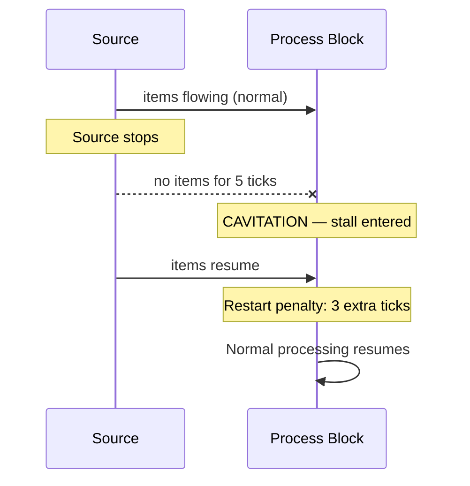

**YAML config**

```yaml
anomalies:
  - id: cavitation_line
    type: cavitation
    target: assembly_line
    trigger:
      conditions:
        - type: queue_empty
          threshold: 0.05        # activates when queue is nearly empty
      logic: any
    effect:
      system: script
      mutation: restart_penalty
    expiry:
      type: condition
      expression: "queue_depth(assembly_line) > 0.1"
    config:
      stall_threshold: 5        # ticks with zero input before stall
      restart_penalty_base: 2   # base ticks to restart
      penalty_per_stall_tick: 1 # extra tick per tick stalled
      max_penalty: 10
```

**Engine behavior**

1. Track consecutive ticks where `container.size == 0` and block is IDLE → increment `_stall_counter`.
2. When `_stall_counter >= stall_threshold`, mark block as cavitating.
3. When new items arrive: `penalty = min(restart_penalty_base + (stall_ticks - threshold) * penalty_per_stall_tick, max_penalty)`.
4. Add `penalty` to the first processing cycle's `_proc_ticks_left`.
5. Reset `_stall_counter`.
6. Log `ANOMALY_EFFECT` with `type=cavitation`, `stall_ticks`, `restart_penalty`.

**Detection pattern**

- `ANOMALY_EFFECT` events with `type=cavitation` and `restart_penalty > 0`.
- Gaps in `ITEM_PROCESSING_STARTED` followed by unusually long first processing duration.

---

### s14.6: Thermal Noise

> **Category:** Thermodynamics
> **Mechanic ID:** s14.6

**Physics analogy**

Brownian motion — the random jiggling of molecules due to thermal energy. Every measurement
has noise. Every timer has jitter. In systems, this is the baseline randomness that affects
all operations: network latency jitter, human reaction time variation, clock imprecision.

**What it does**

Applies a small random offset to **all timing parameters** of the target block each tick:
`processing_ticks`, `batch_timeout`, `schedule_interval`, and particle transit time. Unlike
turbulence (which targets processing time only), thermal noise affects everything.

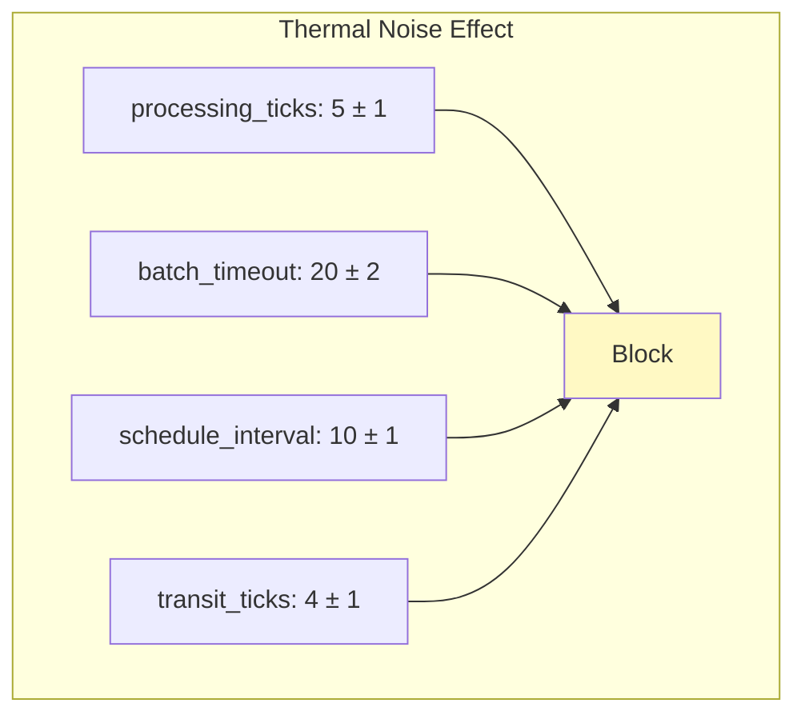

**YAML config**

```yaml
anomalies:
  - id: noise_floor
    type: thermal_noise
    target: all                # special: applies to every block
    trigger:
      conditions:
        - type: probability
          chance: 1.0            # inherent noise: always active once started
      logic: any
    effect:
      system: script
      mutation: timing_jitter
    expiry:
      type: never
    config:
      jitter_range: 1          # ± ticks applied to timing params
      affects:                 # which params to jitter
        - processing_ticks
        - batch_timeout
```

**Engine behavior**

1. Each tick, for every affected block, compute `jitter = random.randint(-jitter_range, +jitter_range)`.
2. Apply jitter to the effective value of each configured parameter (never below 1).
3. Jitter is recomputed each tick — not persistent.
4. Log `ANOMALY_EFFECT` with `type=thermal_noise`, `block`, `jitters={param: offset}`.

**Detection pattern**

- Small random variation in `duration_ticks` across all `ITEM_PROCESSING_STARTED` events.
- Aggregate timing metrics show wider confidence intervals without a directional trend.

---

### s14.7: Heat Buildup

> **Category:** Thermodynamics
> **Mechanic ID:** s14.7

**Physics analogy**

A machine running continuously generates heat. Without cooling, it runs slower and slower
until thermal shutdown. In business, this is fatigue — the 10th hour of a shift is less
productive than the first. Continuous operation degrades performance.

**What it does**

Each tick that the block is in PROCESSING state, a "heat" counter increments. Processing time
increases proportionally to accumulated heat. If heat reaches a threshold, the block enters
a forced cooldown (similar to maintenance). Heat dissipates slowly during IDLE ticks.

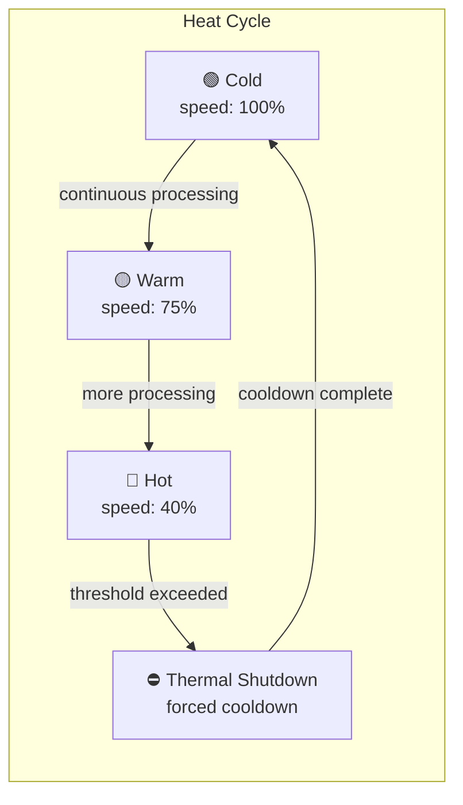

**YAML config**

```yaml
anomalies:
  - id: heat_furnace
    type: heat_buildup
    target: blast_furnace
    trigger:
      conditions:
        - type: block_state
          state: processing      # accumulates heat only while processing
        - type: time_elapsed_in_state
          ticks: 5               # must have been processing for 5+ ticks
      logic: and
    effect:
      system: script
      mutation: progressive_slowdown
    expiry:
      type: block_state
      state: idle                # resets when block goes idle
    config:
      heat_per_processing_tick: 0.02   # heat gained per processing tick
      cooldown_per_idle_tick: 0.01     # heat lost per idle tick
      slowdown_per_heat: 0.5           # extra ticks = heat * factor
      thermal_shutdown_at: 1.0         # forced cooldown at this heat level
      shutdown_duration: 10            # ticks of forced cooldown
```

**Engine behavior**

1. Each tick where `state == PROCESSING`: `heat += heat_per_processing_tick`.
2. Each tick where `state == IDLE`: `heat = max(0, heat - cooldown_per_idle_tick)`.
3. When starting processing: `effective_ticks = processing_ticks + floor(heat * slowdown_per_heat)`.
4. If `heat >= thermal_shutdown_at`: force block to MAINTENANCE state for `shutdown_duration` ticks, reset heat to 0.
5. Log `ANOMALY_EFFECT` with `type=heat_buildup`, `heat_level`, `effective_ticks` or `thermal_shutdown`.

**Detection pattern**

- `effective_ticks` in `ITEM_PROCESSING_STARTED` increases monotonically during sustained processing.
- `ANOMALY_EFFECT` events show `heat_level` approaching `thermal_shutdown_at`.
- Sudden `MAINTENANCE_STARTED` events without matching `maintenance_interval`.

---

### s14.8: Entropy Increase

> **Category:** Thermodynamics
> **Mechanic ID:** s14.8

**Physics analogy**

The second law of thermodynamics — entropy always increases. Data degrades. Copies accumulate
errors. Transmitted messages lose fidelity. In business, this is data rot: a phone number
gets one digit wrong, an address field loses a character, an order quantity gets transposed.

**What it does**

Each tick an item sits in a container, there is a small probability that one of its `data`
fields gets corrupted (replaced with a garbage value). Items that pass through more blocks
accumulate more corruption. Downstream blocks with validation can detect and reject corrupted
items.

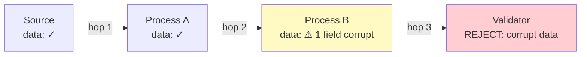

**YAML config**

```yaml
anomalies:
  - id: entropy_data
    type: entropy_increase
    target: all
    trigger:
      conditions:
        - type: tick_range
          from_tick: 100
          to_tick: 400
        - type: probability
          chance: 1.0              # always active during defined tick range
      logic: and
    effect:
      system: data
      mutation: corrupt_fields
    expiry:
      type: tick_range
      to_tick: 400
    config:
      corruption_probability: 0.01   # per item per tick in container
      corruption_mode: field_noise   # field_noise | field_drop | type_change
      detectable: true               # if true, adds _corrupted tag to item
```

**Engine behavior**

1. Each tick, iterate items in target block's container.
2. For each item, roll `random.random() < corruption_probability`.
3. If true, based on `corruption_mode`:
   - `field_noise`: pick random `data` key, replace value with garbage string.
   - `field_drop`: delete a random `data` key.
   - `type_change`: change `item.type` to `corrupted_{original_type}`.
4. If `detectable: true`, set `item.tags["_corrupted"] = True`.
5. Log `ANOMALY_EFFECT` with `type=entropy_increase`, `item_id`, `field_affected`.

**Detection pattern**

- Items arriving at validators with `_corrupted` tag → triggers `ITEM_REJECTED`.
- `ANOMALY_EFFECT` events with `type=entropy_increase`.
- Increasing reject rates at downstream blocks without changes to `reject_rate` config.

---

### s14.9: Phase Transition

> **Category:** Thermodynamics
> **Mechanic ID:** s14.9

**Physics analogy**

Water at 99°C is liquid. At 100°C it becomes steam — a completely different behavior from a
tiny temperature change. Phase transitions are discontinuous: the system snaps from one mode
to another at a critical threshold. In business, this is the tipping point: a call center
handling 90% load is fine, at 95% it collapses.

**What it does**

Monitors a metric on the target block (queue depth, processed count, health, or a custom
counter). When the metric crosses a configured threshold, the block's behavior changes
abruptly: different processing time, different fail chance, different concurrency. The change
is immediate and discontinuous.

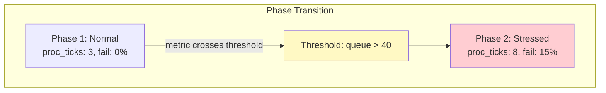

**YAML config**

```yaml
anomalies:
  - id: phase_call_center
    type: phase_transition
    target: call_handler
    trigger:
      conditions:
        - type: queue_overflow
          threshold: 0.70          # activates when queue is 70%+ full
      logic: any
    effect:
      system: script
      mutation: behavior_mode_switch
    expiry:
      type: condition
      expression: "queue_depth(call_handler) < 0.40"
    config:
      metric: queue_depth          # queue_depth | processed_count | health
      threshold: 40
      direction: above             # above | below
      phase_2:
        processing_ticks: 8
        fail_chance: 0.15
        concurrency: 1
      revert_threshold: 20         # revert to phase 1 below this
```

**Engine behavior**

1. Each tick, read the configured `metric` from the target block's runtime.
2. If `metric >= threshold` (for `direction: above`): apply `phase_2` overrides to block runtime fields.
3. If `metric <= revert_threshold`: restore original values.
4. Log `ANOMALY_EFFECT` with `type=phase_transition`, `phase=1|2`, `metric_value`.
5. Only one phase transition per anomaly — no multi-phase cascades from a single config.

**Detection pattern**

- Abrupt step change in `duration_ticks` or `fail_chance` in event logs.
- `ANOMALY_EFFECT` events with `phase=2` when metric crosses threshold.
- Block metrics show bimodal distribution (two distinct operating regimes).

---

### s14.10: Impedance Mismatch

> **Category:** Electrical
> **Mechanic ID:** s14.10

**Physics analogy**

When an electrical signal hits a boundary between two media with different impedances, part
of it reflects back. A fast producer connected to a slow consumer creates a standing wave
of items bouncing back. In business, this is the handoff problem: a fast team sends work
to a slow team, and the overflow bounces back as rework, escalations, or returns.

**What it does**

When a block processes items faster than its downstream neighbor can accept them, a fraction
of items are "reflected" back into the source block's container. This is different from
backpressure (which stops the upstream) — here the upstream keeps running but some output
bounces back.

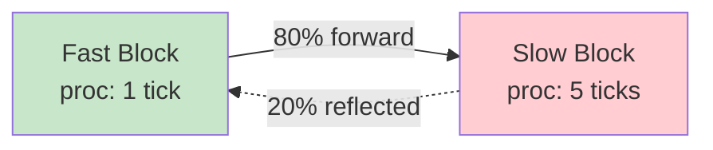

**YAML config**

```yaml
anomalies:
  - id: mismatch_assembly
    type: impedance_mismatch
    target: fast_stamper          # the faster block
    trigger:
      conditions:
        - type: queue_overflow
          threshold: 0.80
          block: slow_qc          # watch the downstream block specifically
      logic: any
    effect:
      system: data
      mutation: item_reflection
    expiry:
      type: condition
      expression: "queue_depth(slow_qc) < 0.40"
    config:
      downstream_block: slow_qc
      reflection_rate: 0.2        # fraction reflected when downstream is full
      trigger_fill_ratio: 0.8     # downstream fill ratio that starts reflection
```

**Engine behavior**

1. When the target block routes items to downstream, check downstream's `container.size / capacity`.
2. If fill ratio > `trigger_fill_ratio`: for each item, roll `random.random() < reflection_rate`.
3. If reflected: push item back into the source block's container (re-queue).
4. Log `ANOMALY_EFFECT` with `type=impedance_mismatch`, `reflected_item_id`, `downstream_fill`.

**Detection pattern**

- Items appearing in `ITEM_QUEUED` events for a block they were already processed by.
- `ANOMALY_EFFECT` events with `type=impedance_mismatch`.
- Audit trail shows the same block appearing twice for the same item.

---

### s14.11: Signal Attenuation

> **Category:** Electrical
> **Mechanic ID:** s14.11

**Physics analogy**

A radio signal weakens with distance. After enough hops through repeaters, the signal is
indistinguishable from noise. In organizations, this is the "telephone game" — an instruction
passed through five intermediaries arrives garbled or not at all.

**What it does**

Signal edges have a delivery probability that decreases with the number of hops from the
original emitter. A signal emitted by block A reaches block B (1 hop) with 95% probability,
block C (2 hops) with 90%, and so on. Lost signals simply don't arrive.

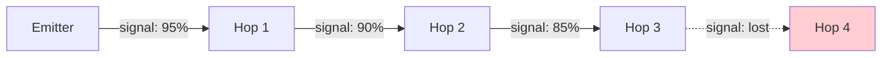

**YAML config**

```yaml
anomalies:
  - id: attenuation_signals
    type: signal_attenuation
    target: all
    trigger:
      conditions:
        - type: probability
          chance: 1.0               # inherent property of all signal edges
      logic: any
    effect:
      system: signal
      mutation: delivery_probability_reduction
    expiry:
      type: never
    config:
      base_delivery_probability: 0.98
      attenuation_per_hop: 0.05     # probability loss per hop
      min_probability: 0.1          # floor
```

**Engine behavior**

1. When `_pending_signals` are delivered to targets, compute the hop count (number of signal edges from original emitter to destination).
2. `delivery_prob = max(min_probability, base_delivery_probability - (hop_count * attenuation_per_hop))`.
3. Roll `random.random() < delivery_prob`. If false, drop the signal.
4. Log `ANOMALY_EFFECT` with `type=signal_attenuation`, `signal`, `hop_count`, `probability`, `delivered=true|false`.

**Detection pattern**

- `SIGNAL_RECEIVED` events decrease for blocks far from emitters.
- `ANOMALY_EFFECT` events with `delivered=false`.
- Blocks with `fires_on: trigger` enter extended WAITING periods.

---

### s14.12: Crosstalk

> **Category:** Electrical
> **Mechanic ID:** s14.12

**Physics analogy**

Electromagnetic interference between parallel wires. A signal on one wire induces a ghost
signal on an adjacent wire. In business, this is the wrong-department problem: a message
meant for shipping accidentally ends up in billing; an order for customer A gets mixed into
customer B's batch.

**What it does**

When two data edges run "in parallel" (same source block or adjacent blocks), items
occasionally jump from one path to the other. An item meant for block B ends up at block C.
This models routing errors, misfiled documents, and cross-contamination between production
lines.

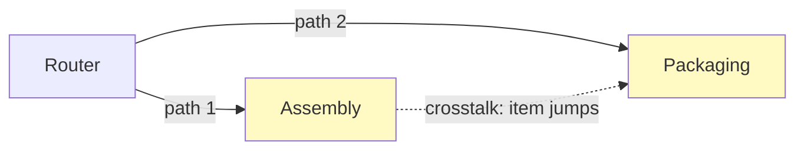

**YAML config**

```yaml
anomalies:
  - id: crosstalk_lines
    type: crosstalk
    targets:
      - line_a_assembly
      - line_b_assembly
    trigger:
      conditions:
        - type: probability
          chance: 0.30           # 30% chance per tick of crosstalk onset
      logic: any
    effect:
      system: data
      mutation: cross_container_injection
    expiry:
      type: time_elapsed
      ticks: 60                  # crosstalk episode lasts 60 ticks
    config:
      cross_probability: 0.02    # per item per tick
```

**Engine behavior**

1. Each tick, for each pair of target blocks, iterate items in both containers.
2. For each item, roll `random.random() < cross_probability`.
3. If true, remove item from current container, push into the paired block's container.
4. Log `ANOMALY_EFFECT` with `type=crosstalk`, `item_id`, `from_block`, `to_block`.

**Detection pattern**

- Items appearing in blocks they were never routed to.
- Audit trail shows unexpected block transitions.
- `ANOMALY_EFFECT` events with `type=crosstalk`.

---

### s14.13: Short Circuit

> **Category:** Electrical
> **Mechanic ID:** s14.13

**Physics analogy**

A short circuit bypasses the normal path — current flows directly from source to ground,
skipping all intermediate resistance. In business, this is the "skip the process" scenario:
a rush order bypasses quality control, a VIP request skips the queue.

**What it does**

Items at the target block have a small probability of skipping it entirely — they are
teleported directly to the block's downstream neighbor without processing. No script runs,
no value is emitted, no cost is charged. The item's audit trail records the bypass.

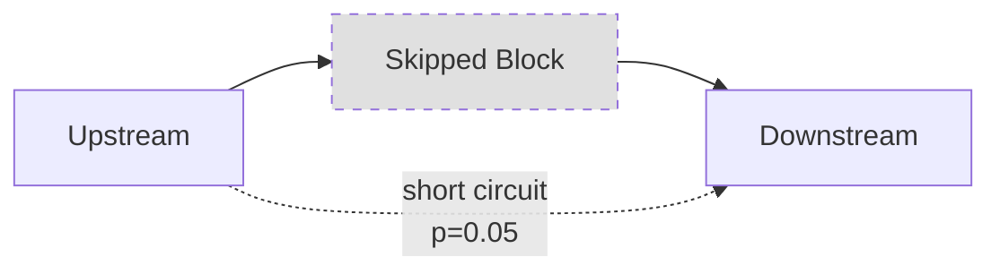

**YAML config**

```yaml
anomalies:
  - id: shortcircuit_qc
    type: short_circuit
    target: quality_check
    trigger:
      conditions:
        - type: queue_overflow
          threshold: 0.65        # activate when QC is backed up to 65%
        - type: probability
          chance: 0.25
      logic: and
    effect:
      system: port
      mutation: bypass_processing
    expiry:
      type: condition
      expression: "queue_depth(quality_check) < 0.30"
    config:
      bypass_probability: 0.05
      stamp_bypass: true          # add "bypassed" to audit trail
```

**Engine behavior**

1. When items are pushed into the target block's container, roll `random.random() < bypass_probability`.
2. If true, instead of queuing the item, immediately route it to the first downstream data edge target.
3. If `stamp_bypass: true`, call `item.stamp(target_id, "bypassed", tick)`.
4. Log `ANOMALY_EFFECT` with `type=short_circuit`, `item_id`, `bypassed_block`.

**Detection pattern**

- Items in downstream blocks whose audit trail skips the target block.
- `ANOMALY_EFFECT` events with `type=short_circuit`.
- Target block's `processed` count is lower than expected given input volume.

---

### s14.14: Brownout

> **Category:** Electrical
> **Mechanic ID:** s14.14

**Physics analogy**

A voltage dip in the power grid. Equipment still runs but at reduced capacity. Lights dim,
motors slow down, but nothing fully stops. In business, this is partial resource availability:
half the team is out sick, the server cluster loses 2 of 5 nodes, the warehouse runs on
backup power.

**What it does**

Temporarily reduces a `ResourcePool`'s capacity to a fraction of its normal value. Blocks
that require resource slots see increased contention and wait times. When the brownout ends,
full capacity is restored.

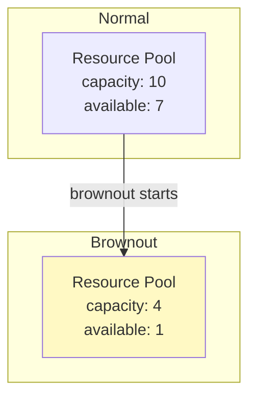

**YAML config**

```yaml
anomalies:
  - id: brownout_welders
    type: brownout
    target: welder_pool          # resource pool ID
    trigger:
      conditions:
        - type: probability
          chance: 0.05           # 5% chance per tick of brownout onset
      logic: any
    effect:
      system: container
      mutation: capacity_reduction
    expiry:
      type: time_elapsed
      ticks: 60                  # brownout lasts 60 ticks
    config:
      reduced_capacity: 0.4      # fraction of original capacity
```

**Engine behavior**

1. On `start_tick`, save original `pool.capacity`.
2. Set `pool.capacity = floor(original * reduced_capacity)`.
3. Release any excess slots if `_used > new_capacity` (forced preemption logged).
4. On deactivation, restore `pool.capacity = original`.
5. Log `ANOMALY_ACTIVATED` with `type=brownout`, `original_capacity`, `reduced_capacity`.

**Detection pattern**

- Spike in `RESOURCE_BLOCKED` events during the anomaly window.
- `ANOMALY_ACTIVATED` / `ANOMALY_EXPIRED` events with `type=brownout`.
- Resource pool `available` drops without increased `used` count.

---

### s14.15: Quantum Tunneling

> **Category:** Quantum/probabilistic
> **Mechanic ID:** s14.15

**Physics analogy**

A particle encountering an energy barrier has a tiny but nonzero probability of appearing
on the other side without crossing it. In business, this is the inexplicable shortcut: a
package arrives before it was shipped, a ticket gets resolved without anyone touching it,
a form appears in the "completed" pile without going through review.

**What it does**

Items queued at the target block have a very small probability of teleporting past the block
and appearing directly in the **next-but-one** downstream block (skipping two blocks). Unlike
short circuit (which skips one block), tunneling skips the current block AND its immediate
downstream neighbor.

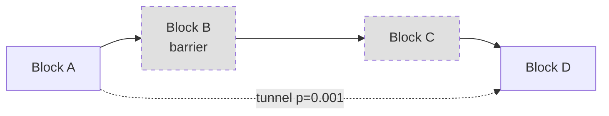

**YAML config**

```yaml
anomalies:
  - id: tunnel_approval
    type: quantum_tunneling
    target: approval_gate
    trigger:
      conditions:
        - type: probability
          chance: 1.0              # inherent stochastic property: always eligible
      logic: any
    effect:
      system: port
      mutation: item_teleport
    expiry:
      type: never
    config:
      tunnel_probability: 0.001    # very rare
      skip_blocks: 2               # how many blocks to skip
```

**Engine behavior**

1. Each tick, for each item in the target block's container, roll `random.random() < tunnel_probability`.
2. If true, remove from container. Follow data edges `skip_blocks` hops downstream.
3. Push item into that block's container.
4. Stamp `item.stamp(target_id, "tunneled", tick)`.
5. Log `ANOMALY_EFFECT` with `type=quantum_tunneling`, `item_id`, `skipped_blocks=[...]`.

**Detection pattern**

- Audit trail shows item jumping from block A directly to block D.
- `ANOMALY_EFFECT` events with `type=quantum_tunneling`.
- Intermediate blocks show no record of the item.

---

### s14.16: Superposition

> **Category:** Quantum/probabilistic
> **Mechanic ID:** s14.16

**Physics analogy**

A quantum particle exists in multiple states simultaneously until measured. Schrödinger's
cat is both alive and dead until the box is opened. In business, this is the ambiguous
outcome: a loan application is both approved and rejected until the committee votes;
a defect is both critical and cosmetic until the inspector looks at it.

**What it does**

When an item enters the target block, it is duplicated into N "superposed" copies, each
carrying a different outcome tag. When the item is processed (observed), only one copy
survives — chosen probabilistically. The other copies are discarded. This models
uncertain outcomes that are resolved only at the point of decision.

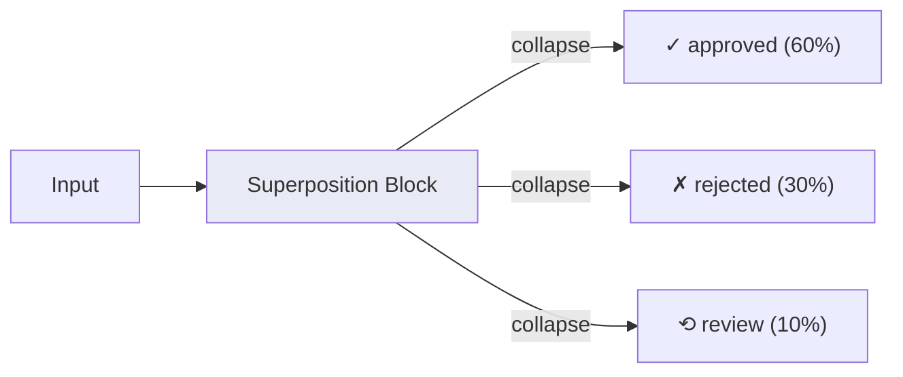

**YAML config**

```yaml
anomalies:
  - id: superposition_review
    type: superposition
    target: review_board
    trigger:
      conditions:
        - type: probability
          chance: 1.0              # always eligible: replaces standard outcome routing
      logic: any
    effect:
      system: script
      mutation: outcome_replacement
    expiry:
      type: never
    config:
      states:
        - outcome: approved
          probability: 0.6
          output_type: approved_order
        - outcome: rejected
          probability: 0.3
          output_type: rejected_order
        - outcome: review
          probability: 0.1
          output_type: review_order
```

**Engine behavior**

1. When processing completes for an item in the target block, instead of using `resolve_outcome()`, use the superposition config.
2. Roll `random.random()` against cumulative probabilities to select one state.
3. Set `item.type = output_type` from the selected state.
4. Set `item.tags["_superposition_outcome"] = outcome`.
5. Route normally via data edges.
6. Log `ANOMALY_EFFECT` with `type=superposition`, `item_id`, `collapsed_to=outcome`.

**Detection pattern**

- `ANOMALY_EFFECT` events with `type=superposition` and `collapsed_to` values.
- Item types change at the target block in a distribution matching config.
- Downstream blocks receive a mix of output types from a single source block.

---

### s14.17: Entanglement

> **Category:** Quantum/probabilistic
> **Mechanic ID:** s14.17

**Physics analogy**

Two entangled particles share a quantum state — measuring one instantly determines the other,
regardless of distance. In business, this is correlated failure: when the east coast data
center goes down, the west coast disaster-recovery site also fails because they share the same
firmware bug.

**What it does**

Links two blocks so their outcomes are correlated. When one block fails, the other fails with
high probability on the same tick. When one succeeds, the other tends to succeed. The
correlation strength is configurable from 0 (independent) to 1 (perfectly correlated).

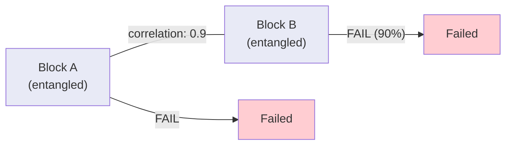

**YAML config**

```yaml
anomalies:
  - id: entangle_dc
    type: entanglement
    targets:
      - primary_server
      - failover_server
    trigger:
      conditions:
        - type: probability
          chance: 1.0              # always active: inherent property of entangled blocks
      logic: any
    effect:
      system: script
      mutation: outcome_correlation_link
    expiry:
      type: never
    config:
      correlation: 0.9           # 0 = independent, 1 = perfectly correlated
      affects: outcome            # outcome | state | health
```

**Engine behavior**

1. When block A's `resolve_outcome()` is called, record the result.
2. When block B's `resolve_outcome()` is called on the same tick:
   - Roll `random.random() < correlation`.
   - If true, return block A's outcome (correlated).
   - If false, resolve independently.
3. Log `ANOMALY_EFFECT` with `type=entanglement`, `block_a_outcome`, `block_b_outcome`, `correlated=true|false`.

**Detection pattern**

- `ITEM_FAILED` events on both blocks in the same tick more often than chance.
- `ANOMALY_EFFECT` events with `correlated=true`.
- Statistical analysis: correlation coefficient of outcomes > configured value.

---

### s14.18: Observer Effect

> **Category:** Quantum/probabilistic
> **Mechanic ID:** s14.18

**Physics analogy**

Measuring a quantum system changes its state. Heisenberg's uncertainty principle says you
can't observe without disturbing. In systems, this is the monitoring overhead: adding
logging slows the application, adding a debugger changes timing, auditing a team makes
them self-conscious and changes their behavior.

**What it does**

When a block has an observation tap (s13.25) connected to it, the act of being observed
adds a small processing overhead. More taps = more overhead. This models the real cost
of monitoring, auditing, and reporting.

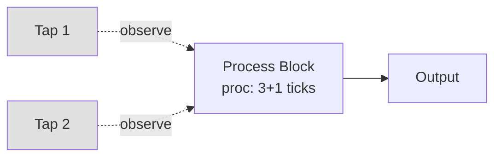

**YAML config**

```yaml
anomalies:
  - id: observer_overhead
    type: observer_effect
    target: all
    trigger:
      conditions:
        - type: probability
          chance: 1.0              # always active: adds overhead to every monitored block
      logic: any
    effect:
      system: script
      mutation: overhead_per_tap
    expiry:
      type: never
    config:
      overhead_per_tap: 1        # extra processing ticks per connected tap edge
      max_overhead: 3            # cap
```

**Engine behavior**

1. Count the number of tap edges connected to the target block.
2. Compute `overhead = min(tap_count * overhead_per_tap, max_overhead)`.
3. Add `overhead` to `_proc_ticks_left` when processing starts.
4. Log `ANOMALY_EFFECT` with `type=observer_effect`, `block`, `tap_count`, `overhead`.

**Detection pattern**

- Blocks with tap edges show longer processing times than configured `processing_ticks`.
- `ANOMALY_EFFECT` events with `type=observer_effect` and `overhead > 0`.
- Removing tap edges (if engine supports it) restores original processing time.

---

### s14.19: Catalyst

> **Category:** Chemistry
> **Mechanic ID:** s14.19

**Physics analogy**

A catalyst speeds up a chemical reaction without being consumed. It lowers the activation
energy needed. In business, this is the expert consultant, the new tool that speeds up the
whole team, or the process improvement that makes neighboring steps faster without
adding resources.

**What it does**

Designates a block as a catalyst for its neighbors. While the catalyst block is active
(not in FAILED or MAINTENANCE state), all blocks connected to it by data edges process
faster — their effective `processing_ticks` is reduced. The catalyst itself doesn't
consume items for this effect; it operates normally on its own workload.

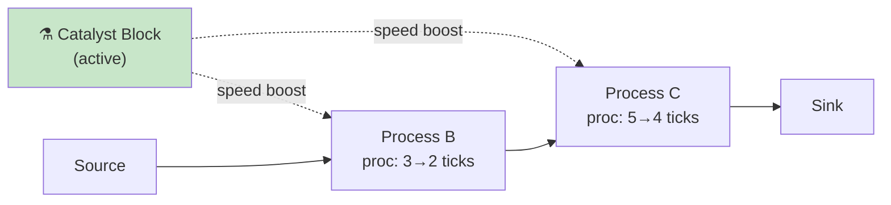

**YAML config**

```yaml
anomalies:
  - id: catalyst_expert
    type: catalyst
    target: expert_consultant
    trigger:
      conditions:
        - type: block_state
          state: processing        # boost is active when catalyst block is processing
      logic: any
    effect:
      system: script
      mutation: neighbor_speed_boost
    expiry:
      type: block_state
      state: unavailable           # boost disables when catalyst becomes unavailable
    config:
      speed_boost: 1             # ticks reduced on neighbors
      max_boost_fraction: 0.5    # can't reduce below 50% of original
      radius: 1                  # number of hops the boost reaches
```

**Engine behavior**

1. Each tick, check if the catalyst block state is IDLE or PROCESSING (active).
2. If active, find all blocks within `radius` data-edge hops.
3. For each neighbor, reduce effective `processing_ticks` by `speed_boost`, but not below `original * (1 - max_boost_fraction)`.
4. If catalyst enters FAILED or MAINTENANCE, remove the boost.
5. Log `ANOMALY_EFFECT` with `type=catalyst`, `boosted_blocks=[...]`, `speed_reduction`.

**Detection pattern**

- Neighbor blocks show lower `duration_ticks` in `ITEM_PROCESSING_STARTED` events.
- `ANOMALY_EFFECT` events with `type=catalyst` and `boosted_blocks`.
- Removing the catalyst block increases neighbor processing times.

---

### s14.20: Corrosion

> **Category:** Chemistry
> **Mechanic ID:** s14.20

**Physics analogy**

Metal pipes corrode over time — the internal surface roughens, flow resistance increases,
and eventually the pipe develops holes. In systems, this is the aging infrastructure:
an integration that gets flakier over time, a database connection that times out more
frequently, a conveyor belt that develops more jams as it ages.

**What it does**

Data edges degrade over time. Each tick, the edge's failure probability increases by a small
amount. Items traversing a corroded edge have an increasing chance of being lost in transit
(dropped) or delayed (extra particle ticks). Eventually, a fully corroded edge stops
delivering items entirely.

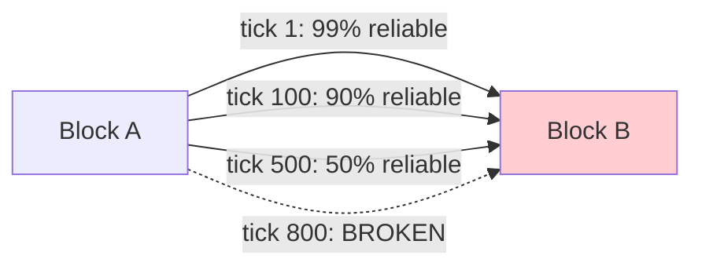

**YAML config**

```yaml
anomalies:
  - id: corrosion_pipe
    type: corrosion
    target: edge_assembly_to_qc    # edge ID (from:to pair)
    trigger:
      conditions:
        - type: probability
          chance: 1.0              # inherent degradation: always accumulates
      logic: any
    effect:
      system: port
      mutation: throttle
    expiry:
      type: never
    config:
      degradation_rate: 0.001      # failure prob increase per tick
      max_failure_prob: 1.0        # fully corroded = no delivery
      extra_transit_ticks: 1       # added per 0.1 failure_prob
```

**Engine behavior**

1. Track `corrosion_level` for the target edge, starting at 0.
2. Each tick: `corrosion_level = min(corrosion_level + degradation_rate, max_failure_prob)`.
3. When a particle uses this edge: roll `random.random() < corrosion_level`.
4. If true, the particle is destroyed (item lost) or delayed by `extra_transit_ticks * floor(corrosion_level * 10)`.
5. Log `ANOMALY_EFFECT` with `type=corrosion`, `edge`, `corrosion_level`, `item_lost|delayed`.

**Detection pattern**

- Increasing item loss rate on specific edges over time.
- `ANOMALY_EFFECT` events with `type=corrosion` and rising `corrosion_level`.
- Downstream block input rate drops while upstream output rate stays constant.

---

### s14.21: Chain Reaction

> **Category:** Chemistry
> **Mechanic ID:** s14.21

**Physics analogy**

A nuclear chain reaction: one atom splits, releasing neutrons that split more atoms,
releasing more neutrons. The reaction is self-amplifying. In business, this is the
cascading failure: one server goes down, its load shifts to others, which then go down,
which shift more load...

**What it does**

When the target block enters FAILED state, connected blocks have a probability of also
failing. Each newly failed block can cascade the failure further, up to a configurable
depth. This models correlated infrastructure failures, supply chain disruptions, and
organizational panic.

```mermaid
graph LR
    A["Block A<br/>FAILED ✗"] -->|"cascade p=0.7"| B["Block B<br/>FAILED ✗"]
    B -->|"cascade p=0.7"| C["Block C<br/>FAILED ✗"]
    B -->|"cascade p=0.7"| D["Block D<br/>OK ✓"]
    A -->|"cascade p=0.7"| E["Block E<br/>FAILED ✗"]
    style A fill:#ef9a9a
    style B fill:#ef9a9a
    style C fill:#ef9a9a
    style E fill:#ef9a9a
    style D fill:#c8e6c9
```

**YAML config**

```yaml
anomalies:
  - id: chain_failure
    type: chain_reaction
    target: central_server
    trigger:
      conditions:
        - type: block_state
          state: unavailable       # activate when the trigger block fails
        - type: probability
          chance: 0.70             # 70% chance of cascade per tick
      logic: and
    effect:
      system: block_state
      mutation: unavailable
    expiry:
      type: signal_received
      signal: RESET
    config:
      cascade_probability: 0.7     # chance each neighbor also fails
      max_depth: 3                 # maximum cascade hops
      propagation_delay: 2         # ticks between cascade levels
      recovery_signal: RESET       # signal type that resets failed blocks
```

**Engine behavior**

1. When the target block transitions to FAILED, begin cascade.
2. For each block connected by data edges (both in/out), roll `random.random() < cascade_probability`.
3. If true, after `propagation_delay` ticks, force that block to FAILED state.
4. Repeat for newly failed blocks up to `max_depth` hops.
5. Emitting `recovery_signal` to any failed block resets it to IDLE.
6. Log `ANOMALY_CASCADE` with `type=chain_reaction`, `origin_block`, `failed_block`, `depth`.

**Detection pattern**

- Multiple `ITEM_FAILED` events across different blocks within a short tick window.
- `ANOMALY_CASCADE` events tracing the propagation path.
- Graph of failures shows expansion from a single origin node.

---

### s14.22: Saturation

> **Category:** Chemistry
> **Mechanic ID:** s14.22

**Physics analogy**

A saturated solution can't dissolve more solute — adding more has diminishing returns.
Enzyme kinetics follow the Michaelis-Menten curve: doubling substrate doesn't double
reaction rate above a threshold. In business, this is the "throwing more people at a late
project makes it later" effect.

**What it does**

A block's throughput follows a saturation curve: linear up to a threshold, then logarithmic
above it. Increasing concurrency or queue depth beyond the saturation point yields
diminishing returns — each additional unit of capacity produces less and less additional
throughput.

```mermaid
graph LR
    subgraph "Throughput vs Load"
        direction TB
        LINEAR["Load 1-10: throughput scales linearly"]
        SAT["Load 10-20: throughput grows slowly"]
        FLAT["Load 20+: throughput plateaus"]
        LINEAR --> SAT --> FLAT
    end
```

**YAML config**

```yaml
anomalies:
  - id: saturation_team
    type: saturation
    target: dev_team
    trigger:
      conditions:
        - type: queue_overflow
          threshold: 0.60          # activates when queue is 60%+ full
      logic: any
    effect:
      system: script
      mutation: throughput_cap
    expiry:
      type: condition
      expression: "queue_depth(dev_team) < 0.30"
    config:
      saturation_threshold: 10     # queue depth where diminishing returns begin
      throughput_cap: 15           # max effective items per batch_size window
      curve: logarithmic           # logarithmic | asymptotic
```

**Engine behavior**

1. Each tick, read the target block's `container.size`.
2. If `container.size > saturation_threshold`:
   - Compute effective batch capacity: `effective = threshold + floor(log(size - threshold + 1) * scale_factor)`.
   - Cap at `throughput_cap`.
   - Limit `container.pop()` calls to `effective` items even if `batch_size` is higher.
3. Log `ANOMALY_EFFECT` with `type=saturation`, `queue_depth`, `effective_throughput`.

**Detection pattern**

- `ITEM_PROCESSED` rate plateaus despite growing queue depth.
- `ANOMALY_EFFECT` events with `type=saturation` showing `effective_throughput < batch_size`.
- Queue depth grows continuously while processed count stays flat.

---

### s14.23: Byzantine Failure

> **Category:** Chaos engineering
> **Mechanic ID:** s14.23

**Physics analogy**

The Byzantine Generals Problem — a node in a distributed system sends different (and wrong)
information to different peers. It doesn't crash; it lies. In business, this is the corrupt
employee, the malfunctioning sensor that reports normal values when the machine is on fire,
or the process step that stamps "approved" on everything without actually reviewing.

**What it does**

The target block appears to process items normally — it doesn't fail, doesn't crash, doesn't
trigger circuit breakers. But its output is wrong: item types are changed, data fields are
corrupted, or items are silently routed to the wrong downstream block. The block reports
success on every processing cycle.

```mermaid
graph LR
    A[Upstream] --> B["Byzantine Block<br/>appears normal ✓"]
    B -->|"correct output (80%)"| C[Correct Path]
    B -->|"WRONG output (20%)"| D[Wrong Path]
    style B fill:#fff9c4
    style D fill:#ffcdd2
```

**YAML config**

```yaml
anomalies:
  - id: byzantine_qc
    type: byzantine_failure
    target: quality_check
    trigger:
      conditions:
        - type: tick_range
          from_tick: 200
          to_tick: 300
        - type: probability
          chance: 0.35             # 35% chance per tick within window
      logic: and
    effect:
      system: data
      mutation: output_corruption
    expiry:
      type: tick_range
      to_tick: 300
    config:
      corruption_rate: 0.2          # fraction of items corrupted
      corruption_mode: wrong_type   # wrong_type | wrong_data | wrong_route
      wrong_output_type: passed     # used with wrong_type mode
      wrong_route_target: reject_bin  # used with wrong_route mode
```

**Engine behavior**

1. After the target block completes processing (outcome = "success"), intercept item routing.
2. For each item, roll `random.random() < corruption_rate`.
3. If true, based on `corruption_mode`:
   - `wrong_type`: set `item.type = wrong_output_type`.
   - `wrong_data`: corrupt a random data field value.
   - `wrong_route`: route to `wrong_route_target` instead of normal downstream.
4. The block's processed count and state machine are unaffected — it looks healthy.
5. Log `ANOMALY_EFFECT` with `type=byzantine_failure`, `item_id`, `corruption_mode`, but NOT logged as `ITEM_FAILED`.

**Detection pattern**

- Downstream blocks receive items of unexpected types.
- `ANOMALY_EFFECT` events with `type=byzantine_failure` (only visible in raw anomaly log).
- End-to-end validation detects mismatches between expected and actual output.
- Block health, circuit breaker, and processed count all appear normal.

---

### s14.24: Clock Drift

> **Category:** Chaos engineering
> **Mechanic ID:** s14.24

**Physics analogy**

Oscillator drift — every clock runs slightly fast or slightly slow. Over time, two clocks that
started synchronized diverge. In distributed systems, clock drift causes ordering errors,
timeout miscalculation, and scheduling failures.

**What it does**

The target block's internal perception of the tick counter drifts away from the engine's
global tick. Its schedules, time windows, and timeout calculations use a skewed tick value.
This causes the block to fire at wrong times, miss time windows, or timeout prematurely.

```mermaid
graph LR
    subgraph "Clock View"
        ENGINE["Engine: tick 100"]
        BLOCK["Block: sees tick 103<br/>(drift: +3)"]
        ENGINE ---|"drift accumulates"| BLOCK
    end
    style BLOCK fill:#fff9c4
```

**YAML config**

```yaml
anomalies:
  - id: drift_scheduler
    type: clock_drift
    target: batch_scheduler
    trigger:
      conditions:
        - type: tick_range
          from_tick: 50
          to_tick: 350
        - type: probability
          chance: 1.0              # always accumulates once active within window
      logic: and
    effect:
      system: script
      mutation: timing_skew
    expiry:
      type: tick_range
      to_tick: 350
    config:
      drift_per_tick: 0.01         # ticks gained/lost per engine tick
      drift_direction: fast        # fast | slow
      max_drift: 10                # cap on accumulated drift
```

**Engine behavior**

1. Track `accumulated_drift` for the target block, starting at 0.
2. Each tick: `accumulated_drift = min(accumulated_drift + drift_per_tick, max_drift)`.
3. The block's effective tick for time windows, schedules, and batch timeouts is `tick + accumulated_drift` (fast) or `tick - accumulated_drift` (slow).
4. This can cause time windows to open/close at wrong times, schedules to fire early/late, and batch timeouts to trigger prematurely.
5. Log `ANOMALY_EFFECT` with `type=clock_drift`, `block`, `engine_tick`, `perceived_tick`, `drift`.

**Detection pattern**

- Block schedule events (`ITEM_CREATED` from sources) occur at wrong ticks relative to `schedule_interval`.
- Time window blocks are open/closed when they shouldn't be.
- `ANOMALY_EFFECT` events with `type=clock_drift` and growing `drift` values.

---

## 5. Anomaly Interaction Matrix

Anomalies don't exist in isolation. They interact with each other and with the 33+ existing
engine mechanics. This matrix documents the most important interactions.

### 5.1 Interactions with Circuit Breaker (s13.14)

| Anomaly | Interaction |
|---|---|
| Chain Reaction (s14.21) | Cascade can trip circuit breakers on downstream blocks. A tripped CB prevents further cascade through that path — the CB acts as a firewall. |
| Byzantine Failure (s14.23) | No interaction — byzantine blocks don't fail, so CBs never trip. This is why byzantine failures are dangerous: they evade CB protection. |
| Heat Buildup (s14.7) | Thermal shutdown forces MAINTENANCE state, not FAILED. CB failure counter is unaffected. But if heat causes `fail_chance` via phase transition, CB will eventually trip. |
| Turbulence (s14.3) | Random timing doesn't trigger CB. But if turbulence adds enough delay to trigger batch timeouts, partial batches may increase fail rate and eventually trip CB. |
| Impedance Mismatch (s14.10) | Reflected items re-enter the container, increasing queue depth, but don't count as failures. CB is unaffected. |

### 5.2 Interactions with Backpressure (s13.13)

| Anomaly | Interaction |
|---|---|
| Pressure Buildup (s14.2) | Operates alongside standard backpressure. Standard BP is binary (gate open/close); pressure buildup adds graduated slowdown. Both can be active simultaneously — BP closes the gate while pressure buildup slows blocks that are still open. |
| Flow Resistance (s14.1) | Increased processing time fills queues faster, which triggers BP sooner. The two effects compound. |
| Saturation (s14.22) | Reduced throughput at high load fills upstream queues, triggering BP earlier. Self-reinforcing cycle. |
| Brownout (s14.14) | Reduced resource capacity slows blocks, filling queues, triggering BP. Resource scarcity cascades into flow scarcity. |

### 5.3 Interactions with Dead Letter Queue (s13.24)

| Anomaly | Interaction |
|---|---|
| Leakage (s14.4) | Leaked items do NOT go to DLQ — they are truly lost. This is intentional: leakage models undetectable loss. |
| Entropy Increase (s14.8) | Corrupted items that fail downstream validation go to DLQ with `reason=validation_failed`. The corruption is recorded in the item's data. |
| Byzantine Failure (s14.23) | Incorrectly processed items do NOT go to DLQ immediately. They appear in DLQ only if a downstream block rejects them. |
| Chain Reaction (s14.21) | Items in process when a block is cascade-failed go to DLQ with `reason=cascade_failure`. |
| Corrosion (s14.20) | Items lost to edge corrosion go to DLQ with `reason=edge_corrosion` if `loss_type: logged`, otherwise lost silently. |

### 5.4 Interactions with Signals (s6)

| Anomaly | Interaction |
|---|---|
| Signal Attenuation (s14.11) | Attenuated signals may not reach blocks with `fires_on: trigger`, leaving them in permanent WAITING state. |
| Chain Reaction (s14.21) | `recovery_signal` can reset cascade-failed blocks. Attenuated recovery signals may not reach all failed blocks. |
| Clock Drift (s14.24) | Drifting blocks receive signals at the correct tick but process them with a skewed internal clock, potentially misinterpreting time-dependent signal logic. |

### 5.5 Interactions with Value System (s7)

| Anomaly | Interaction |
|---|---|
| Short Circuit (s14.13) | Bypassed blocks emit no value — no cost, no revenue. Financial totals will be lower than expected for the throughput. |
| Quantum Tunneling (s14.15) | Tunneled items skip cost accumulation for bypassed blocks. Item `cost_ledger` is under-reported. |
| Byzantine Failure (s14.23) | Block emits value normally (it thinks processing succeeded). Costs are charged for work that was done wrong. |
| Catalyst (s14.19) | Catalyst doesn't change value emissions. Neighbors process faster, so value accumulates faster — same amount per item, more items per unit time. |

### 5.6 Anomaly-to-Anomaly Interactions

| Anomaly A | Anomaly B | Interaction |
|---|---|---|
| Heat Buildup | Flow Resistance | Compound slowdown: heat increases processing time, which fills queues, which increases friction. Positive feedback loop. |
| Leakage | Cavitation | Leakage reduces items in container, potentially triggering cavitation stall on the same block. |
| Turbulence | Phase Transition | Random timing spikes from turbulence may push a metric above phase transition threshold, causing unpredictable mode switches. |
| Crosstalk | Byzantine Failure | Items crossing into a byzantine block get corrupted AND are in the wrong path. Double disruption. |
| Entanglement | Chain Reaction | If entangled blocks share failure state and one fails, both fail. If both are in the chain reaction scope, the cascade accelerates. |
| Clock Drift | Signal Attenuation | A drifting block sends signals at skewed times. Combined with attenuation, distant blocks may never receive correction signals. |

---

## 6. Example Playbook — Manufacturing Stress Test

A complete playbook demonstrating multiple anomalies in a manufacturing simulation:

```yaml
simulation:
  ticks: 500
  tick_hours: 1
  context:
    scenario: manufacturing_stress_test
    plant: acme_factory

calendar:
  default_hours: { start: 6, end: 22 }
  holidays: ["2026-04-01"]

resources:
  - id: welder_pool
    capacity: 5
  - id: inspector_pool
    capacity: 3

data_types:
  - type: raw_material
  - type: stamped_part
  - type: assembled_unit
  - type: inspected_unit
  - type: defective_unit

nodes:
  - id: material_source
    type: source
    outputs: [raw_material]
    auto_rate: 0.8
    schedule: { interval_ticks: 1 }

  - id: stamping_press
    type: process
    processing_ticks: 3
    concurrency: 2
    container: { capacity: 20, strategy: fifo, overflow: block }
    fail_chance: 0.02

  - id: assembly_line
    type: process
    processing_ticks: 5
    batch_size: 4
    batch_timeout: 15
    container: { capacity: 30, strategy: fifo }
    script:
      requires_resource: { pool: welder_pool, slots: 1 }

  - id: quality_check
    type: process
    processing_ticks: 2
    container: { capacity: 15, strategy: fifo }
    script:
      requires_resource: { pool: inspector_pool, slots: 1 }
    reject_rate: 0.05
    circuit_breaker:
      failure_threshold: 5
      cooldown_ticks: 10

  - id: shipping_dock
    type: sink
    inputs: [inspected_unit]

  - id: reject_bin
    type: sink
    inputs: [defective_unit]

edges:
  - type: data
    from: material_source
    to: stamping_press

  - type: data
    from: stamping_press
    to: assembly_line

  - type: data
    from: assembly_line
    to: quality_check

  - type: data
    from: quality_check
    to: shipping_dock

  - type: data
    from: quality_check
    to: reject_bin
    rejected: true

  - type: backpressure
    from: assembly_line
    to: stamping_press

# ──────────────────────────────────────────────────────
# Anomaly injection timeline
# ──────────────────────────────────────────────────────

anomalies:
  # Act 1: Gradual degradation (ticks 0–200)
  - id: floor_turbulence
    type: turbulence
    target: stamping_press
    trigger:
      conditions:
        - type: probability
          chance: 1.0              # inherent: always applies
      logic: any
    effect:
      system: script
      mutation: processing_time_jitter
    expiry:
      type: never
    config:
      distribution: normal
      stddev_factor: 0.2
      min_ticks: 1

  - id: pipe_corrosion
    type: corrosion
    target: edge_stamping_to_assembly
    trigger:
      conditions:
        - type: probability
          chance: 1.0              # inherent degradation: always accumulates
      logic: any
    effect:
      system: port
      mutation: throttle
    expiry:
      type: never
    config:
      degradation_rate: 0.0005
      max_failure_prob: 0.3
      extra_transit_ticks: 1

  # Act 2: System under stress (ticks 100–300)
  - id: heat_assembly
    type: heat_buildup
    target: assembly_line
    trigger:
      conditions:
        - type: tick_range
          from_tick: 100
          to_tick: 300
        - type: probability
          chance: 1.0
      logic: and
    effect:
      system: script
      mutation: processing_slowdown
    expiry:
      type: tick_range
      to_tick: 300
    config:
      heat_per_processing_tick: 0.015
      cooldown_per_idle_tick: 0.005
      slowdown_per_heat: 2.0
      thermal_shutdown_at: 1.0
      shutdown_duration: 15

  - id: brownout_welders
    type: brownout
    target: welder_pool
    trigger:
      conditions:
        - type: tick_range
          from_tick: 150
          to_tick: 500
        - type: probability
          chance: 0.05             # 5% onset chance per tick once in window
      logic: and
    effect:
      system: container
      mutation: capacity_reduction
    expiry:
      type: time_elapsed
      ticks: 60                    # brownout episode lasts 60 ticks once triggered
    config:
      reduced_capacity: 0.4

  # Act 3: Cascading failure (ticks 250+)
  - id: byzantine_qc
    type: byzantine_failure
    target: quality_check
    trigger:
      conditions:
        - type: tick_range
          from_tick: 250
          to_tick: 300
        - type: probability
          chance: 0.35
      logic: and
    effect:
      system: data
      mutation: output_corruption
    expiry:
      type: time_elapsed
      ticks: 50
    config:
      corruption_rate: 0.15
      corruption_mode: wrong_type
      wrong_output_type: defective_unit

  - id: chain_meltdown
    type: chain_reaction
    target: assembly_line
    trigger:
      conditions:
        - type: tick_range
          from_tick: 300
          to_tick: 9999
        - type: block_state
          state: unavailable
      logic: and
    effect:
      system: block_state
      mutation: unavailable
    expiry:
      type: signal_received
      signal: PLANT_RESET
    config:
      cascade_probability: 0.5
      max_depth: 2
      propagation_delay: 3
      recovery_signal: PLANT_RESET

  # Act 4: Recovery (tick 350+)
  # The simulation tests whether circuit breakers, DLQ, and
  # backpressure can contain the damage and allow recovery
  # once anomalies deactivate.
```

### Reading the timeline

```
Tick     0        50       100      150      200      250      300      350      400      500
         |--------|--------|--------|--------|--------|--------|--------|--------|--------|
         [====== turbulence (permanent) =================================================>
         [====== corrosion (permanent, gradual) =========================================>
                           [======= heat buildup =======]
                                    [= brownout =]
                                                         [= byzantine =]
                                                                  [==== chain reaction ===>
```

**Expected observations:**
- Ticks 0–100: Baseline with mild turbulence. Corrosion begins but is negligible.
- Ticks 100–150: Assembly slows as heat builds. Queue depth grows upstream.
- Ticks 150–200: Brownout compounds with heat — assembly nearly stalls. BP activates.
- Ticks 200–250: Heat anomaly ends, brownout ends. System partially recovers. Corrosion now noticeable.
- Ticks 250–300: Byzantine QC passes defective items. Shipping receives wrong types.
- Ticks 300–350: Chain reaction from assembly failure. Multiple blocks go down. CB may activate.
- Ticks 350–500: Anomalies deactivate. System recovery depends on CB reset, DLQ replay, and remaining corrosion.

---

## 7. Implementation Roadmap

### Phase 1 — Core infrastructure
- Add `AnomalyEngine` class to `src/engine.py` or `src/anomaly.py`.
- Parse `anomalies` key from playbook config.
- Implement anomaly lifecycle (activate/deactivate/tick).
- Add `ANOMALY_*` event types to `EventLogger`.

### Phase 2 — Timing anomalies (6 mechanics)
- s14.1 Flow Resistance
- s14.3 Turbulence
- s14.5 Cavitation
- s14.6 Thermal Noise
- s14.7 Heat Buildup
- s14.24 Clock Drift

### Phase 3 — Loss and corruption anomalies (5 mechanics)
- s14.4 Leakage
- s14.8 Entropy Increase
- s14.20 Corrosion
- s14.23 Byzantine Failure
- s14.12 Crosstalk

### Phase 4 — Systemic anomalies (5 mechanics)
- s14.2 Pressure Buildup
- s14.9 Phase Transition
- s14.21 Chain Reaction
- s14.22 Saturation
- s14.14 Brownout

### Phase 5 — Probabilistic and interaction anomalies (5 mechanics)
- s14.10 Impedance Mismatch
- s14.11 Signal Attenuation
- s14.13 Short Circuit
- s14.15 Quantum Tunneling
- s14.16 Superposition

### Phase 6 — Advanced anomalies (3 mechanics)
- s14.17 Entanglement
- s14.18 Observer Effect
- s14.19 Catalyst

---

## 8. Appendix — Anomaly Event Schema

All anomaly events follow this structure in JSONL logs:

```json
{
  "ts": 1711723456.789,
  "tick": 150,
  "sim_dt": "2026-03-16T06:00",
  "event": "ANOMALY_EFFECT",
  "anomaly_id": "heat_assembly",
  "anomaly_type": "heat_buildup",
  "target": "assembly_line",
  "details": {
    "heat_level": 0.75,
    "effective_ticks": 8,
    "original_ticks": 5
  }
}
```

| Field | Type | Description |
|---|---|---|
| `event` | string | One of `ANOMALY_ACTIVATED`, `ANOMALY_EFFECT`, `ANOMALY_EXPIRED`, `ANOMALY_BLOCKED`, `ANOMALY_CASCADE` |
| `anomaly_id` | string | Matches the `id` from the playbook `anomalies` config |
| `anomaly_type` | string | The mechanic type (e.g., `heat_buildup`, `leakage`) |
| `target` | string | Block or edge ID being affected |
| `details` | dict | Type-specific data (varies by mechanic) |
