# Block Simulator — Mechanics Guide

> **Comprehensive reference for every mechanic in the block simulator engine (`src/engine.py`).**
> Each section is self-contained — jump to any mechanic and understand it without reading the whole document.
> For authoritative definitions, see `docs/BLOCK-DESIGN.md`. For engine source, see `src/engine.py`.

---

## Table of Contents

### Core Systems (s4–s12)
- [s4: Data System — Typed Items](#s4-data-system--typed-items)
- [s4.3: Container — Queue Management](#s43-container--queue-management)
- [s5: Script System — Trigger Conditions](#s5-script-system--trigger-conditions)
- [s6: Signal System — Triggers and Events](#s6-signal-system--triggers-and-events)
- [s7: Value System — Cost and Revenue](#s7-value-system--cost-and-revenue)
- [s8: Filter System — Gates and Routing](#s8-filter-system--gates-and-routing)
- [s9: Block States — State Machine](#s9-block-states--state-machine)
- [s10: Resource Locking — Concurrency](#s10-resource-locking--concurrency)
- [s11: Batch Processing](#s11-batch-processing)
- [s12: Composite Blocks](#s12-composite-blocks)

### Extended Mechanics (s13.1–s13.33)
- [s13.1: Skill Requirement on Data](#s131-skill-requirement-on-data)
- [s13.2: Machine Health Degradation and Repair](#s132-machine-health-degradation-and-repair)
- [s13.3: Time-Based Schedule Auto-Trigger](#s133-time-based-schedule-auto-trigger)
- [s13.4: Conditional Event Routing](#s134-conditional-event-routing)
- [s13.5: Value Formula](#s135-value-formula)
- [s13.6: Data Type Conversion](#s136-data-type-conversion)
- [s13.7: Router Block](#s137-router-block)
- [s13.8: Counter and Accumulator](#s138-counter-and-accumulator)
- [s13.9: Priority Queue](#s139-priority-queue)
- [s13.10: Data Enrichment Join](#s1310-data-enrichment-join)
- [s13.11: Item Aging, Priority Escalation, and Max-Age Expiry](#s1311-item-aging-priority-escalation-and-max-age-expiry)
- [s13.12: Shared Resource Pool](#s1312-shared-resource-pool)
- [s13.13: Backpressure Propagation](#s1313-backpressure-propagation)
- [s13.14: Circuit Breaker](#s1314-circuit-breaker)
- [s13.15: Compensation / Saga](#s1315-compensation--saga)
- [s13.16: Fork/Join — Parallel Split and Barrier](#s1316-forkjoin--parallel-split-and-barrier)
- [s13.17: Time Windows](#s1317-time-windows)
- [s13.18: Item Cost Accumulation](#s1318-item-cost-accumulation)
- [s13.19: Adaptive Concurrency](#s1319-adaptive-concurrency)
- [s13.20: Rate Limiter — Token Bucket](#s1320-rate-limiter--token-bucket)
- [s13.21: Probabilistic Outcomes](#s1321-probabilistic-outcomes)
- [s13.22: Audit Trail on Item](#s1322-audit-trail-on-item)
- [s13.23: Simulation Context and Scenarios](#s1323-simulation-context-and-scenarios)
- [s13.24: Dead Letter Queue and Replay](#s1324-dead-letter-queue-and-replay)
- [s13.25: Observation Tap](#s1325-observation-tap)
- [s13.26: Versioned Item Types](#s1326-versioned-item-types)
- [s13.27: Human-in-the-Loop Approval Gate](#s1327-human-in-the-loop-approval-gate)
- [s13.28: Simulation Clock and Fast-Forward](#s1328-simulation-clock-and-fast-forward)
- [s13.29: Warmup Period](#s1329-warmup-period)
- [s13.30: Yield Rate](#s1330-yield-rate)
- [s13.31: Preventive Maintenance](#s1331-preventive-maintenance)
- [s13.32: Block Priority](#s1332-block-priority)
- [s13.33: Energy Cost](#s1333-energy-cost)

---

## Core Systems (s4–s12)

---

### s4: Data System — Typed Items

> Items are the fundamental units of work flowing through the simulation graph.

**What it does**

Every piece of work in the simulation is represented as a typed `Item` — like an envelope with a label and a payload. Items are created by `source` blocks, processed by `process` blocks, and consumed by `sink` blocks. Each item carries data fields, a priority, an audit trail, a cost ledger, and a schema version.

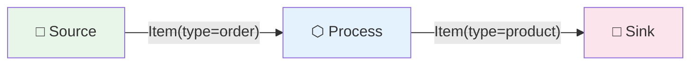

**YAML example**

```yaml
data_types:
  - type: order
  - type: work_order
  - type: component
  - type: product
```

**Engine behavior**

1. A `source` block creates an `Item` with a unique `id`, the configured `type`, `born_tick` set to the current tick, and context data injected from `simulation.context`.
2. The item is dispatched as a `Particle` along data edges, taking `PARTICLE_TICKS = 4` ticks to transit.
3. On arrival at a block, the item is pushed into that block's `Container` (queue).
4. Items carry these fields throughout their lifecycle:

| Field | Type | Default | Purpose |
|---|---|---|---|
| `id` | str | auto-generated | Unique item identifier |
| `type` | str | from source config | Data type label |
| `data` | dict | `{}` | Arbitrary payload fields |
| `priority` | int | 0 | Queue ordering (higher = first) |
| `born_tick` | int | current tick | Creation time for aging |
| `age_ticks` | int | 0 | Computed age |
| `audit_trail` | list | `[]` | Block-by-block processing log |
| `cost_ledger` | float | 0.0 | Accumulated cost |
| `schema_version` | int | 1 | Item format version |
| `saga_id` | str | None | Saga group identifier |
| `tags` | dict | `{}` | Arbitrary metadata |

---

### s4.3: Container — Queue Management

> Every block has an internal queue that holds items waiting to be processed.

**What it does**

The Container is the queue sitting inside every block. It controls how many items can wait (`capacity`), what order they are served (`strategy`), and what happens when the queue is full (`overflow`). Think of it as the waiting room before a service desk — it can be a line (FIFO), a stack (LIFO), or a priority queue.

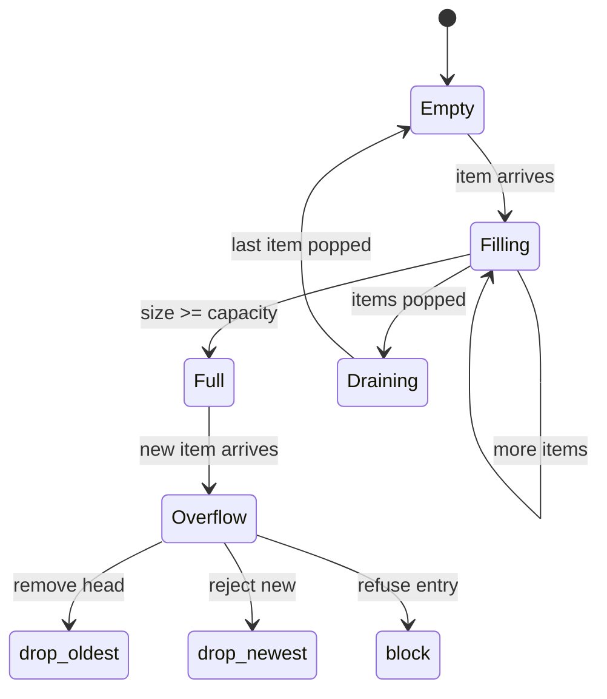

**YAML example**

```yaml
- id: support_queue
  type: process
  container:
    capacity: 50              # max items (0 = unlimited)
    strategy: priority        # fifo | lifo | priority
    overflow: drop_oldest     # drop_oldest | drop_newest | block
```

**Engine behavior**

- **Push**: When an item arrives, `Container.push()` checks capacity. If full, the overflow policy applies.
- **Pop**: `Container.pop(n)` dequeues items according to the strategy:
  - `fifo`: standard first-in-first-out via `deque.popleft()`.
  - `lifo`: items are appended to the front on push, so `popleft()` acts as last-in-first-out.
  - `priority`: sorts the entire queue by `-item.priority` and takes the top N items. Higher numeric priority = served first.
- **Overflow policies**:
  - `drop_newest`: rejects the newly arriving item (push returns `False`).
  - `drop_oldest`: removes the oldest item from the queue, then accepts the new one.
  - `block`: rejects the new item (push returns `False`), signaling upstream to stop.

---

### s5: Script System — Trigger Conditions

> Controls when a block starts processing — on data arrival, on signal, or both.

**What it does**

The Script System determines the conditions under which a block "fires" and begins a processing cycle. By default, blocks fire when they have enough data in their queue. You can configure blocks to fire only when they receive a trigger signal, or to require both data and a signal. This is how you model event-driven processes versus data-driven ones.

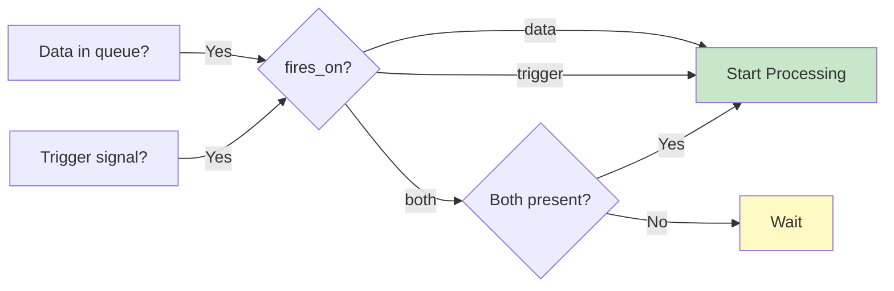

**YAML example**

```yaml
# Fires only on trigger signal — ignores queue state
- id: maintenance_handler
  type: process
  fires_on: trigger

# Fires only when both a signal AND data are present
- id: batch_release
  type: process
  fires_on: both
  batch_size: 10
```

**Engine behavior**

Each tick, when a block is in IDLE or WAITING state, the engine checks:

| `fires_on` | Condition to start processing |
|---|---|
| `data` (default) | `container.size >= batch_size` |
| `trigger` | At least one pending trigger signal |
| `both` | Pending trigger AND `container.size >= batch_size` |

- When `fires_on: trigger`, the block ignores its queue entirely — it fires when signalled.
- When `fires_on: both`, both conditions must be true simultaneously.
- Pending triggers are cleared after firing.

---

### s6: Signal System — Triggers and Events

> Zero-tick communication between blocks — "something happened, react now."

**What it does**

The Signal System lets blocks communicate without sending data. A block emits an EVENT_OUT signal when it completes or fails processing. That signal travels along signal edges to other blocks' TRIGGER_IN ports, waking them up. Signals carry no payload — they just say "go." This is how you chain dependent processes, trigger repairs on failure, or coordinate parallel work.

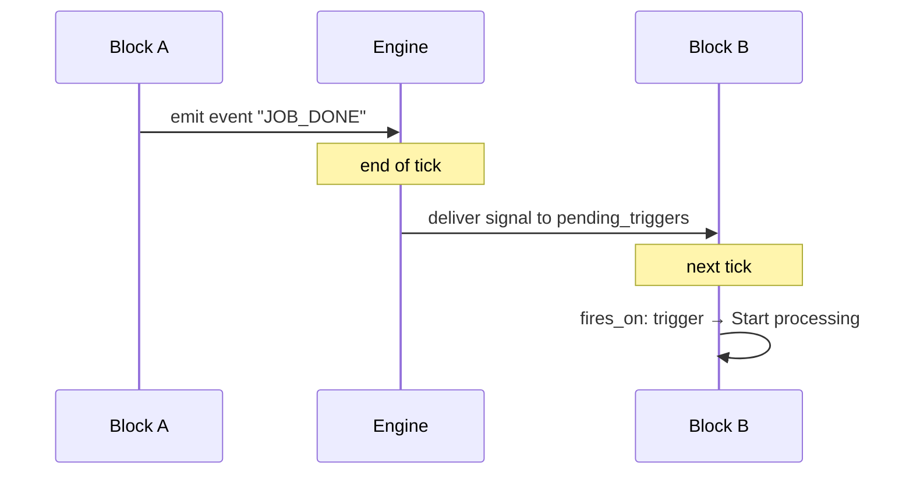

**YAML example**

```yaml
nodes:
  - id: assembly_line
    type: process
    processing_ticks: 3
    event_out:
      on_complete: ASSEMBLY_DONE
      on_fail: ASSEMBLY_FAILED

  - id: quality_check
    type: process
    fires_on: trigger

edges:
  - type: signal
    from: assembly_line
    to: quality_check
```

**Engine behavior**

1. After a block completes processing, `_emit_event()` is called with `"on_complete"` or `"on_fail"`.
2. The signal name is resolved from `event_out` config (e.g., `"ASSEMBLY_DONE"`).
3. A `Signal` object is created and queued in `_pending_signals`.
4. At the END of the tick (after all blocks have run), signals are delivered to target blocks' `pending_triggers`.
5. Signals are zero-tick — emitted and delivered within the same engine cycle.
6. `signal_logic: any` (default): block fires on first signal received.
7. `signal_logic: all`: block fires only after receiving all expected signal types.

---

### s7: Value System — Cost and Revenue

> Track the financial impact of every processing step.

**What it does**

The Value System records the economic impact of each block's operation. Every time a block processes items, it can emit a cost (`value_cost`) and/or revenue (`value_out`). These accumulate on the block and propagate along value edges to parent blocks or aggregators. This gives you a running P&L for any part of your simulation — from individual machines up to entire departments.

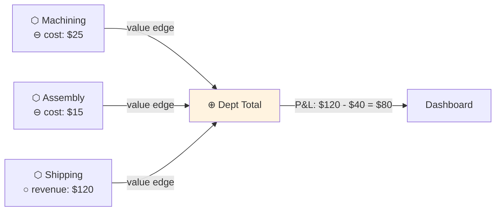

**YAML example**

```yaml
- id: machining_center
  type: process
  processing_ticks: 2
  value_cost:
    amount: 25.00             # cost per item processed
    type: material_cost
  value_out:
    amount: 120.00
    type: product_revenue
```

**Engine behavior**

1. On successful processing, `_emit_value()` multiplies the configured `amount` by the number of items in the batch.
2. `value_cost.amount` is added to `rt.value_cost_total` and logged as `VALUE_EMITTED`.
3. `value_out.amount` is added to `rt.value_out_total` and logged as `VALUE_EMITTED`.
4. Value edges propagate amounts to connected blocks' totals.
5. Per-item cost is also stamped on the item via `item.stamp()` — see [s13.18](#s1318-item-cost-accumulation).

---

### s8: Filter System — Gates and Routing

> Remote on/off control for blocks — open or close the gate via API or backpressure.

**What it does**

The Filter System provides a binary gate on each block. When `gate_open` is `False`, the block will not start new processing — it waits. Gates can be controlled remotely via the API (an operator flipping a switch) or automatically via backpressure edges (downstream congestion closes upstream gates). This is how you model manual pauses, load shedding, and congestion control.

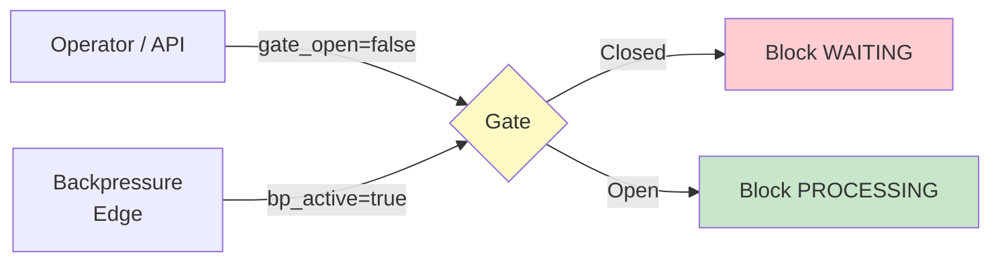

**YAML example**

```yaml
edges:
  - type: filter
    from: gate_controller
    to: controlled_block

  - type: backpressure
    from: slow_downstream
    to: fast_upstream
```

**Engine behavior**

- Gate is checked at the very start of the IDLE/WAITING processing path — before concurrency, circuit breaker, time window, or any other check.
- `engine.update_filter(block_id, {"gate_open": False})` closes the gate via API.
- Backpressure edges automatically set `gate_open = NOT bp_active` on each tick.

---

### s9: Block States — State Machine

> Every block follows the same lifecycle from idle to processing and back.

**What it does**

Each block in the simulation is always in one of eight states. The state machine governs what happens each tick — whether the block tries to pull items and process them, waits for conditions to be met, or sits in a special mode like maintenance or approval. Understanding the state machine is key to understanding why a block is or isn't working.

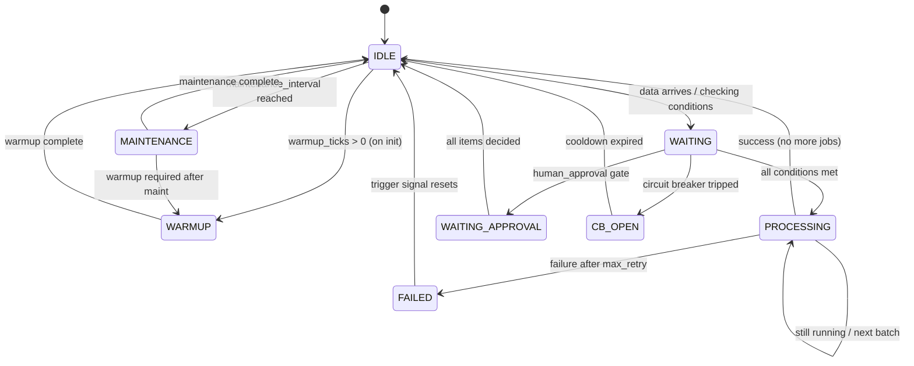

**YAML example**

States are not configured directly — they are a consequence of other mechanics. A block's initial state depends on its configuration:

```yaml
- id: furnace
  type: process
  warmup_ticks: 12            # starts in WARMUP state
  maintenance_interval: 120   # enters MAINTENANCE every 120 ticks
  circuit_breaker:
    failure_threshold: 5      # enters CB_OPEN after 5 failures
  human_approval: true        # enters WAITING_APPROVAL when items arrive
```

**Engine behavior**

| State | What happens each tick |
|---|---|
| `IDLE` | Check for maintenance trigger, then try to start a new processing cycle |
| `WAITING` | Conditions not yet met (no data, gate closed, no signal, etc.) |
| `PROCESSING` | Decrement `_proc_ticks_left`; when 0, resolve outcome |
| `FAILED` | Wait for a trigger signal to reset to IDLE |
| `WAITING_APPROVAL` | Wait for API call to approve/reject items |
| `CB_OPEN` | Wait for circuit breaker cooldown to expire |
| `MAINTENANCE` | Decrement `_maint_remaining`; when 0, transition to IDLE or WARMUP |
| `WARMUP` | Decrement `_warmup_remaining`; when 0, transition to IDLE |

---

### s10: Resource Locking — Concurrency

> Control how many items a block can process simultaneously.

**What it does**

Concurrency sets the maximum number of parallel processing cycles a block can run at once. Setting `concurrency: 1` means the block is locked while processing — no new work starts until the current cycle finishes. Higher values model parallel workstations, multi-threaded services, or staffed desks. Setting `concurrency: 0` means unlimited parallel processing.

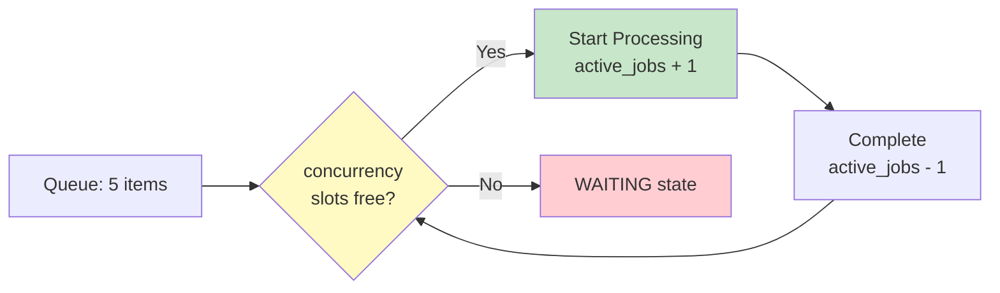

**YAML example**

```yaml
- id: welding_cell
  type: process
  processing_ticks: 5
  concurrency: 3              # up to 3 jobs at once (0 = unlimited)
```

**Engine behavior**

- Before starting a new cycle: `active_jobs < concurrency` (or `concurrency == 0`).
- If at limit → state stays WAITING, no new work that tick.
- On processing complete: `active_jobs -= 1`, freeing a slot.
- Each concurrent cycle uses the same `_proc_items` and `_proc_ticks_left` tracking.

---

### s11: Batch Processing

> Accumulate items before processing them as a group.

**What it does**

Batch processing forces a block to wait until it has collected a minimum number of items before starting a processing cycle. All items in the batch are processed together in a single duration. An optional timeout allows starting with a partial batch if the full batch doesn't arrive in time. This models ovens that need to be full, transport that waits for passengers, or bulk invoice runs.

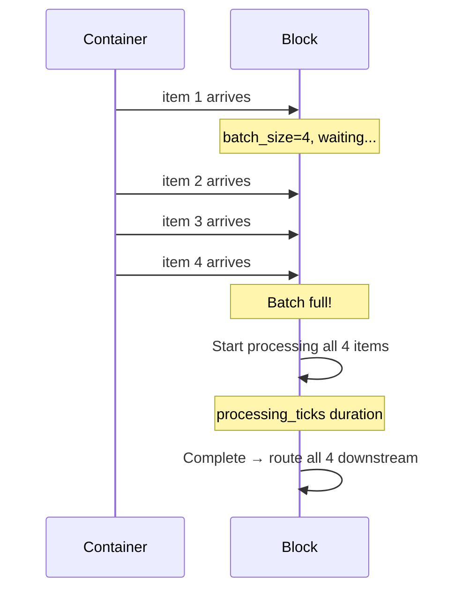

**YAML example**

```yaml
- id: curing_oven
  type: process
  processing_ticks: 15
  batch_size: 8               # wait for 8 items
  batch_timeout: 20           # OR start after 20 ticks with partial batch
```

**Engine behavior**

1. Each tick in WAITING state, if `container.size < batch_size`, `_batch_wait` increments.
2. If `batch_timeout > 0` and `_batch_wait >= batch_timeout` → start with whatever is available.
3. When batch is ready: pop `min(batch_size, container.size)` items and begin one processing cycle.
4. All items are processed together in `processing_ticks` duration.
5. Logs `BATCH_STARTED` (vs `ITEM_PROCESSING_STARTED` for single items).

---

### s12: Composite Blocks

> Wrap a sub-graph of blocks inside a single named block for encapsulation and reuse.

**What it does**

A composite block contains an inner graph of child blocks and edges. From the outside, it looks like any other block — it has inputs, outputs, and value ports. Inside, items flow through the child blocks. This is how you model departments, production cells, or any multi-step process as a single reusable unit. Composites nest freely — there is no depth limit.

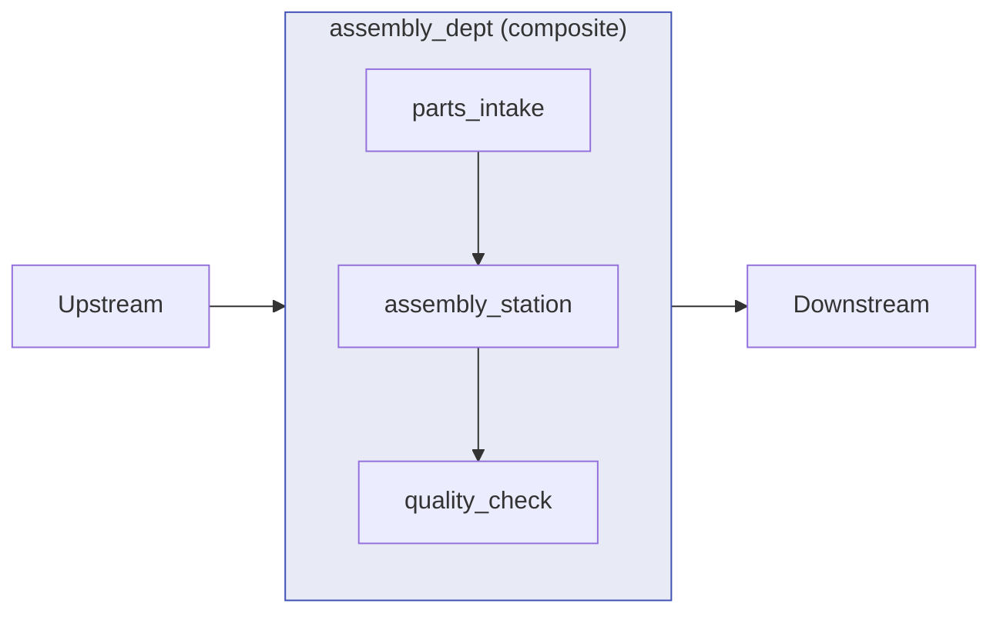

**YAML example**

```yaml
- id: assembly_dept
  type: composite
  container_mode: passthrough

  children:
    nodes:
      - id: parts_intake
        type: process
        processing_ticks: 1
      - id: assembly_station
        type: process
        processing_ticks: 4
      - id: quality_check
        type: process
        processing_ticks: 2

    edges:
      - { from: parts_intake, to: assembly_station, type: data }
      - { from: assembly_station, to: quality_check, type: data }
```

**Engine behavior**

- **`container_mode`** controls how items enter the sub-graph:
  - `passthrough` (most common): items go directly to the entry child — no composite-level queue.
  - `internal_only`: items queue in the composite's container; manual control of child entry.
  - `script_only`: composite processes items with its own script, then sends to children.
  - `script_then_internal`: script first, then buffer in composite container, then to children.
  - `internal_then_script`: children process first, composite script runs on exit.
- **Entry child**: the child with no incoming edges from other children (auto-detected by `_find_entry_child`).
- **Exit bubble-up**: when a child has no outgoing data edges to siblings, its output routes to the parent composite's outgoing edges.
- **Value aggregation**: inner blocks' `value_cost` and `value_out` propagate upward through value edges to the composite's totals.

---

## Extended Mechanics (s13.1–s13.33)

---

### s13.1: Skill Requirement on Data

> Block requires items with specific attribute values before it can process them.

**What it does**

A block can declare that it needs items meeting certain attribute thresholds. For example, a CNC lathe might require worker_hours items with `skill >= 3`. Items that don't meet the requirement stay in the queue — the block waits until qualifying items are available. This models skill-based routing, certification requirements, and quality thresholds.

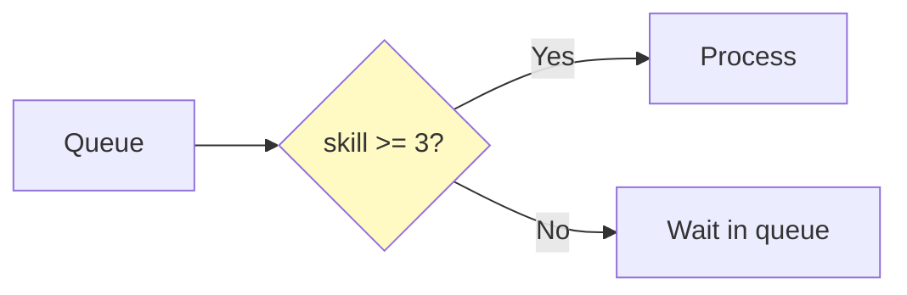

**YAML example**

```yaml
- id: cnc_lathe
  type: process
  processing_ticks: 4
  script:
    requires:
      - type: worker_hours
        count: 1
        attribute: skill
        min_value: 3
```

**Engine behavior**

- The `requires` field is defined on the script but the current engine primarily enforces `batch_size` via `has_enough_data()`.
- Items with insufficient skill will sit in the queue. The engine checks `container.size >= batch_size` — attribute filtering is declared for documentation and future enforcement.
- For attribute-aware routing now, use a `router` block upstream to filter by skill before items reach this block.

---

### s13.2: Machine Health Degradation and Repair

> Equipment wears out over time — health drops with each cycle until it breaks.

**What it does**

A block can have a health value (0.0–1.0) that degrades with each successful processing cycle. When health drops below a threshold, the block starts failing every cycle. An external repair action (via API or signal) restores health. This models equipment wear, battery depletion, technician fatigue, or accumulated technical debt.

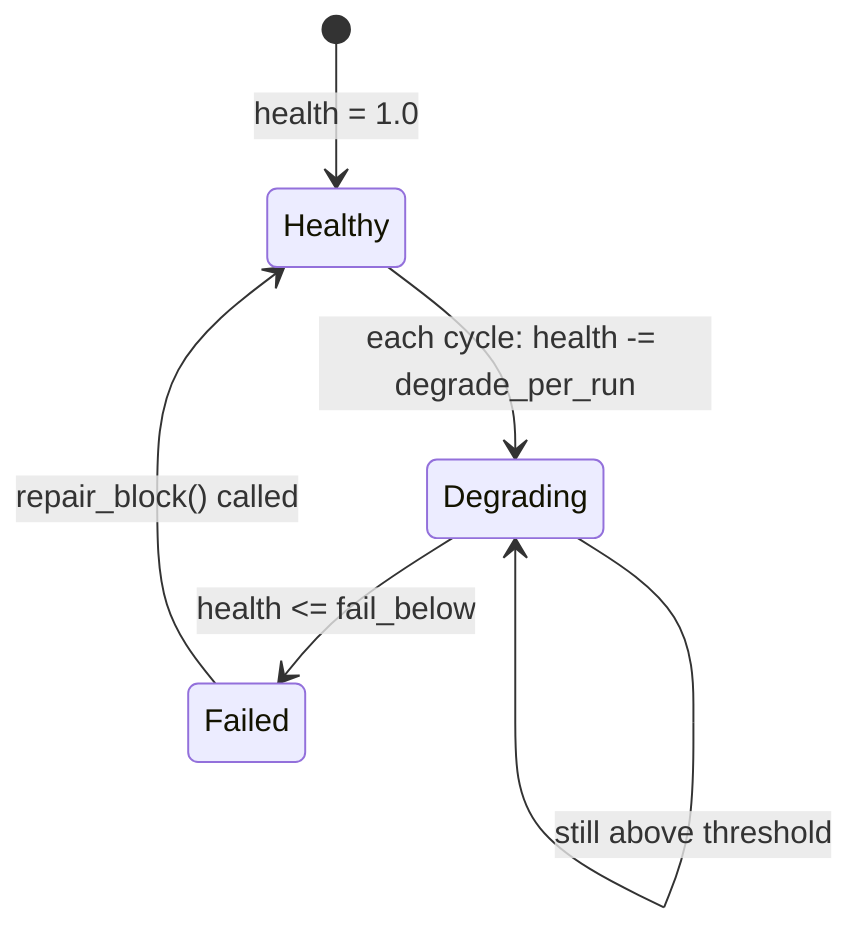

**YAML example**

```yaml
- id: cnc_lathe
  type: process
  processing_ticks: 2
  resource:
    health: 1.0
    degrade_per_run: 0.008
    fail_below: 0.20
    repair_amount: 1.0
```

**Engine behavior**

1. On each successful cycle: `health = max(0.0, health - degrade_per_run)`. Logs `HEALTH_DEGRADED`.
2. On each failed cycle: `health -= degrade_per_run * 0.5` (half the normal rate).
3. `resolve_outcome()` checks health first: if `health <= fail_below` → always returns `"fail"`. Logs `HEALTH_FAILED`.
4. Repair via `engine.repair_block(block_id)`: `health = min(1.0, health + repair_amount)`. If block was FAILED → resets to IDLE.
5. Repair via Flask: `POST /repair {"block_id": "cnc_lathe"}`.

---

### s13.3: Time-Based Schedule Auto-Trigger

> Sources emit items on a regular schedule — like an alarm clock for the simulation.

**What it does**

Source blocks can be configured to automatically emit items at regular intervals, with an optional start delay. This is how you model work orders arriving every shift, customer arrivals at a predictable rate, or daily batch jobs. The schedule fires independently of data — it's time-driven.

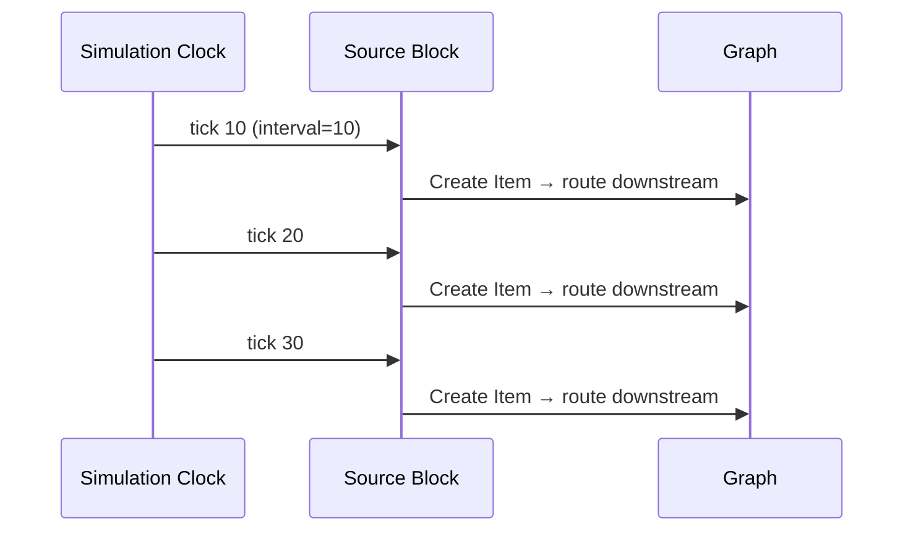

**YAML example**

```yaml
- id: daily_orders
  type: source
  outputs:
    - work_order
  schedule:
    interval_ticks: 8         # fire every 8 ticks
    start_delay_ticks: 2      # skip first 2 ticks
  auto_rate: 0.3              # ALSO: 30% random chance per tick
```

**Engine behavior**

1. Each tick, `_auto_trigger_source()` checks two conditions:
   - `auto_rate > 0`: rolls `random() < auto_rate` — fires if true.
   - `schedule.interval_ticks > 0`: fires when `(tick - start_delay) % interval == 0`.
2. Both can coexist. If `auto_rate` already fired, the schedule won't double-fire that tick.
3. Calendar gates apply: source will NOT fire outside configured work hours.
4. Each fired item gets `born_tick` = current tick and inherits simulation context fields.

---

### s13.4: Conditional Event Routing

> Emit different signals based on the processing outcome.

**What it does**

Instead of emitting the same signal for every completion, a block can emit different signal types based on its processing result. This lets you wire success and failure to completely different downstream handlers — send `ASSEMBLY_DONE` to packaging on success, `ASSEMBLY_FAILED` to the repair crew on failure.

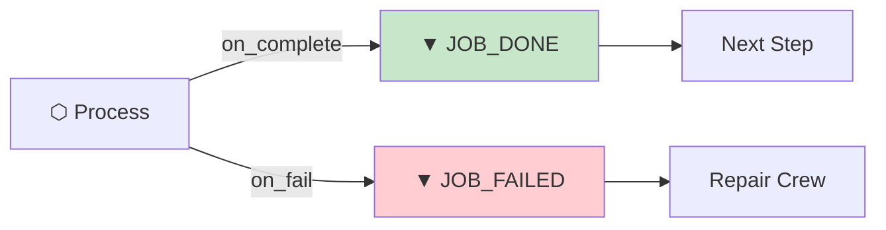

**YAML example**

```yaml
- id: quality_gate
  type: process
  event_out:
    on_complete: QC_PASSED
    on_fail: QC_FAILED
```

**Engine behavior**

- `_emit_event(block_id, "on_complete", tick)` resolves the signal name from `event_out["on_complete"]`.
- `_emit_event(block_id, "on_fail", tick)` resolves from `event_out["on_fail"]`.
- The resolved signal name is sent to all blocks connected by signal edges from this block.
- If no `event_out` config exists, the raw event name (`"on_complete"` / `"on_fail"`) is used.

---

### s13.5: Value Formula

> Calculate value dynamically based on processing results.

**What it does**

Instead of a fixed cost or revenue per item, a block can use a formula that references runtime variables. This lets you model variable pricing, quantity-based discounts, or waste-adjusted revenue. The formula is defined in the YAML and evaluated with the item count and configured variables.

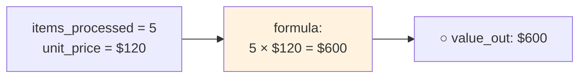

**YAML example**

```yaml
- id: billing_station
  type: process
  value_out:
    amount: 120.00
    type: revenue
    # formula: "items_processed * unit_price"
    # variables:
    #   unit_price: 120.0
```

**Engine behavior**

- In the current engine, `_emit_value()` uses `float(amount) * item_count`.
- The `formula` field is defined in BLOCK-DESIGN.md for future extension.
- Currently, `value_out.amount` × batch size is the effective calculation each cycle.

---

### s13.6: Data Type Conversion

> Change an item's type during processing — raw material becomes a finished product.

**What it does**

A block can transform the type label of items passing through it. This models any transformation where the input and output are fundamentally different things — machining a raw cylinder into a shaft, processing an order into a shipment, converting a raw request into a response. The item keeps its identity but changes its type.

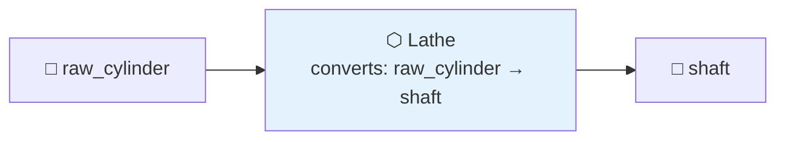

**YAML example**

```yaml
- id: lathe_station
  type: process
  processing_ticks: 3
  script:
    converts:
      raw_cylinder: machined_shaft
      raw_block: machined_block
```

**Engine behavior**

1. After successful processing, `_apply_conversion()` is called on each item.
2. Looks up `item.type` in the `converts` dictionary.
3. If found, `item.type` is changed to the mapped value.
4. If not found, the item type is unchanged.
5. Conversion happens before routing — downstream router rules see the new type.

---

### s13.7: Router Block

> Route items to different destinations based on field values — no processing delay.

**What it does**

A router block inspects each item's data fields and sends it to a different downstream block based on configurable rules. It's instant — no processing time. Think of it as a sorting hat: items with `quality: pass` go to the good line, items with `quality: fail` go to rework. Rules are evaluated top-to-bottom; first match wins.

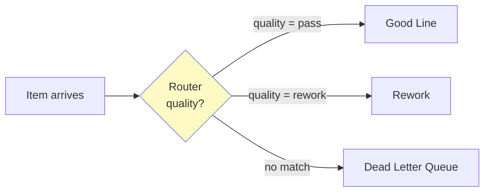

**YAML example**

```yaml
- id: quality_router
  type: router
  routes:
    - field: quality
      op: eq
      value: pass
      to: good_line
    - field: quality
      op: gt
      value: 0.8
      to: premium_line
    - field: defect_score
      op: lt
      value: 0.3
      to: rework_line
  default_route: inspection_queue
```

**Engine behavior**

1. Items are popped from the container and evaluated against rules top-to-bottom.
2. Supported operators: `eq`, `neq`, `gt`, `lt`, `contains`.
3. Field lookup: checks `item.data[field]` first, falls back to `item.type`.
4. First matching rule wins — item is dispatched via particle to the `to` block.
5. No match + no `default_route` → item goes to DLQ with reason `"no_route_matched"`.
6. Routing is instant — no `processing_ticks` delay.

---

### s13.8: Counter and Accumulator

> Count items passing through and fire events at milestones.

**What it does**

A counter block processes items normally but also tracks the running count. When the count hits a configured threshold (and every multiple thereafter), it fires a `MILESTONE_REACHED` event and emits a `threshold_reached` signal. This models production quotas, shift-end triggers, or maintenance schedules based on usage count.

An accumulator block buffers items until a threshold count is reached, then forwards all accumulated items at once.

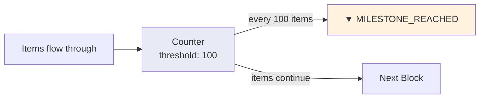

**YAML example**

```yaml
# Counter — processes items and fires milestones
- id: production_counter
  type: counter
  count_threshold: 100
  label: "Daily Quota"

# Accumulator — buffers items until threshold
- id: batch_buffer
  type: accumulator
  count_threshold: 20
```

**Engine behavior**

**Counter**:
1. Processes items like a normal `process` block.
2. After each cycle: checks `processed % count_threshold == 0`.
3. If true: logs `MILESTONE_REACHED`, emits `threshold_reached` signal, stores message in `_milestones`.

**Accumulator**:
1. Items queue normally in the container.
2. When `container.size >= count_threshold`, all items are popped and routed downstream.
3. Fires `threshold_reached` event.

---

### s13.9: Priority Queue

> Serve the most important items first, regardless of arrival order.

**What it does**

When a container uses `strategy: priority`, items are dequeued in priority order — highest numeric priority value is served first. Combined with item aging (s13.11), priority escalation ensures that even low-priority items eventually get served. This models emergency wards (critical patients first), VIP customer lanes, and priority mail sorting.

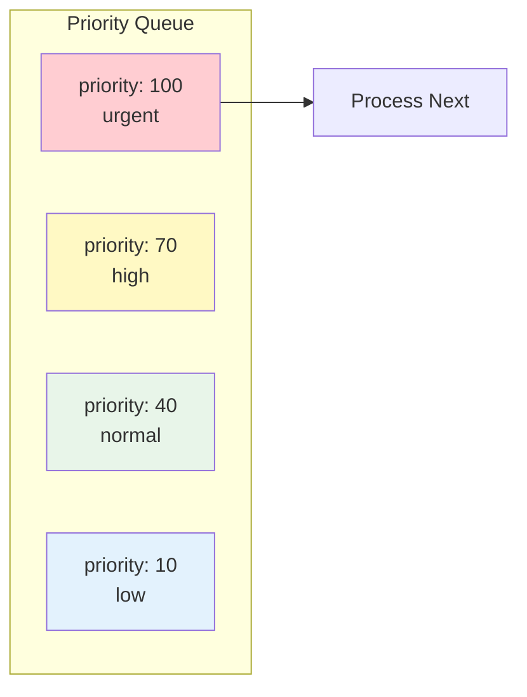

**YAML example**

```yaml
- id: er_triage
  type: process
  container:
    strategy: priority
```

**Engine behavior**

- On `Container.pop(n)`, the engine sorts the entire queue by `-item.priority` and takes the top N items.
- Higher numeric priority = served first.
- Items' priority can be set at creation (in item data) or escalated via aging (s13.11).
- Priority is a plain integer field on the `Item` object.

---

### s13.10: Data Enrichment Join

> Wait for multiple data streams and merge them into one item.

**What it does**

A join block waits for items from multiple different types that share a common key field. When all required types arrive with the same key, the items are merged into a single enriched item and forwarded. This models order fulfillment (wait for all parts of a kit), data enrichment (combine order with inventory check), or convergence of parallel approval paths.

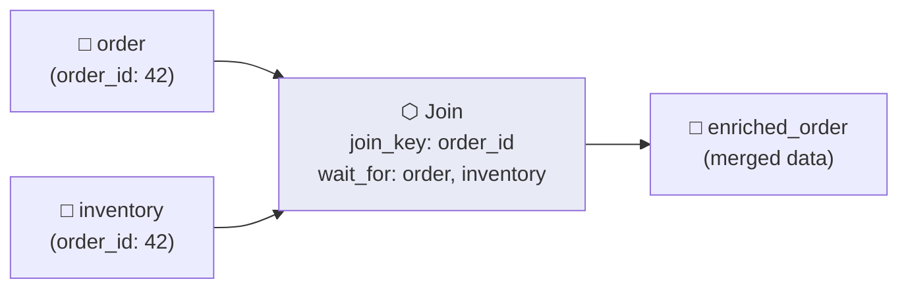

**YAML example**

```yaml
- id: order_enrichment
  type: join
  join_key: order_id
  wait_for:
    - order
    - inventory_check
```

**Engine behavior**

1. Items are grouped in `_join_waiting[key][type]` based on `item.data[join_key]`.
2. Each tick, the join block checks if any key has all `wait_for` types satisfied.
3. When complete: merge all items into one — first item is the base, others contribute their `data`, `cost_ledger`, and `audit_trail`.
4. The merged item is stamped `"joined"` and routed downstream.
5. If `wait_for` is empty, any single item completing a key group triggers the merge.

---

### s13.11: Item Aging, Priority Escalation, and Max-Age Expiry

> Items get more urgent the longer they wait — and expire if they wait too long.

**What it does**

Items sitting in a container accumulate age. Periodically, their priority is bumped up so older items get served sooner (SLA escalation). Items that wait past a maximum age are removed and sent to the dead letter queue. This models SLA-driven ticket escalation, perishable goods spoiling, regulatory deadlines, and stale request cleanup.

```mermaid
sequenceDiagram
    participant Item as Item (priority: 10)
    participant Queue as Container
    participant DLQ as Dead Letter Queue
    Note over Item,Queue: Every 24 ticks
    Queue->>Item: priority += 5 → 15
    Note over Item,Queue: After 24 more ticks
    Queue->>Item: priority += 5 → 20
    Note over Item,Queue: At max_age_ticks (144)
    Queue->>DLQ: Item expired → DLQ
```

**YAML example**

```yaml
- id: ticket_queue
  type: process
  container:
    strategy: priority
    aging:
      interval_ticks: 24              # escalate every 24 ticks (= 1 day)
      escalate_priority_by: 5         # add 5 to priority each interval
      max_age_ticks: 144              # expire after 144 ticks (= 6 days)
```

**Engine behavior**

1. `Container.age_items(tick)` is called every tick:
   - For each item: `age_ticks = tick - born_tick`.
   - If `age_ticks % interval_ticks == 0` → `item.priority += escalate_priority_by`.
2. `Container.expired_items(tick)` removes items where `tick - born_tick >= max_age_ticks`.
3. Each expired item is sent to DLQ with reason `"max_age_exceeded"` and logged as `ITEM_EXPIRED`.

---

### s13.12: Shared Resource Pool

> Multiple blocks compete for a limited shared resource — a crane, an expert, a license.

**What it does**

A resource pool represents a finite number of identical slots that blocks must acquire before processing. Only blocks that successfully claim slots can proceed; others wait. This models shared equipment (one crane for three bays), limited staff (one DBA expert for twenty services), or software licenses.

```mermaid
graph LR
    POOL["Resource Pool<br/>crane_pool<br/>capacity: 2"]
    BAY_A["Bay A<br/>needs 1 slot"] -.->|acquire| POOL
    BAY_B["Bay B<br/>needs 1 slot"] -.->|acquire| POOL
    BAY_C["Bay C<br/>needs 1 slot"] -.->|blocked!| POOL
    style POOL fill:#fff3e0
    style BAY_C fill:#ffcdd2
```

**YAML example**

```yaml
resources:
  - id: crane_pool
    capacity: 2

nodes:
  - id: loading_bay
    type: process
    processing_ticks: 3
    script:
      requires_resource:
        pool: crane_pool
        slots: 1
```

**Engine behavior**

1. Before starting a cycle, `_acquire_pool()` calls `pool.try_acquire(slots)`.
2. `try_acquire()` is thread-safe: if `used + slots <= capacity`, increments `_used` and returns `True`.
3. If acquisition fails → block stays WAITING, logs `RESOURCE_BLOCKED`.
4. On successful processing complete, `_release_pool()` returns slots: `_used -= slots`.
5. Pool state is visible via `engine.get_state()["resources"]`.

---

### s13.13: Backpressure Propagation

> When a downstream queue fills up, upstream blocks automatically pause.

**What it does**

Backpressure is an automatic congestion control mechanism. When a block's container depth exceeds a configured threshold, it signals upstream blocks to close their gates and stop sending work. When the queue drains, upstream resumes. This models kanban WIP limits, network flow control, and production line balancing.

```mermaid
sequenceDiagram
    participant Up as Upstream Block
    participant Down as Downstream Block
    Note over Down: queue >= threshold
    Down->>Up: bp_active = true → gate_open = false
    Note over Up: WAITING (gate closed)
    Note over Down: queue drains < threshold
    Down->>Up: bp_active = false → gate_open = true
    Note over Up: resumes processing
```

**YAML example**

```yaml
nodes:
  - id: slow_processor
    type: process
    container:
      backpressure:
        threshold: 30

edges:
  - type: backpressure
    from: slow_processor
    to: fast_source
```

**Engine behavior**

1. `Container._update_bp()` sets `bp_active = True` when `size >= threshold`.
2. At step 5 of `_do_tick()`, for each backpressure edge: `target.gate_open = NOT source.bp_active`.
3. When upstream's `gate_open` is `False`, it enters WAITING state and won't start new cycles.
4. When queue drains below threshold: `bp_active = False` → upstream resumes.

---

### s13.14: Circuit Breaker

> Stop hammering a failing block — trip a breaker after repeated failures.

**What it does**

A circuit breaker protects a block from cascading failures. After a configurable number of consecutive failures, the breaker "trips open" — the block refuses all work for a cooldown period. After cooldown, it enters half-open state and allows one probe cycle. If the probe succeeds, the breaker closes and normal operation resumes. If it fails again, the breaker reopens.

```mermaid
stateDiagram-v2
    [*] --> CLOSED : normal operation
    CLOSED --> OPEN : failures >= threshold
    OPEN --> HALF_OPEN : cooldown_ticks elapsed
    HALF_OPEN --> CLOSED : probe succeeds
    HALF_OPEN --> OPEN : probe fails
```

**YAML example**

```yaml
- id: payment_gateway
  type: process
  processing_ticks: 2
  fail_chance: 0.30
  circuit_breaker:
    failure_threshold: 5
    cooldown_ticks: 20
```

**Engine behavior**

1. Before each cycle: `cb.is_allowing(tick)` is checked.
   - `closed` → always `True`.
   - `open` → `True` only if `tick - open_since >= cooldown_ticks` (transitions to `half_open`).
   - `half_open` → `True` (one probe allowed).
2. On success: `record_success()` → `_failures = 0`, state → `closed`. Logs `CIRCUIT_BREAKER_CLOSED`.
3. On failure: `record_failure(tick)` → `_failures += 1`. If `_failures >= failure_threshold` → state → `open`. Logs `CIRCUIT_BREAKER_OPENED`.
4. Block enters `CB_OPEN` state when breaker is open — no processing until cooldown expires.

---

### s13.15: Compensation / Saga

> Coordinate rollback across multiple blocks when a multi-step process fails.

**What it does**

Multiple blocks can share a `saga_id` to form a transaction group. When the saga needs to be rolled back (due to a downstream failure), a compensation signal can be sent to all blocks in the group. This models distributed transactions — reversing a stock reservation, refunding a payment, or rolling back a multi-step order fulfillment.

```mermaid
graph LR
    A["Step A<br/>saga: order_saga"] --> B["Step B<br/>saga: order_saga"]
    B --> C["Step C<br/>saga: order_saga"]
    C -->|FAIL| COMP["COMPENSATE signal<br/>sent to A, B, C"]
    COMP -.-> A
    COMP -.-> B
    style COMP fill:#ffcdd2
```

**YAML example**

```yaml
nodes:
  - id: reserve_stock
    type: process
    saga_id: order_fulfillment

  - id: charge_payment
    type: process
    saga_id: order_fulfillment

  - id: ship_order
    type: process
    saga_id: order_fulfillment
```

**Engine behavior**

1. During `_build_nodes()`, blocks with `saga_id` are registered in `_saga_blocks[saga_id]`.
2. Saga compensation is NOT automatic — it must be triggered manually:
   ```python
   for block_id in engine._saga_blocks["order_fulfillment"]:
       engine.send_signal(block_id, "COMPENSATE")
   ```
3. Each saga block should use `fires_on: trigger` and have compensation logic wired via downstream blocks.

---

### s13.16: Fork/Join — Parallel Split and Barrier

> Send one item to multiple paths simultaneously, then wait for all paths to complete.

**What it does**

Fork (split) sends the same item to multiple downstream blocks in parallel — like sending a document to legal, finance, and technical review simultaneously. Join (barrier) waits for all required item types with the same key to arrive before merging them into one enriched item and continuing. Together, they model parallel approvals, concurrent testing, and multi-department workflows.

```mermaid
graph LR
    FORK["Scanner"] -->|"fork"| A["Live DB"]
    FORK -->|"fork"| B["Archive"]
    FORK -->|"fork"| C["Audit Log"]

    D["Finance ✓"] -->|"order_id"| JOIN["Join<br/>wait_for: all"]
    E["Legal ✓"] -->|"order_id"| JOIN
    F["Tech ✓"] -->|"order_id"| JOIN
    JOIN --> NEXT["Continue"]
    style JOIN fill:#e8eaf6
```

**YAML example — Fork (multiple data edges)**

```yaml
edges:
  - { from: scanner, to: live_db }
  - { from: scanner, to: archive_store }
  - { from: scanner, to: audit_log }
```

**YAML example — Join (barrier)**

```yaml
- id: approval_join
  type: join
  join_key: request_id
  wait_for:
    - finance_approval
    - legal_approval
    - tech_approval
```

**Engine behavior**

**Fork**: `_route_data_output()` iterates ALL data edges from the source block — one particle per target.

**Join**:
1. Items accumulate in `_join_waiting[key][type]` using `item.data[join_key]`.
2. When all `wait_for` types arrive for a key → merge and forward.
3. Merge: first item is base; others contribute their `data`, `cost_ledger`, `audit_trail`.
4. Merged item is stamped `"joined"` and routed downstream.

---

### s13.17: Time Windows

> Block operates only during specific tick ranges — shift hours, trading hours, maintenance windows.

**What it does**

A time window restricts when a block can process items. The block defines one or more open ranges within a repeating period. Outside these windows, the block enters WAITING state — items queue but aren't processed. This models day shifts, business hours, market trading windows, or regulatory blackout periods.

```mermaid
graph LR
    subgraph Period["24-tick period"]
        OFF1["0–7: OFF"] --> ON["8–16: ON"]
        ON --> OFF2["17–23: OFF"]
    end
    ON -->|Items processed| PROC[Processing]
    OFF1 -->|Items queue| WAIT[Waiting]
    OFF2 -->|Items queue| WAIT
    style ON fill:#c8e6c9
    style OFF1 fill:#ffcdd2
    style OFF2 fill:#ffcdd2
```

**YAML example**

```yaml
- id: day_shift_press
  type: process
  processing_ticks: 1
  time_window:
    open_ticks:
      - [8, 16]               # active from tick 8 to 16 within the period
    period: 24                 # repeating cycle length
```

**Engine behavior**

1. `in_time_window(tick)` computes `t = tick % period`.
2. Returns `True` if `t` falls within any `[start, end]` range.
3. If outside the window → block state = WAITING, no processing that tick.
4. Evaluated before batch/concurrency checks in the IDLE/WAITING path.

---

### s13.18: Item Cost Accumulation

> Every block stamps its cost onto each item — track total per-unit cost from source to sink.

**What it does**

As items flow through the graph, each processing block adds its cost to the item's running `cost_ledger`. By the time an item reaches a sink, its ledger shows the total cost of production. This enables per-unit cost analysis — which items are profitable, which paths are expensive, where cost accumulates fastest.

```mermaid
graph LR
    S["Source"] --> A["Machining<br/>cost: $25"]
    A --> B["Assembly<br/>cost: $15"]
    B --> C["Shipping<br/>cost: $8"]
    C --> SINK["Sink<br/>item.cost_ledger = $48"]
    style SINK fill:#fff3e0
```

**YAML example**

```yaml
- id: machining_center
  type: process
  value_cost:
    amount: 25.00
    type: material_cost
```

**Engine behavior**

1. On each successful processing cycle, `item.stamp(block_id, "processed", tick, cost_per_item)` is called.
2. `stamp()` appends to `item.audit_trail` and adds cost to `item.cost_ledger`.
3. `cost_per_item` comes from `value_cost.amount` on the block's node definition.
4. The `cost_ledger` is a running float total — the full breakdown is in the `audit_trail`.

---

### s13.19: Adaptive Concurrency

> Automatically scale parallel capacity up or down based on queue depth.

**What it does**

A block can automatically adjust its concurrency (number of parallel processing slots) based on how full its queue is. When the queue grows large, concurrency scales up to handle the load. When the queue shrinks, concurrency scales back down. This models auto-scaling cloud services, dynamic staff allocation, or elastic manufacturing cells.

```mermaid
graph LR
    Q["Queue Depth"] --> CHECK{Queue vs target?}
    CHECK -->|"> 2× target"| UP["concurrency + 1<br/>(up to max)"]
    CHECK -->|"< 50% target"| DOWN["concurrency - 1<br/>(down to min)"]
    CHECK -->|"in range"| SAME["no change"]
    style UP fill:#c8e6c9
    style DOWN fill:#ffcdd2
    style SAME fill:#e3f2fd
```

**YAML example**

```yaml
- id: elastic_workers
  type: process
  processing_ticks: 3
  concurrency: 2
  concurrency_cfg:
    min: 1
    max: 10
    target_queue: 5
```

**Engine behavior**

`adapt_concurrency()` is called every tick:
- If `queue_size > target_queue * 2` → `concurrency = min(max, concurrency + 1)`.
- If `queue_size < max(1, target_queue // 2)` → `concurrency = max(min, concurrency - 1)`.
- Changes take effect on the next tick.

---

### s13.20: Rate Limiter — Token Bucket

> Cap throughput using a token bucket — burst capacity with steady-state limits.

**What it does**

A rate limiter controls how many items a block can process per time period using a token bucket algorithm. The bucket refills at a steady rate each tick and empties as items are processed. If the bucket is empty, the block waits. This models API rate limits, throttled production lines, bandwidth caps, and regulatory throughput controls.

```mermaid
graph LR
    REFILL["Every tick:<br/>tokens += refill_rate"] --> BUCKET["Token Bucket<br/>capacity: 20"]
    BUCKET --> CHECK{tokens >= cost?}
    CHECK -->|Yes| PROC["Process<br/>tokens -= cost"]
    CHECK -->|No| WAIT["WAITING<br/>(RATE_LIMITED)"]
    style BUCKET fill:#fff3e0
    style WAIT fill:#ffcdd2
```

**YAML example**

```yaml
- id: api_gateway
  type: process
  processing_ticks: 1
  rate_limiter:
    capacity: 20
    refill_rate: 5
    cost_per_item: 1
```

**Engine behavior**

1. Every tick: `tick_refill()` adds `refill_rate` tokens (capped at `capacity`).
2. Before starting a cycle: `try_consume()` deducts `cost_per_item` tokens.
3. If insufficient tokens → WAITING state, logs `RATE_LIMITED` with current token count.
4. Tokens persist across ticks — burst capacity is available when tokens accumulate during idle periods.

---

### s13.21: Probabilistic Outcomes

> Processing results drawn from a probability distribution — model real-world uncertainty.

**What it does**

Instead of simple pass/fail, a block can define multiple named outcomes with probabilities. Each processing cycle randomly selects an outcome. This models quality inspection results (pass/rework/scrap), variable production quality, uncertain service outcomes, or Monte Carlo style simulation.

```mermaid
graph LR
    PROC["⬡ Process"] --> ROLL{"Random outcome"}
    ROLL -->|"87%"| PASS["pass → downstream"]
    ROLL -->|"10%"| REWORK["rework → rework_line"]
    ROLL -->|"3%"| SCRAP["scrap → DLQ"]
    style ROLL fill:#fff9c4
```

**YAML example**

```yaml
- id: quality_inspection
  type: process
  processing_ticks: 1
  outcome_distribution:
    - result: pass
      probability: 0.87
    - result: rework
      probability: 0.10
    - result: scrap
      probability: 0.03
```

**Engine behavior**

`resolve_outcome()` evaluation order:
1. Check health: if `health <= fail_below` → always `"fail"`.
2. Check `reject_rate`: if `random() < reject_rate` → `"reject"`.
3. Check `fail_chance`: if `random() < fail_chance` → `"fail"`.
4. Check `outcome_distribution`: cumulative probability walk — `random()` selects the outcome.
5. If nothing triggers → `"success"`.

Custom outcomes (not `"success"`, `"fail"`, or `"reject"`) are treated as success by the engine.

---

### s13.22: Audit Trail on Item

> Every block stamps a record on each item — full traceability from source to sink.

**What it does**

Every item automatically accumulates an audit trail as it flows through the graph. Each time a block processes, rejects, joins, receives, or approves an item, a timestamped record is added. This provides complete provenance — you can trace every step an item took, when it happened, and what it cost. This models compliance requirements, chain-of-custody tracking, and GDPR audit logs.

```mermaid
graph LR
    S["Source<br/>tick: 0"] --> A["Assembly<br/>tick: 5"]
    A --> B["Inspection<br/>tick: 9"]
    B --> SINK["Sink<br/>tick: 13"]

    TRAIL["audit_trail:<br/>1. assembly: processed, tick 5, $25<br/>2. inspection: processed, tick 9, $10<br/>3. sink: received, tick 13, $0"]
    style TRAIL fill:#e8eaf6
```

**YAML example**

No YAML configuration needed — audit trailing is automatic.

```yaml
# Every process block automatically stamps items:
- id: assembly_station
  type: process
  processing_ticks: 3
  value_cost:
    amount: 25.00
# Each processed item gets: {block: "assembly_station", action: "processed", tick: N, cost: 25.0}
```

**Engine behavior**

- `item.stamp(block_id, action, tick, cost)` is called at every significant event:
  - `"processed"` — successful processing cycle (with cost from `value_cost.amount`).
  - `"rejected"` — item rejected by quality check.
  - `"joined"` — items merged in a join block.
  - `"received"` — item arrived at a sink.
  - `"approved"` — item approved at human approval gate.
- Each stamp appends `{"block": ..., "action": ..., "tick": ..., "cost": ...}` to `item.audit_trail`.
- `item.cost_ledger` is updated with the cost amount.

---

### s13.23: Simulation Context and Scenarios

> Global variables injected into every item — switch scenarios with one config change.

**What it does**

Simulation context is a shared dictionary of variables that gets injected into every newly created item's data. By changing context values at runtime, you can model different scenarios — peak season demand, pricing tier changes, regional variations — without modifying the graph structure. Items carry context values and router blocks can branch on them.

```mermaid
graph LR
    CTX["Context:<br/>pricing_tier: premium<br/>region: eu_west"] --> SRC["Source"]
    SRC -->|"item.data includes<br/>pricing_tier, region"| PROC["Process"]
    PROC --> ROUTER["Router<br/>field: pricing_tier"]
    ROUTER -->|premium| VIP["VIP Lane"]
    ROUTER -->|standard| STD["Standard Lane"]
    style CTX fill:#e8eaf6
```

**YAML example**

```yaml
simulation:
  context:
    pricing_tier: standard
    scenario: baseline
    region: uk
```

**Engine behavior**

1. Context is initialized from `simulation.context` in the config.
2. `_fire_source()` calls `item.data.update(self._context)` — every new item gets context values.
3. Runtime update: `engine.set_context({"pricing_tier": "premium"})` — affects all future items.
4. Flask API: `POST /context {"pricing_tier": "premium"}` and `GET /context`.
5. Router blocks can branch on context-injected fields like any other `item.data` field.

---

### s13.24: Dead Letter Queue and Replay

> Failed items don't disappear — they go to a holding area for inspection and retry.

**What it does**

The Dead Letter Queue (DLQ) is a holding area for items the system couldn't process. Items land here when: retries are exhausted, approval is rejected, no routing rule matches, or items expire from aging. Operators can inspect the DLQ, diagnose why items failed, and replay them back into any block for reprocessing. A non-empty DLQ reveals blocked paths or under-resourced blocks.

```mermaid
graph LR
    FAIL["Block fails<br/>max_retry exceeded"] --> DLQ["Dead Letter Queue"]
    REJECT["Approval rejected"] --> DLQ
    EXPIRE["Item expired<br/>max_age exceeded"] --> DLQ
    NOROUTE["No route matched"] --> DLQ
    DLQ -->|"Operator replays"| TARGET["Target Block"]
    style DLQ fill:#ffcdd2
```

**YAML example**

The DLQ is automatic — no YAML configuration needed. Items arrive via these paths:

```yaml
# Items go to DLQ when:
# 1. max_retry exceeded
- id: flaky_service
  type: process
  fail_chance: 0.3
  max_retry: 3                # 4th failure → DLQ

# 2. No route matched in router (no default_route)
- id: strict_router
  type: router
  routes:
    - { field: type, op: eq, value: known, to: handler }
    # No default_route → unmatched items → DLQ
```

**Engine behavior**

1. `_to_dlq()` creates a `DeadLetterEntry` with the item, block_id, reason, and tick.
2. DLQ is capped at 500 entries — older entries are dropped.
3. Logged as `ITEM_DLQ` with reason.
4. DLQ reasons: `max_retry_exceeded`, `approval_rejected`, `no_route_matched`, `max_age_exceeded`, `rejected`.
5. Query: `engine.get_dlq()` or `GET /dlq`.
6. Replay: `engine.replay_dlq(dlq_id, target_block_id)` or `POST /dlq/replay`.
7. Replay pushes the item into the target block's container and removes it from DLQ.

---

### s13.25: Observation Tap

> Sample items non-destructively — like a quality inspector peeking at the conveyor belt.

**What it does**

A tap edge copies a fraction of items flowing through a block to a separate observation sink — without removing them from the main flow. The original item continues normally; the tap receives a clone. This models quality sampling (inspect 10% of items), analytics pipelines (shadow copy), or monitoring dashboards.

```mermaid
graph LR
    MAIN["Main Flow"] --> BLOCK["Process Block"]
    BLOCK -->|"clone (10%)"| TAP["Sample Station"]
    BLOCK --> NEXT["Next Block"]
    style TAP fill:#e8eaf6,stroke-dasharray: 5 5
```

**YAML example**

```yaml
edges:
  - type: tap
    from: main_conveyor
    to: sample_station
    sample_rate: 0.10           # copy 10% of items
```

**Engine behavior**

1. When an item arrives at a block, `_deliver_to_node()` checks for tap edges on that block.
2. For each tap edge: `random() < sample_rate` → if true, push `item.clone()` to the tap target.
3. The clone is a deep copy — modifications to the clone don't affect the original.
4. The original item continues into the block's container normally.
5. Logs `ITEM_TAPPED` event.
6. `sample_rate: 1.0` = 100% of items are copied.

---

### s13.26: Versioned Item Types

> Items carry a schema version — route differently based on format generation.

**What it does**

Each item has a `schema_version` field (default: 1). This allows the simulation to handle multiple generations of items simultaneously — routing v1 items to a legacy pipeline and v2 items to a new pipeline. This models API versioning, data schema migrations, document format upgrades, or coexisting product generations.

```mermaid
graph LR
    ITEMS["Items arrive<br/>schema_version: 1 or 2"] --> ROUTER["Router<br/>field: schema_version"]
    ROUTER -->|"version = 2"| NEW["New Pipeline"]
    ROUTER -->|"version = 1"| OLD["Legacy Pipeline"]
    style ROUTER fill:#fff9c4
```

**YAML example**

```yaml
- id: version_router
  type: router
  routes:
    - field: schema_version
      op: eq
      value: 2
      to: new_pipeline
    - field: schema_version
      op: eq
      value: 1
      to: legacy_pipeline
  default_route: unknown_sink
```

**Engine behavior**

- `Item.schema_version` defaults to `1`.
- The field is available in `item.data` for router field lookup (falls back to the Item attribute).
- Can be set at creation or modified during conversion.
- No automatic migration — use router + conversion blocks to transform v1 → v2 items.

---

### s13.27: Human-in-the-Loop Approval Gate

> Items pause and wait for a human to approve or reject them.

**What it does**

An approval gate holds items until an external human decision is made via the API. When a block with `human_approval: true` is ready to process, it moves items from the queue into a pending approval list and enters WAITING_APPROVAL state. An operator then approves (item continues downstream) or rejects (item goes to DLQ) each item individually. This models expense approvals, compliance reviews, quality sign-offs, and medical order reviews.

```mermaid
sequenceDiagram
    participant Q as Queue
    participant Block as Approval Gate
    participant API as Operator API
    participant Down as Downstream
    participant DLQ as Dead Letter Queue
    Q->>Block: Items ready
    Block->>Block: state = WAITING_APPROVAL
    Block->>API: APPROVAL_REQUESTED
    API->>Block: approve(item_id)
    Block->>Down: Item routed downstream
    API->>Block: reject(item_id)
    Block->>DLQ: Item → DLQ
```

**YAML example**

```yaml
- id: compliance_review
  type: process
  human_approval: true
```

**Engine behavior**

1. When block is ready to fire: items are popped from container into `_approval_items[item_id]`.
2. Block enters `WAITING_APPROVAL` state.
3. Logs `APPROVAL_REQUESTED` for each item.
4. `engine.approve_item(block_id, item_id)`:
   - Stamps item `"approved"`, logs `APPROVAL_GRANTED`, routes downstream.
   - If no more pending items → state = IDLE.
5. `engine.reject_approval(block_id, item_id)`:
   - Logs `APPROVAL_REJECTED`, sends item to DLQ with reason `"approval_rejected"`.
   - If no more pending items → state = IDLE.
6. Flask API: `POST /approve`, `POST /reject`, `GET /approvals`.

---

### s13.28: Simulation Clock and Fast-Forward

> Map simulation ticks to real calendar time — and skip ahead instantly.

**What it does**

The simulation clock converts abstract tick numbers into real datetime values. Each tick advances the clock by a configurable number of hours. This enables calendar-aware features — work schedules, weekends, holidays, and daily reports all work against simulated calendar time. Fast-forward runs ticks without wall-clock delay, letting you skip to a future state instantly.

```mermaid
graph LR
    T0["tick 0<br/>Mon 08:00"] --> T1["tick 1<br/>Mon 09:00"]
    T1 --> T8["tick 8<br/>Mon 16:00"]
    T8 --> T16["tick 16<br/>Tue 00:00"]
    T16 -->|"SIMULATION_DAY_CHANGE"| T24["tick 24<br/>Tue 08:00"]

    FF["fast_forward(240)"] -.->|"instant"| T240["tick 240<br/>10 days later"]
    style FF fill:#e8eaf6,stroke-dasharray: 5 5
```

**YAML example**

```yaml
simulation:
  start_time: "2026-01-05T08:00:00"   # Monday 8am
  tick_hours: 1                        # 1 tick = 1 hour
  speed: 2.0                           # 2 ticks per second (real-time)
```

**Engine behavior**

- `SimulationClock` maps ticks to datetime: `current_dt = start + timedelta(hours=tick * tick_hours)`.
- Properties: `tick`, `current_dt`, `hour`, `weekday`, `is_weekend`, `date_str`, `day_name`, `iso()`.
- Day change detection: logs `SIMULATION_DAY_CHANGE` when the simulated date advances.
- `set_speed(speed)`: adjusts tick interval — `max(0.05, 1.0 / speed)` seconds per tick.
- `fast_forward(ticks)`: runs up to 2000 ticks synchronously with no delay, acquiring the engine lock.
- Flask API: `POST /speed {"speed": 5.0}`, `POST /fast-forward {"ticks": 240}`.

---

### s13.29: Warmup Period

> Block needs time to prepare before it can start processing — like a furnace heating up.

**What it does**

A warmup period delays a block's first processing cycle. The block starts in WARMUP state and counts down for `warmup_ticks` ticks before transitioning to IDLE. During warmup, items can queue but no work is done. After preventive maintenance, the warmup period restarts. This models cold-start delays — furnace heat-up, server boot, machine initialization, or new employee training.

```mermaid
sequenceDiagram
    participant B as Block
    Note over B: START → WARMUP (12 ticks)
    B->>B: tick 1: warmup remaining = 11
    B->>B: tick 2: warmup remaining = 10
    Note over B: ... items queue during warmup ...
    B->>B: tick 12: warmup remaining = 0
    Note over B: WARMUP → IDLE → ready to process
```

**YAML example**

```yaml
- id: injection_molder
  type: process
  processing_ticks: 3
  warmup_ticks: 12
```

**Engine behavior**

1. Block initializes in `BlockState.WARMUP` (if `warmup_ticks > 0`).
2. Each tick: `_warmup_remaining -= 1`. Logs `BLOCK_WARMUP` with remaining count.
3. When `_warmup_remaining <= 0` → state = IDLE. Logs `WARMUP_COMPLETE`.
4. Items arriving during warmup queue normally in the container.
5. After maintenance completes, warmup restarts: `_warmup_remaining = warmup_ticks`.

---

### s13.30: Yield Rate

> A fraction of items are lost during processing — models waste, shrinkage, and attrition.

**What it does**

Yield rate controls what fraction of successfully processed items actually make it downstream. Items that fail the yield check are silently discarded — not retried, not sent to DLQ. This models material waste (stamping press produces 95% good parts), evaporation, shrinkage, data processing that drops malformed records, or natural attrition.

```mermaid
graph LR
    IN["10 items in"] --> PROC["⬡ Process<br/>yield_rate: 0.90"]
    PROC -->|"9 items (90%)"| OUT["Downstream"]
    PROC -->|"1 item (10%)<br/>YIELD_LOSS"| LOST["Lost<br/>(not DLQ)"]
    style LOST fill:#ffcdd2,stroke-dasharray: 5 5
```

**YAML example**

```yaml
- id: stamping_press
  type: process
  processing_ticks: 1
  yield_rate: 0.95              # 5% of items are lost
```

**Engine behavior**

1. After successful processing, for each item: `if random() > yield_rate` → item is discarded.
2. Lost items log `YIELD_LOSS` but are NOT sent to DLQ — they simply disappear.
3. Default `yield_rate: 1.0` = no loss.
4. Applied per item individually.

---

### s13.31: Preventive Maintenance

> Block automatically enters maintenance mode every N ticks for scheduled downtime.

**What it does**

Preventive maintenance schedules regular downtime for a block. Every `maintenance_interval` ticks, the block stops processing and enters MAINTENANCE state for `maintenance_duration` ticks. During maintenance, no items are processed (they queue). After maintenance, the block may need to warm up again. This models tool changes, oil changes, calibration cycles, shift breaks, and planned service windows.

```mermaid
sequenceDiagram
    participant B as Block
    Note over B: Processing normally
    B->>B: tick 120: maintenance_interval reached
    Note over B: IDLE → MAINTENANCE (8 ticks)
    B->>B: tick 121–127: MAINTENANCE
    B->>B: tick 128: maintenance complete
    Note over B: MAINTENANCE → WARMUP (if configured)
    B->>B: tick 128–129: WARMUP (2 ticks)
    Note over B: WARMUP → IDLE → resume processing
```

**YAML example**

```yaml
- id: stamping_press
  type: process
  processing_ticks: 1
  maintenance_interval: 120     # every 120 ticks
  maintenance_duration: 8       # maintenance lasts 8 ticks
  warmup_ticks: 2               # re-warm after maintenance
```

**Engine behavior**

1. Each tick in IDLE: `_ticks_since_maint += 1`.
2. When `_ticks_since_maint >= maintenance_interval`:
   - `_maint_remaining = maintenance_duration`, `_ticks_since_maint = 0`.
   - State → MAINTENANCE. Logs `MAINTENANCE_STARTED`.
3. During MAINTENANCE each tick: `_maint_remaining -= 1`. Logs `MAINTENANCE_ACTIVE`.
4. When `_maint_remaining <= 0`:
   - If `warmup_ticks > 0` → state = WARMUP, `_warmup_remaining = warmup_ticks`.
   - Otherwise → state = IDLE. Logs `MAINTENANCE_COMPLETE`.

---

### s13.32: Block Priority

> Control the order blocks are processed within each tick — lower number = earlier.

**What it does**

Block priority determines the execution order within each simulation tick. All blocks are sorted by their `priority` value (ascending) before being processed. Lower numbers execute first. This ensures that critical blocks (like routers or approval gates) are processed before less critical ones, preventing ordering artifacts in the simulation.

```mermaid
graph LR
    subgraph Tick["Within one tick"]
        B10["Block A<br/>priority: 10"] --> B30["Block B<br/>priority: 30"]
        B30 --> B50["Block C<br/>priority: 50"]
        B50 --> B90["Block D<br/>priority: 90"]
    end
    style B10 fill:#c8e6c9
    style B90 fill:#ffcdd2
```

**YAML example**

```yaml
nodes:
  - id: critical_router
    type: router
    priority: 10               # processed first

  - id: normal_worker
    type: process
    priority: 50               # default

  - id: low_priority_logger
    type: process
    priority: 90               # processed last
```

**Engine behavior**

- In `_do_tick()`: `sorted_rts = sorted(self._runtimes.values(), key=lambda r: r.priority)`.
- Default priority is `50`.
- Lower value = processed earlier in the tick.
- Priority affects execution order only — it does not affect item priority in queues (that's `item.priority`).

---

### s13.33: Energy Cost

> Continuous cost charged every tick the block is active — models power draw and standby costs.

**What it does**

Energy cost is a per-tick charge applied whenever a block is NOT in IDLE state. Unlike `value_cost` (charged per processing cycle), energy cost is continuous — it accumulates every tick the block is warming up, processing, waiting, in maintenance, or in any non-idle state. This models furnace power draw, server compute costs, heated chamber operating costs, or any resource that costs per unit time regardless of throughput.

```mermaid
graph LR
    subgraph States["Charged States"]
        W["WAITING"]
        P["PROCESSING"]
        M["MAINTENANCE"]
        WU["WARMUP"]
        F["FAILED"]
    end
    States -->|"energy_cost per tick"| TOTAL["energy_total<br/>accumulates"]
    IDLE["IDLE"] -->|"no charge"| IDLE
    style IDLE fill:#e8f5e9
    style States fill:#fff3e0
```

**YAML example**

```yaml
- id: industrial_furnace
  type: process
  processing_ticks: 8
  energy_cost: 2.50             # 2.50 cost units per active tick
```

**Engine behavior**

1. Each tick, if `energy_cost > 0` and `state != IDLE`:
   - `energy_total += energy_cost`.
   - Logs `ENERGY_CONSUMED` with `cost` and `total`.
2. Tracked separately in `rt.energy_total` — NOT added to `value_cost_total`.
3. Charged in ALL non-idle states: WAITING, PROCESSING, FAILED, CB_OPEN, MAINTENANCE, WARMUP.
4. Access via logs (`ENERGY_CONSUMED` events) or extend `get_state()` to include `energy_total`.

---

## Appendix: Event Log Taxonomy

Every engine event is logged as a JSONL line. Key events by category:

| Category | Events |
|---|---|
| **Lifecycle** | `SIMULATION_STARTED`, `SIMULATION_ENDED`, `TICK_SUMMARY`, `SIMULATION_DAY_CHANGE` |
| **Items** | `ITEM_CREATED`, `ITEM_QUEUED`, `ITEM_PROCESSING_STARTED`, `BATCH_STARTED`, `ITEM_PROCESSED`, `ITEM_REJECTED`, `ITEM_FAILED`, `ITEM_RETRIED`, `ITEM_EXPIRED`, `ITEM_SINK_RECEIVED` |
| **Signals** | `SIGNAL_EMITTED`, `SIGNAL_RECEIVED` |
| **Value** | `VALUE_EMITTED`, `ENERGY_CONSUMED` |
| **Reliability** | `HEALTH_DEGRADED`, `HEALTH_FAILED`, `CIRCUIT_BREAKER_OPENED`, `CIRCUIT_BREAKER_BLOCKED`, `CIRCUIT_BREAKER_CLOSED` |
| **Approval** | `APPROVAL_REQUESTED`, `APPROVAL_GRANTED`, `APPROVAL_REJECTED` |
| **Flow Control** | `RATE_LIMITED`, `RESOURCE_BLOCKED`, `BLOCK_UNAVAILABLE`, `YIELD_LOSS` |
| **Maintenance** | `MAINTENANCE_STARTED`, `MAINTENANCE_ACTIVE`, `MAINTENANCE_COMPLETE`, `WARMUP_COMPLETE`, `BLOCK_WARMUP` |
| **Observation** | `ITEM_TAPPED`, `ITEM_DLQ`, `MILESTONE_REACHED` |
