# Block Simulator — Monitoring Mechanics

> **Design document for 21 playbook-driven monitoring types that let users explicitly declare
> what to observe in their simulations.**
> Monitors are read-only observers — they sample state, compute metrics, and emit structured
> data without altering the simulation.
> For core mechanics see `docs/BLOCK-DESIGN.md`. For anomaly mechanics see `docs/ANOMALY-MECHANICS.md`.
> For engine source see `src/engine.py`.

---

## 1. Philosophy

### 1.1 Why active monitoring?

The block simulator already writes every event to a JSONL log (via `EventLogger` — see
`src/engine.py`). Observation taps (s13.25) let you clone items flowing through edges. But
both mechanisms are **passive** — they capture everything, and the operator must dig through
raw logs to find what matters.

Active monitoring inverts this. The operator declares **what** to watch, **how often** to
sample, and **when to alert**. The monitor system produces a focused, structured stream of
exactly the metrics the operator asked for — nothing more. This stream is the foundation
for dashboards, analytics (DuckDB Phase 4), and automated anomaly detection.

### 1.2 Design principles

**Declaration, not discovery.** Monitors are explicitly declared in playbook YAML. If you
didn't ask for it, you don't see it. This keeps the monitoring output small, predictable,
and meaningful.

**Read-only.** Monitors observe but never modify. They read container sizes, block states,
value totals, and signal counts — they never push items, change gates, or fire triggers.
Remove all monitors and the simulation produces identical results.

**Structured output.** Every monitor sample follows the same `MonitorSample` schema. Samples
are written to a dedicated monitor log (separate from the event JSONL) so analytics can
query them directly without filtering noise.

**Configurable frequency.** Each monitor runs at its own interval — per tick, every N ticks,
or on state change. High-frequency monitors like `queue_depth_monitor` run every tick;
expensive aggregations like `efficiency_monitor` run every 50 ticks.

**Alert-capable.** Each monitor can define threshold, rate-of-change, absence, and pattern
alerts. Alerts are metadata on the `MonitorSample` — they don't stop the simulation, but
they flag moments that need attention.

### 1.3 Where monitors fit in the engine loop

Monitors run at the END of each tick, after all block processing and signal delivery are
complete. They see the fully resolved state of tick N before tick N+1 begins:

```
_do_tick():
  1. advance particles
  2. tick every block (sorted by priority)
  3. drain signals
  4. source auto-trigger
  5. backpressure propagation
  6. periodic tick summary
  7. ─── MONITOR PASS ───              ← NEW
       for each active monitor:
         if tick % monitor.interval == 0:
           sample = monitor.collect(engine_state)
           evaluate alerts
           write MonitorSample to monitor log
```

This placement guarantees monitors see consistent post-tick state. It also means monitors
cannot affect the next tick's processing — they are purely observational.

### 1.4 Monitoring as the user's observable window

The raw simulation event log (`.jsonl`) captures everything the engine does: every tick,
every state transition, every item movement, every anomaly activation. This log is for
machine consumption — analytics pipelines and post-run diagnostics.

**Monitors are what operators see during a run.** A monitor is an intentional window into a
specific part of the system: the depth of one queue, the error rate of one block, the flow
on one edge. Operators declare what they want to observe in advance by configuring monitors
in the playbook YAML.

Consequences of this model:
- Operators **cannot** access raw event logs during a simulation run
- Only what is explicitly monitored is visible
- The monitoring configuration expresses *observational intent*: what do you actually care about?
- An unmonitored block is invisible to the operator (but still fully logged internally for analytics)

This is intentional: it prevents observers from inferring system state from arbitrary log
events and forces explicit instrument placement — the same discipline applied in real-world
operational monitoring.

### 1.5 Monitor configuration lifecycle

Monitors are defined before a simulation run in the playbook's `monitors:` section. They
activate when the simulation starts and produce samples for the entire run duration.

**Enabling and disabling**

Set `enabled: false` to pause a monitor without removing it. A disabled monitor produces no
samples and triggers no alerts. Use this to measurement-off a specific instrument between
runs without losing its configuration:

```yaml
monitors:
  - id: watch_assembly
    type: queue_depth_monitor
    target: assembly
    interval: 1
    enabled: false             # paused — no samples collected this run
```

**Adding and removing monitors**

Edit the playbook's `monitors:` section between runs to add or remove instruments.
Removing a monitor is permanent for that run — no historical data is collected for the
absent period. Monitors can be re-added in a later run.

**Future: live reconfiguration**

The REST API will support adding, removing, enabling, and disabling monitors while a
simulation is running, without restarting the engine. Monitor state changes will take
effect at the start of the next sample tick.

---

## 2. Monitor Summary Table

| ID | Name | Category | One-liner |
|---|---|---|---|
| s15.1 | Queue Depth Monitor | Block | Track container size of a block over time |
| s15.2 | State Monitor | Block | Track block state transitions |
| s15.3 | Throughput Monitor | Block | Count items processed per N ticks |
| s15.4 | Latency Monitor | Block | Measure processing time per item |
| s15.5 | Health Monitor | Block | Track block health value over time |
| s15.6 | Concurrency Monitor | Block | Track active parallel jobs |
| s15.7 | Error Rate Monitor | Block | Track fail/reject ratio over sliding window |
| s15.8 | Edge Flow Monitor | Flow | Track items flowing through a specific edge |
| s15.9 | Particle Monitor | Flow | Track specific item types in transit |
| s15.10 | Backpressure Monitor | Flow | Track backpressure state on edges |
| s15.11 | Bottleneck Monitor | Flow | Identify blocks where items accumulate fastest |
| s15.12 | Cost Monitor | Value | Track cumulative cost at a block |
| s15.13 | Revenue Monitor | Value | Track cumulative value output |
| s15.14 | Efficiency Monitor | Value | Ratio of value_out / value_cost over time |
| s15.15 | Signal Monitor | Signal | Track signal emissions and receptions |
| s15.16 | Circuit Breaker Monitor | Signal | Track CB state changes |
| s15.17 | Resource Pool Monitor | Resource | Track pool utilization over time |
| s15.18 | Resource Contention Monitor | Resource | Track blocks waiting for resources |
| s15.19 | DLQ Monitor | System | Track dead letter queue size and entries |
| s15.20 | Approval Queue Monitor | System | Track pending approvals |
| s15.21 | Anomaly Monitor | System | Track anomaly activations and effects |

---

## 3. Playbook YAML Schema

### 3.1 Top-level structure

Monitors are declared in a top-level `monitors` key alongside `nodes`, `edges`, and
`anomalies`:

```yaml
simulation:
  ticks: 500
  context:
    scenario: "production_run"

nodes:
  # ... block definitions ...

edges:
  # ... edge definitions ...

anomalies:
  # ... anomaly definitions (s14.x) ...

monitors:
  - id: watch_assembly_queue
    type: queue_depth_monitor
    target: assembly_station
    interval: 1
    alert:
      - condition: "> 8"
        severity: warning
        message: "Assembly queue backing up"
    enabled: true              # set to false to pause without removing

  - id: watch_throughput
    type: throughput_monitor
    target: assembly_station
    window: 10

  - id: watch_flow
    type: edge_flow_monitor
    from: source_orders
    to: assembly_station
    interval: 5

  - id: watch_cost
    type: cost_monitor
    target: assembly_station
    interval: 10
    alert:
      - condition: "> 5000"
        severity: critical
        message: "Assembly cost exceeding budget"
```

### 3.2 Field definitions

| Field | Type | Required | Default | Description |
|---|---|---|---|---|
| `id` | string | yes | — | Unique monitor identifier for output correlation |
| `type` | string | yes | — | Monitor type matching one of the 21 defined types |
| `target` | string | conditional | — | Block ID to observe (block-level monitors) |
| `from` | string | conditional | — | Source block for edge monitors |
| `to` | string | conditional | — | Destination block for edge monitors |
| `targets` | list | conditional | — | Multiple block IDs (bottleneck, particle monitors) |
| `resource` | string | conditional | — | Resource pool ID (resource monitors) |
| `interval` | int | no | `1` | Sample every N ticks |
| `window` | int | no | `10` | Sliding window size for rate/ratio calculations |
| `enabled` | bool | no | `true` | Set to `false` to pause this monitor — no samples collected |
| `alert` | list | no | `[]` | Alert condition definitions (see §5) |
| `config` | dict | no | `{}` | Type-specific parameters |

### 3.3 Target resolution

- **Block-level monitors** (s15.1–s15.7): `target` must be a valid block ID.
- **Edge monitors** (s15.8–s15.10): `from` and `to` must be valid block IDs connected by a data edge.
- **Bottleneck monitor** (s15.11): `targets` is a list of block IDs to compare, or `"*"` for all blocks.
- **Value monitors** (s15.12–s15.14): `target` is a block ID. Use `"*"` for system-wide totals.
- **Signal monitors** (s15.15–s15.16): `target` is a block ID emitting or receiving signals.
- **Resource monitors** (s15.17–s15.18): `resource` is a resource pool ID.
- **System monitors** (s15.19–s15.21): no target required — they observe global engine state.

---

## 4. Monitor Output Format

### 4.1 MonitorSample schema

Every monitor produces a `MonitorSample` on each collection tick. All samples share a
common envelope with type-specific `value` contents:

```yaml
monitor_sample:
  monitor_id: watch_assembly_queue    # links to playbook monitor.id
  type: queue_depth_monitor           # monitor type
  tick: 42                            # engine tick when sampled
  sim_dt: "2026-03-10T18:00"          # simulated datetime
  target: assembly_station            # observed target
  metric: queue_depth                 # metric name (per monitor type)
  value: 7                            # current metric value
  window_values: null                 # for windowed monitors: list of recent values
  alert: null                         # null or {severity, condition, message}
```

### 4.2 JSON representation

The monitor log writes one JSON line per sample:

```json
{
  "ts": 1711742400.123,
  "monitor_id": "watch_assembly_queue",
  "type": "queue_depth_monitor",
  "tick": 42,
  "sim_dt": "2026-03-10T18:00",
  "target": "assembly_station",
  "metric": "queue_depth",
  "value": 7,
  "window_values": null,
  "alert": null
}
```

### 4.3 Alert envelope

When a monitor triggers an alert, the `alert` field is populated:

```json
{
  "alert": {
    "severity": "warning",
    "condition": "> 8",
    "message": "Assembly queue backing up",
    "triggered_value": 9,
    "monitor_id": "watch_assembly_queue"
  }
}
```

### 4.4 Monitor log output

Monitor samples are written to a dedicated file separate from event JSONL:

```
logs/
  sim_20260310_180000.jsonl           # event log (EventLogger)
  sim_20260310_180000_monitors.jsonl  # monitor log (MonitorLogger)
```

The monitor log file is named by appending `_monitors` to the event log filename stem.
This keeps event and monitor data cleanly separated for downstream analytics.

---

## 5. Alert System

### 5.1 Alert types

Each monitor can define one or more alert conditions. Four alert types are supported:

| Alert Type | Trigger Condition | Example |
|---|---|---|
| **Threshold** | Value crosses a static boundary | `"> 8"`, `"< 2"`, `">= 100"` |
| **Rate of change** | Value changes by more than X% in N ticks | `"delta > 20% in 5"` |
| **Absence** | No items/events observed for N ticks | `"absent 10"` |
| **Pattern** | N consecutive matching observations | `"consecutive 3 failed"` |

### 5.2 Threshold alerts

The simplest alert — fires when the metric crosses a static boundary.

```yaml
alert:
  - condition: "> 8"
    severity: warning
    message: "Queue depth exceeding safe limit"
  - condition: "> 15"
    severity: critical
    message: "Queue depth critical — overflow imminent"
```

**Operators:** `>`, `>=`, `<`, `<=`, `==`, `!=`

The condition is evaluated against the monitor's `value` field each sample tick.

### 5.3 Rate-of-change alerts

Fires when the metric changes by more than a percentage within a sliding window.

```yaml
alert:
  - condition: "delta > 20% in 5"
    severity: warning
    message: "Rapid queue growth detected"
  - condition: "delta < -50% in 3"
    severity: info
    message: "Sharp throughput drop"
```

**Parsing:** `delta [>|<] {percent}% in {ticks}`

The monitor engine stores the last N values and computes:
`change_pct = abs(current - oldest_in_window) / max(oldest_in_window, 1) * 100`

### 5.4 Absence alerts

Fires when a flow or event metric stays at zero for N consecutive ticks.

```yaml
alert:
  - condition: "absent 10"
    severity: critical
    message: "No items flowing through edge for 10 ticks"
```

**Parsing:** `absent {ticks}`

The monitor tracks consecutive zero-value samples. When the count reaches the threshold,
the alert fires once and resets.

### 5.5 Pattern alerts

Fires when a specific observation repeats N consecutive times.

```yaml
alert:
  - condition: "consecutive 3 failed"
    severity: critical
    message: "Block has failed 3 times in a row"
```

**Parsing:** `consecutive {count} {pattern}`

Patterns match against the `value` or `state` field of the monitor sample. Supported patterns:
- `failed` — block state is FAILED
- `cb_open` — circuit breaker is OPEN
- `bp_active` — backpressure is active
- `zero` — value is 0
- `full` — container is at capacity

### 5.6 Severity levels

| Severity | Meaning | Dashboard behavior |
|---|---|---|
| `info` | Noteworthy but not actionable | Blue indicator |
| `warning` | Approaching a limit, requires attention | Yellow indicator |
| `critical` | Immediate problem, requires intervention | Red indicator |

### 5.7 Alert deduplication

Alerts are **edge-triggered**, not **level-triggered**. An alert fires once when the
condition transitions from false to true. It does not fire again until the condition
returns to false and then becomes true again. This prevents alert storms when a value
stays above a threshold for many ticks.

Each alert tracks a `_triggered: bool` state:
```
tick 40: value=7  condition "> 8" → false  (no alert)
tick 41: value=9  condition "> 8" → true   (ALERT FIRES, _triggered=true)
tick 42: value=10 condition "> 8" → true   (no alert, already triggered)
tick 43: value=6  condition "> 8" → false  (_triggered=false, reset)
tick 44: value=9  condition "> 8" → true   (ALERT FIRES again)
```

---

## 6. Monitor Mechanics — Detailed Reference

---

### s15.1: Queue Depth Monitor

> Track the number of items waiting in a block's container over time.

**What it observes**

Reads `container.size` from the target block each sample tick. This is the fundamental
capacity metric — rising queue depth signals congestion; falling depth signals underutilization.

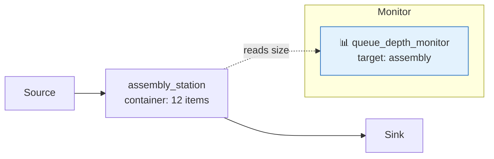

**YAML config**

```yaml
monitors:
  - id: watch_assembly_queue
    type: queue_depth_monitor
    target: assembly_station
    interval: 1
    alert:
      - condition: "> 8"
        severity: warning
        message: "Assembly queue backing up"
      - condition: "> 15"
        severity: critical
        message: "Queue overflow imminent"
```

**Sample output**

```json
{"monitor_id": "watch_assembly_queue", "type": "queue_depth_monitor",
 "tick": 42, "sim_dt": "2026-03-10T18:00", "target": "assembly_station",
 "metric": "queue_depth", "value": 12,
 "details": {"capacity": 20, "fill_ratio": 0.6, "strategy": "fifo"},
 "alert": null}
```

**Alert examples**

```yaml
alert:
  - condition: "> 8"
    severity: warning
  - condition: "delta > 50% in 5"
    severity: critical
    message: "Queue growing too fast"
```

**Use cases**

- Detect congestion before overflow occurs.
- Validate that backpressure (s13.13) is functioning — queue depth should stabilize.
- Size containers appropriately by observing peak queue depth.
- Detect flow resistance (s14.1) or pressure buildup (s14.2) anomalies.

---

### s15.2: State Monitor

> Track state transitions of a block (IDLE → PROCESSING → FAILED, etc.).

**What it observes**

Reads `rt.state` from the target block each sample tick and detects transitions from
the previous sample. Also records how long the block has been in the current state
(`state_duration`). Useful for finding blocks stuck in FAILED, CB_OPEN, or MAINTENANCE.

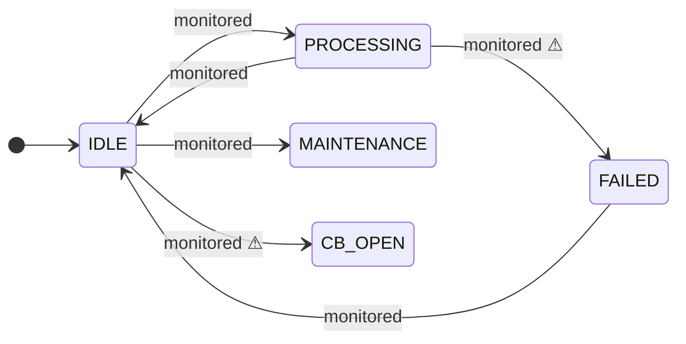

**YAML config**

```yaml
monitors:
  - id: watch_furnace_state
    type: state_monitor
    target: blast_furnace
    interval: 1
    alert:
      - condition: "consecutive 3 failed"
        severity: critical
        message: "Furnace stuck in FAILED state"
```

**Sample output**

```json
{"monitor_id": "watch_furnace_state", "type": "state_monitor",
 "tick": 87, "sim_dt": "2026-03-13T15:00", "target": "blast_furnace",
 "metric": "state", "value": "processing",
 "details": {"previous_state": "idle", "transition": true, "state_duration": 1},
 "alert": null}
```

**Alert examples**

```yaml
alert:
  - condition: "consecutive 5 failed"
    severity: critical
  - condition: "consecutive 10 cb_open"
    severity: critical
    message: "Circuit breaker stuck open"
```

**Use cases**

- Detect blocks stuck in non-productive states (FAILED, CB_OPEN, WAITING_APPROVAL).
- Measure utilization: ratio of PROCESSING ticks to total ticks.
- Identify maintenance scheduling problems — block spends too much time in MAINTENANCE.
- Correlate state transitions with anomaly activations (s14.x).

---

### s15.3: Throughput Monitor

> Count items successfully processed by a block over a sliding window.

**What it observes**

Tracks the delta in `rt.processed` between sample ticks, reporting items processed
per window. This is the key performance metric — are blocks keeping up with demand?

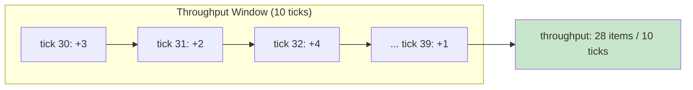

**YAML config**

```yaml
monitors:
  - id: watch_throughput
    type: throughput_monitor
    target: assembly_station
    window: 10
    interval: 1
    alert:
      - condition: "< 5"
        severity: warning
        message: "Assembly throughput below target"
```

**Sample output**

```json
{"monitor_id": "watch_throughput", "type": "throughput_monitor",
 "tick": 50, "sim_dt": "2026-03-12T02:00", "target": "assembly_station",
 "metric": "throughput", "value": 28,
 "details": {"window": 10, "items_per_tick": 2.8},
 "alert": null}
```

**Alert examples**

```yaml
alert:
  - condition: "< 5"
    severity: warning
  - condition: "delta < -30% in 10"
    severity: critical
    message: "Throughput dropping sharply"
  - condition: "absent 5"
    severity: critical
    message: "No items processed for 5 windows"
```

**Use cases**

- Measure whether a block meets its SLA rate.
- Detect saturation (s14.22) — throughput plateaus despite growing queue.
- Compare throughput before and after anomaly injection.
- Feed capacity planning models with observed throughput data.

---

### s15.4: Latency Monitor

> Measure processing time (ticks) per item from queue entry to processing completion.

**What it observes**

For each item completed by the target block, computes `latency = completion_tick - queued_tick`.
Reports the average, min, max, and p95 latency over the sliding window. Uses the item's
`born_tick` and audit trail stamps to compute exact timing.

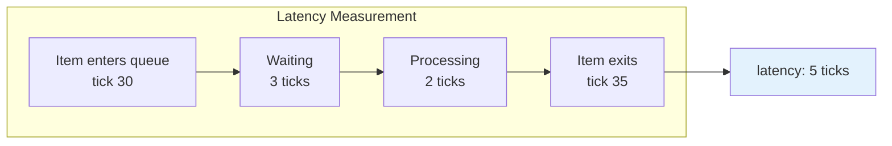

**YAML config**

```yaml
monitors:
  - id: watch_latency
    type: latency_monitor
    target: assembly_station
    window: 20
    interval: 5
    alert:
      - condition: "> 10"
        severity: warning
        message: "Assembly latency exceeds 10 ticks"
```

**Sample output**

```json
{"monitor_id": "watch_latency", "type": "latency_monitor",
 "tick": 55, "sim_dt": "2026-03-12T07:00", "target": "assembly_station",
 "metric": "latency", "value": 5.2,
 "details": {"min": 2, "max": 9, "p95": 8, "sample_count": 20},
 "alert": null}
```

**Alert examples**

```yaml
alert:
  - condition: "> 10"
    severity: warning
  - condition: "delta > 100% in 10"
    severity: critical
    message: "Latency doubling — possible flow resistance"
```

**Use cases**

- SLA compliance: are items processed within the target time?
- Detect flow resistance (s14.1) and pressure buildup (s14.2) — latency increases.
- Measure heat buildup (s14.7) effects — latency grows with continuous operation.
- Feed queuing theory models (Little's Law: L = λW).

---

### s15.5: Health Monitor

> Track a block's health value (s13.2) over time.

**What it observes**

Reads `rt.health` from the target block each sample tick. Health starts at 1.0 and degrades
toward 0.0 with processing. Repair triggers restore it. This monitor surfaces the invisible
wear-and-tear on equipment blocks.

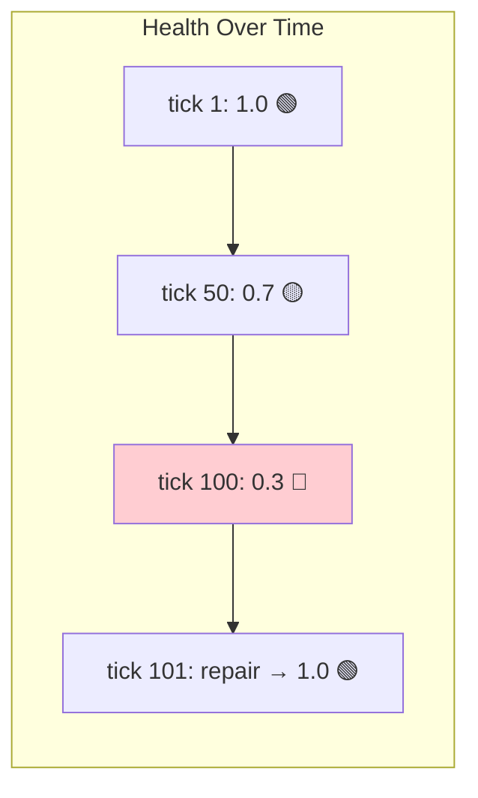

**YAML config**

```yaml
monitors:
  - id: watch_furnace_health
    type: health_monitor
    target: blast_furnace
    interval: 1
    alert:
      - condition: "< 0.5"
        severity: warning
        message: "Furnace health degrading"
      - condition: "< 0.2"
        severity: critical
        message: "Furnace near failure"
```

**Sample output**

```json
{"monitor_id": "watch_furnace_health", "type": "health_monitor",
 "tick": 100, "sim_dt": "2026-03-14T04:00", "target": "blast_furnace",
 "metric": "health", "value": 0.32,
 "details": {"degrade_rate": 0.005, "fail_threshold": 0.1},
 "alert": {"severity": "warning", "condition": "< 0.5",
           "message": "Furnace health degrading", "triggered_value": 0.32}}
```

**Alert examples**

```yaml
alert:
  - condition: "< 0.5"
    severity: warning
  - condition: "delta < -10% in 5"
    severity: critical
    message: "Health degrading rapidly — check for heat buildup anomaly"
```

**Use cases**

- Schedule preventive maintenance (s13.31) based on observed health trends.
- Detect heat buildup (s14.7) — health degrades faster than expected.
- Correlate health drops with processing load.
- Validate repair trigger effectiveness.

---

### s15.6: Concurrency Monitor

> Track the number of active parallel processing jobs in a block.

**What it observes**

Reads `rt.concurrency_used` — the number of currently active processing slots — each
sample tick. Compare against `rt.concurrency` (configured max) to see utilization.

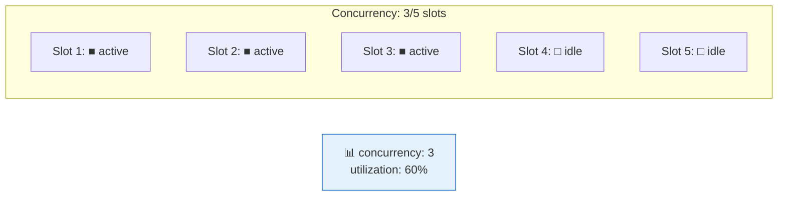

**YAML config**

```yaml
monitors:
  - id: watch_concurrency
    type: concurrency_monitor
    target: dev_team
    interval: 1
    alert:
      - condition: ">= 5"
        severity: warning
        message: "Dev team at max concurrency"
```

**Sample output**

```json
{"monitor_id": "watch_concurrency", "type": "concurrency_monitor",
 "tick": 60, "sim_dt": "2026-03-12T12:00", "target": "dev_team",
 "metric": "concurrency", "value": 3,
 "details": {"max_concurrency": 5, "utilization": 0.6},
 "alert": null}
```

**Alert examples**

```yaml
alert:
  - condition: ">= 5"
    severity: warning
  - condition: "consecutive 20 full"
    severity: critical
    message: "Block at max concurrency for 20 consecutive ticks"
```

**Use cases**

- Identify overloaded blocks that need higher concurrency limits.
- Validate adaptive concurrency (s13.19) — does it scale up under load?
- Detect idle capacity — low concurrency despite queue depth.
- Right-size team/machine allocation.

---

### s15.7: Error Rate Monitor

> Track the ratio of failed/rejected items over a sliding window.

**What it observes**

Computes `error_rate = (failed + rejected) / (processed + failed + rejected)` over the
configured window. Rising error rate signals degradation, while steady low rates confirm
stability.

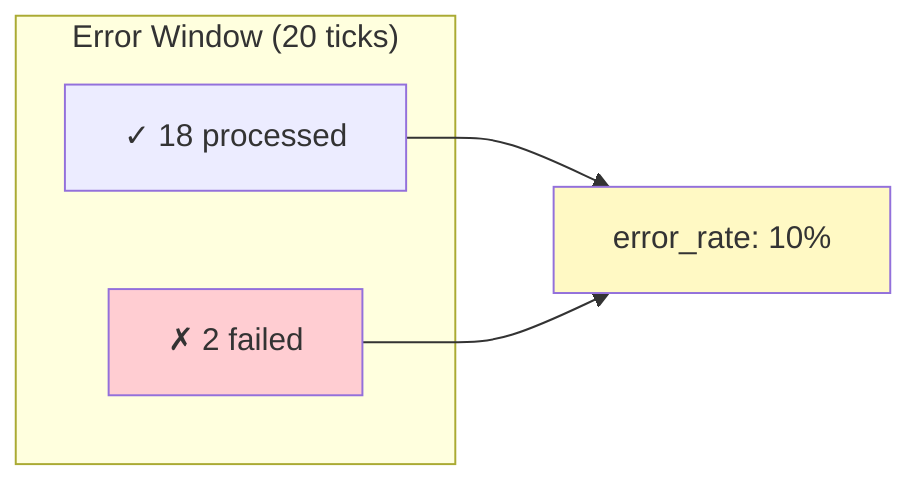

**YAML config**

```yaml
monitors:
  - id: watch_error_rate
    type: error_rate_monitor
    target: quality_check
    window: 20
    interval: 5
    alert:
      - condition: "> 0.15"
        severity: warning
        message: "Error rate exceeding 15%"
      - condition: "> 0.30"
        severity: critical
        message: "Error rate critical"
```

**Sample output**

```json
{"monitor_id": "watch_error_rate", "type": "error_rate_monitor",
 "tick": 80, "sim_dt": "2026-03-13T08:00", "target": "quality_check",
 "metric": "error_rate", "value": 0.10,
 "details": {"processed": 18, "failed": 1, "rejected": 1, "window": 20},
 "alert": null}
```

**Alert examples**

```yaml
alert:
  - condition: "> 0.15"
    severity: warning
  - condition: "delta > 50% in 5"
    severity: critical
    message: "Error rate spiking — check for entropy anomaly"
```

**Use cases**

- Detect entropy increase (s14.8) — error rate rises as data corrupts.
- Monitor circuit breaker effectivness — error rate should drop after CB opens.
- Validate fail_chance tuning in playbooks.
- Feed quality KPIs for process improvement analysis.

---

### s15.8: Edge Flow Monitor

> Track the number of items flowing through a specific edge per sample tick.

**What it observes**

Counts particles (items in transit on data edges) between two specific blocks. This measures
the flow rate on a particular connection, independent of what the source or destination
block is doing internally.

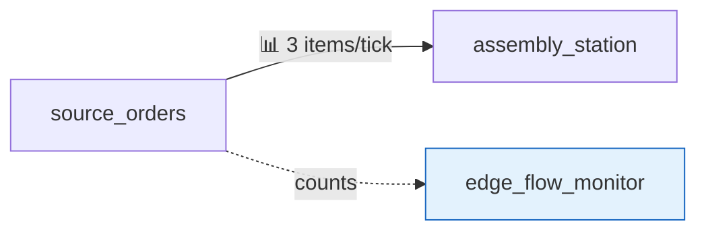

**YAML config**

```yaml
monitors:
  - id: watch_order_flow
    type: edge_flow_monitor
    from: source_orders
    to: assembly_station
    interval: 1
    alert:
      - condition: "absent 5"
        severity: warning
        message: "No orders flowing to assembly for 5 ticks"
```

**Sample output**

```json
{"monitor_id": "watch_order_flow", "type": "edge_flow_monitor",
 "tick": 45, "sim_dt": "2026-03-11T21:00", "target": "source_orders→assembly_station",
 "metric": "edge_flow", "value": 3,
 "details": {"from": "source_orders", "to": "assembly_station", "in_transit": 2},
 "alert": null}
```

**Alert examples**

```yaml
alert:
  - condition: "absent 5"
    severity: warning
  - condition: "> 20"
    severity: warning
    message: "Unusually high flow rate"
```

**Use cases**

- Detect leakage (s14.4) — flow out of Block A doesn't match flow into Block B.
- Verify routing correctness — items go to the expected destination.
- Identify crosstalk (s14.12) — unexpected items appearing on an edge.
- Measure the impact of rate limiting (s13.20) on edge flow.

---

### s15.9: Particle Monitor

> Track items of a specific type flowing anywhere in the graph.

**What it observes**

Counts in-transit particles matching a specified `item_type` across all edges or between
specified blocks. Unlike edge flow monitor (which watches one edge), particle monitor
tracks an item type globally.

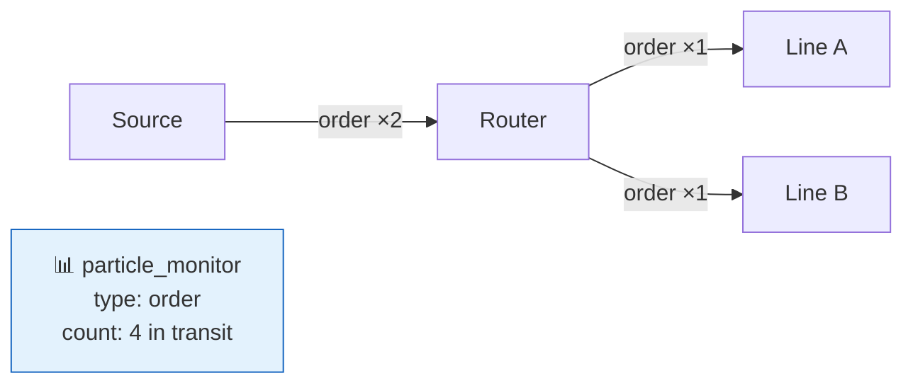

**YAML config**

```yaml
monitors:
  - id: watch_orders_in_flight
    type: particle_monitor
    config:
      item_type: order
    interval: 1
    alert:
      - condition: "> 50"
        severity: warning
        message: "Too many orders in transit"
```

**Sample output**

```json
{"monitor_id": "watch_orders_in_flight", "type": "particle_monitor",
 "tick": 33, "sim_dt": "2026-03-11T09:00",
 "metric": "particle_count", "value": 12,
 "details": {"item_type": "order", "edges": {"source→router": 4, "router→line_a": 5, "router→line_b": 3}},
 "alert": null}
```

**Alert examples**

```yaml
alert:
  - condition: "> 50"
    severity: warning
  - condition: "absent 10"
    severity: critical
    message: "No orders in transit — supply chain stopped"
```

**Use cases**

- Track work-in-progress across the entire graph.
- Detect short circuits (s14.13) — items bypass expected intermediate blocks.
- Monitor flow balance across parallel paths (fork/join — s13.16).
- Count specific item types for inventory management scenarios.

---

### s15.10: Backpressure Monitor

> Track backpressure activation state on edges.

**What it observes**

Reads `container.bp_active` on the downstream block of each monitored edge. When
backpressure activates, upstream gates close and flow stops — this monitor captures when
and how long backpressure events last.

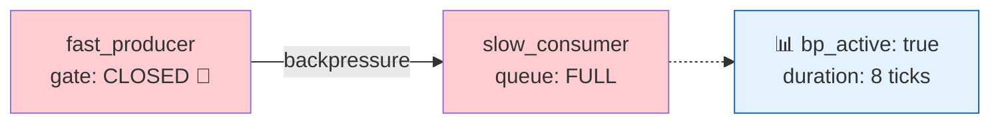

**YAML config**

```yaml
monitors:
  - id: watch_backpressure
    type: backpressure_monitor
    from: fast_producer
    to: slow_consumer
    interval: 1
    alert:
      - condition: "consecutive 20 bp_active"
        severity: critical
        message: "Sustained backpressure — downstream blocked"
```

**Sample output**

```json
{"monitor_id": "watch_backpressure", "type": "backpressure_monitor",
 "tick": 90, "sim_dt": "2026-03-13T18:00",
 "target": "fast_producer→slow_consumer",
 "metric": "backpressure", "value": true,
 "details": {"bp_active": true, "downstream_fill": 0.95, "consecutive_ticks": 12},
 "alert": null}
```

**Alert examples**

```yaml
alert:
  - condition: "consecutive 20 bp_active"
    severity: critical
  - condition: "delta > 0% in 1"
    severity: info
    message: "Backpressure activated"
```

**Use cases**

- Identify persistent bottlenecks that keep backpressure active.
- Measure flow interruption duration for SLA analysis.
- Detect pressure buildup (s14.2) — backpressure activates sooner than expected.
- Validate container capacity tuning.

---

### s15.11: Bottleneck Monitor

> Identify blocks where items accumulate fastest across the graph.

**What it observes**

Compares queue growth rate (`Δ container.size / Δ ticks`) across multiple blocks and
ranks them. The block with the highest growth rate is the current bottleneck — the point
where flow is most constrained.

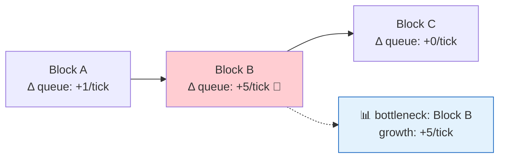

**YAML config**

```yaml
monitors:
  - id: find_bottleneck
    type: bottleneck_monitor
    targets: "*"               # all blocks, or list specific IDs
    window: 10
    interval: 10
    alert:
      - condition: "> 3"
        severity: warning
        message: "Bottleneck detected with growth rate > 3/tick"
```

**Sample output**

```json
{"monitor_id": "find_bottleneck", "type": "bottleneck_monitor",
 "tick": 100, "sim_dt": "2026-03-14T04:00",
 "metric": "bottleneck_growth_rate", "value": 5.2,
 "details": {
   "rankings": [
     {"block": "assembly_station", "growth_rate": 5.2, "queue_depth": 18},
     {"block": "quality_check", "growth_rate": 1.1, "queue_depth": 6},
     {"block": "packaging", "growth_rate": 0.0, "queue_depth": 2}
   ]
 },
 "alert": {"severity": "warning", "condition": "> 3",
           "message": "Bottleneck detected with growth rate > 3/tick",
           "triggered_value": 5.2}}
```

**Alert examples**

```yaml
alert:
  - condition: "> 3"
    severity: warning
  - condition: "> 8"
    severity: critical
    message: "Severe bottleneck — consider adding capacity"
```

**Use cases**

- Automatically find the constraint in a complex graph.
- Theory of Constraints analysis — improve the bottleneck first.
- Detect impedance mismatch (s14.10) — a fast block feeding a slow one.
- Monitor whether graph rebalancing shifts the bottleneck.

---

### s15.12: Cost Monitor

> Track cumulative `value_cost` at a specific block over time.

**What it observes**

Reads `rt.value_cost_total` from the target block each sample tick. Reports the running
total and the cost delta since the last sample.

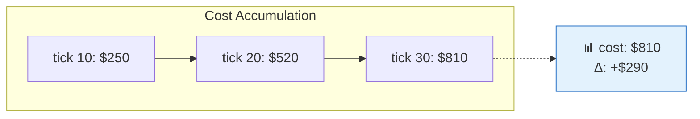

**YAML config**

```yaml
monitors:
  - id: watch_assembly_cost
    type: cost_monitor
    target: assembly_station
    interval: 10
    alert:
      - condition: "> 5000"
        severity: warning
        message: "Assembly cost exceeding budget"
```

**Sample output**

```json
{"monitor_id": "watch_assembly_cost", "type": "cost_monitor",
 "tick": 30, "sim_dt": "2026-03-11T06:00", "target": "assembly_station",
 "metric": "cost_total", "value": 810.0,
 "details": {"delta": 290.0, "cost_per_tick": 29.0},
 "alert": null}
```

**Alert examples**

```yaml
alert:
  - condition: "> 5000"
    severity: warning
  - condition: "delta > 40% in 10"
    severity: critical
    message: "Cost acceleration detected"
```

**Use cases**

- Budget tracking — alert when costs approach limits.
- Compare cost efficiency across parallel production lines.
- Detect energy cost (s13.33) spikes from idle blocks.
- Feed P&L dashboards with real-time cost data.

---

### s15.13: Revenue Monitor

> Track cumulative `value_out` at a specific block over time.

**What it observes**

Reads `rt.value_out_total` from the target block each sample tick. Reports the running
revenue total and the delta since the last sample.

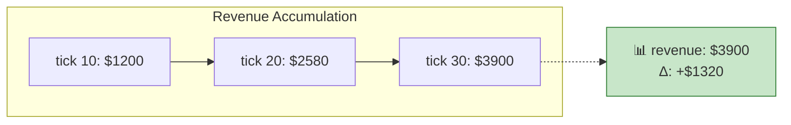

**YAML config**

```yaml
monitors:
  - id: watch_revenue
    type: revenue_monitor
    target: shipping_dock
    interval: 10
    alert:
      - condition: "< 1000"
        severity: warning
        message: "Revenue below target at checkpoint"
```

**Sample output**

```json
{"monitor_id": "watch_revenue", "type": "revenue_monitor",
 "tick": 30, "sim_dt": "2026-03-11T06:00", "target": "shipping_dock",
 "metric": "revenue_total", "value": 3900.0,
 "details": {"delta": 1320.0, "revenue_per_tick": 132.0},
 "alert": null}
```

**Use cases**

- Track revenue against targets at configured intervals.
- Compare revenue impact of different playbook scenarios.
- Detect saturation (s14.22) — revenue growth plateaus.
- Feed ROI analysis: combine with cost monitor for running margin.

---

### s15.14: Efficiency Monitor

> Track the ratio of value_out to value_cost over a sliding window.

**What it observes**

Computes `efficiency = value_out_total / max(value_cost_total, 1)` for the target block.
An efficiency above 1.0 means the block generates more value than it consumes. This is the
key economic health indicator.

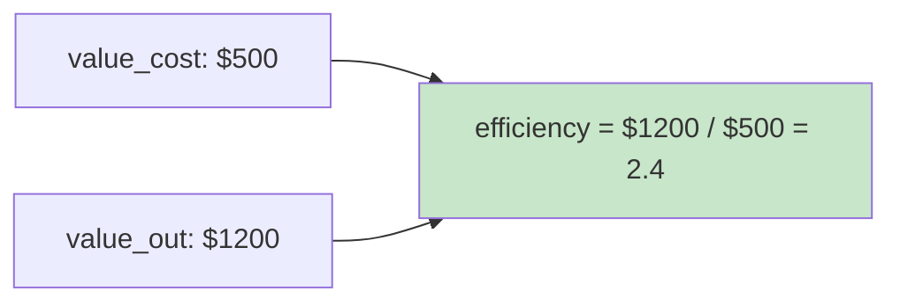

**YAML config**

```yaml
monitors:
  - id: watch_efficiency
    type: efficiency_monitor
    target: assembly_station
    window: 50
    interval: 10
    alert:
      - condition: "< 1.0"
        severity: critical
        message: "Assembly cost exceeds revenue"
      - condition: "< 1.5"
        severity: warning
        message: "Assembly efficiency below target"
```

**Sample output**

```json
{"monitor_id": "watch_efficiency", "type": "efficiency_monitor",
 "tick": 100, "sim_dt": "2026-03-14T04:00", "target": "assembly_station",
 "metric": "efficiency", "value": 2.4,
 "details": {"value_out": 1200.0, "value_cost": 500.0, "window": 50},
 "alert": null}
```

**Use cases**

- Track whether process improvements translate to financial outcomes.
- Compare efficiency across alternative process designs.
- Detect brownouts (s14.14) — resource shortages reduce efficiency.
- Feed business case analysis with actual simulation economics.

---

### s15.15: Signal Monitor

> Track signal emissions and receptions for a specific block.

**What it observes**

Counts signals emitted (EVENT_OUT) and received (TRIGGER_IN) by the target block per
sample window. Reports signal type breakdown and delivery success rate.

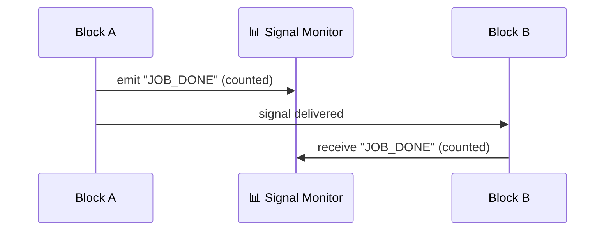

**YAML config**

```yaml
monitors:
  - id: watch_signals
    type: signal_monitor
    target: assembly_station
    window: 10
    interval: 5
    alert:
      - condition: "absent 10"
        severity: warning
        message: "No signals emitted for 10 sample ticks"
```

**Sample output**

```json
{"monitor_id": "watch_signals", "type": "signal_monitor",
 "tick": 50, "sim_dt": "2026-03-12T02:00", "target": "assembly_station",
 "metric": "signal_count", "value": 7,
 "details": {
   "emitted": {"ASSEMBLY_DONE": 5, "ASSEMBLY_FAILED": 2},
   "received": {"START_ASSEMBLY": 7},
   "delivery_rate": 1.0
 },
 "alert": null}
```

**Use cases**

- Verify signal-driven workflows are functioning.
- Detect signal attenuation (s14.11) — delivery rate drops below 1.0.
- Measure event-driven process responsiveness.
- Audit which signals a block sends and receives.

---

### s15.16: Circuit Breaker Monitor

> Track circuit breaker (s13.14) state changes on a specific block.

**What it observes**

Reads the circuit breaker state (`closed`, `open`, `half_open`) and failure count from the
target block each sample tick. Detects transitions and records time spent in each state.

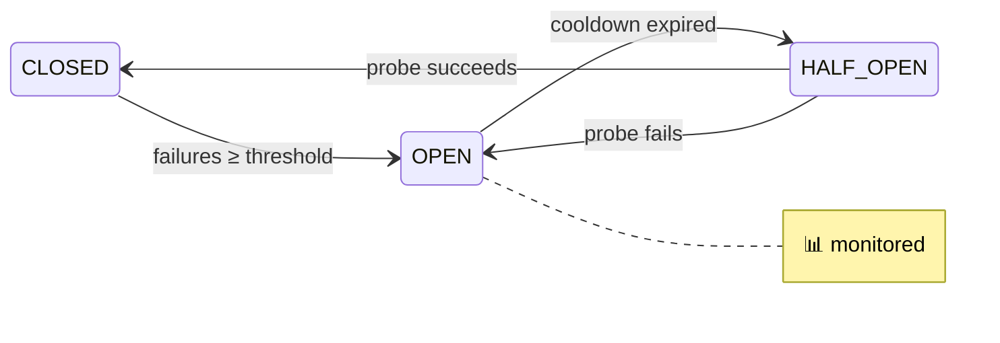

**YAML config**

```yaml
monitors:
  - id: watch_circuit_breaker
    type: circuit_breaker_monitor
    target: external_api
    interval: 1
    alert:
      - condition: "consecutive 5 cb_open"
        severity: critical
        message: "Circuit breaker stuck open"
```

**Sample output**

```json
{"monitor_id": "watch_circuit_breaker", "type": "circuit_breaker_monitor",
 "tick": 75, "sim_dt": "2026-03-13T03:00", "target": "external_api",
 "metric": "circuit_breaker_state", "value": "open",
 "details": {"failures": 5, "cooldown_remaining": 3, "transition": true,
             "previous_state": "closed"},
 "alert": {"severity": "critical", "condition": "consecutive 5 cb_open",
           "message": "Circuit breaker stuck open", "triggered_value": "open"}}
```

**Use cases**

- Monitor service reliability — how often does the CB trip?
- Tune failure threshold and cooldown parameters.
- Detect chain reactions (s14.21) — multiple CBs opening in sequence.
- Correlate CB events with anomaly activations.

---

### s15.17: Resource Pool Monitor

> Track utilization of a shared resource pool (s13.12) over time.

**What it observes**

Reads `pool.available`, `pool.capacity`, and computes `utilization = used / capacity` for
the specified resource pool each sample tick.

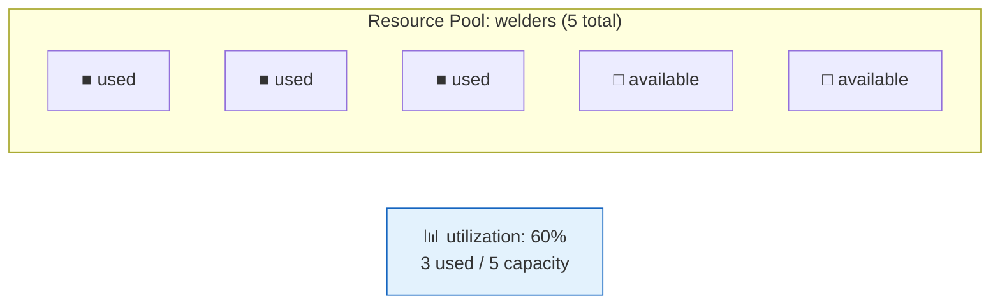

**YAML config**

```yaml
monitors:
  - id: watch_welder_pool
    type: resource_pool_monitor
    resource: welder_pool
    interval: 1
    alert:
      - condition: ">= 1.0"
        severity: warning
        message: "Welder pool fully utilized"
```

**Sample output**

```json
{"monitor_id": "watch_welder_pool", "type": "resource_pool_monitor",
 "tick": 60, "sim_dt": "2026-03-12T12:00",
 "target": "welder_pool",
 "metric": "resource_utilization", "value": 0.6,
 "details": {"capacity": 5, "used": 3, "available": 2},
 "alert": null}
```

**Use cases**

- Identify resource constraints limiting throughput.
- Detect brownout (s14.14) — pool capacity temporarily drops.
- Right-size resource pools based on observed utilization.
- Feed resource contention analysis.

---

### s15.18: Resource Contention Monitor

> Track blocks waiting for resources from a shared pool.

**What it observes**

Counts blocks in WAITING state whose wait reason is resource contention — they called
`pool.try_acquire()` and got `False`. Reports which blocks are waiting and how long.

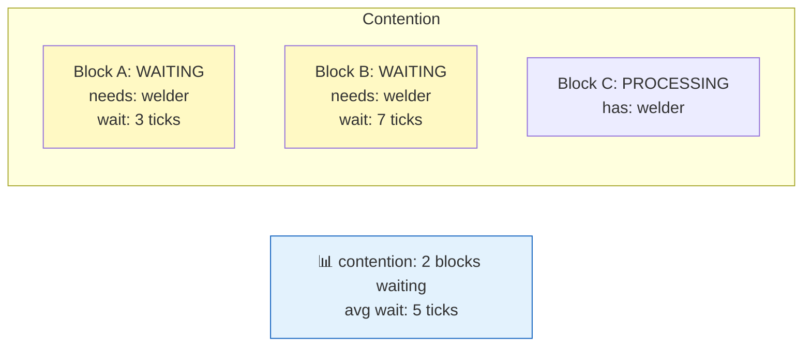

**YAML config**

```yaml
monitors:
  - id: watch_contention
    type: resource_contention_monitor
    resource: welder_pool
    interval: 5
    alert:
      - condition: "> 3"
        severity: warning
        message: "Multiple blocks contending for welders"
```

**Sample output**

```json
{"monitor_id": "watch_contention", "type": "resource_contention_monitor",
 "tick": 65, "sim_dt": "2026-03-12T17:00",
 "target": "welder_pool",
 "metric": "contention_count", "value": 2,
 "details": {
   "waiting_blocks": [
     {"block": "station_a", "wait_ticks": 3},
     {"block": "station_b", "wait_ticks": 7}
   ],
   "avg_wait": 5.0
 },
 "alert": null}
```

**Use cases**

- Identify resource starvation scenarios.
- Justify resource capacity increases with contention data.
- Detect priority inversion — low-priority blocks holding resources.
- Correlate contention with throughput drops.

---

### s15.19: DLQ Monitor

> Track the dead letter queue (s13.24) size and entry rate.

**What it observes**

Reads the global DLQ size and computes the entry rate over the sliding window. Reports
recent DLQ entries with block and reason breakdown.

```mermaid
graph LR
    A["Block A<br/>FAILED"] -->|"item_123"| DLQ["🗃️ DLQ<br/>size: 12"]
    B["Block B<br/>max_age"| ] -->|"item_456"| DLQ
    MON["📊 dlq_size: 12<br/>+3 this window"]
    DLQ -.-> MON
    style DLQ fill:#ffcdd2
    style MON fill:#e3f2fd,stroke:#1565c0
```

**YAML config**

```yaml
monitors:
  - id: watch_dlq
    type: dlq_monitor
    interval: 5
    alert:
      - condition: "> 10"
        severity: warning
        message: "DLQ growing — check failure sources"
      - condition: "delta > 100% in 10"
        severity: critical
        message: "DLQ growth rate spiking"
```

**Sample output**

```json
{"monitor_id": "watch_dlq", "type": "dlq_monitor",
 "tick": 85, "sim_dt": "2026-03-13T13:00",
 "metric": "dlq_size", "value": 12,
 "details": {
   "delta": 3,
   "by_reason": {"max_retry_exceeded": 2, "max_age_exceeded": 1},
   "by_block": {"assembly_station": 2, "quality_check": 1}
 },
 "alert": {"severity": "warning", "condition": "> 10",
           "message": "DLQ growing — check failure sources",
           "triggered_value": 12}}
```

**Use cases**

- Detect systemic failures — DLQ growth means items are not recoverable.
- Identify which blocks contribute most to DLQ.
- Measure the impact of anomalies on failure rates.
- Plan DLQ replay strategies based on entry patterns.

---

### s15.20: Approval Queue Monitor

> Track pending approval requests (s13.27) in the system.

**What it observes**

Counts blocks in `WAITING_APPROVAL` state and the total number of items awaiting
human decision. Reports per-block breakdown and wait duration.

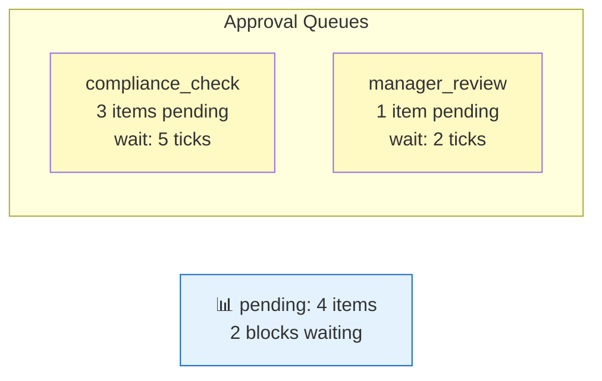

**YAML config**

```yaml
monitors:
  - id: watch_approvals
    type: approval_queue_monitor
    interval: 1
    alert:
      - condition: "> 5"
        severity: warning
        message: "Too many items awaiting approval"
      - condition: "consecutive 20 full"
        severity: critical
        message: "Approval bottleneck sustained"
```

**Sample output**

```json
{"monitor_id": "watch_approvals", "type": "approval_queue_monitor",
 "tick": 110, "sim_dt": "2026-03-14T14:00",
 "metric": "pending_approvals", "value": 4,
 "details": {
   "blocks_waiting": 2,
   "by_block": [
     {"block": "compliance_check", "pending": 3, "wait_ticks": 5},
     {"block": "manager_review", "pending": 1, "wait_ticks": 2}
   ],
   "avg_wait": 3.5
 },
 "alert": null}
```

**Use cases**

- Identify human bottlenecks in the process.
- Measure approval turnaround time.
- Staffing analysis — how many approvers are needed?
- Detect blocks stuck in WAITING_APPROVAL due to simulation misconfiguration.

---

### s15.21: Anomaly Monitor

> Track anomaly activations, effects, and durations (ties into Phase 2 anomaly mechanics).

**What it observes**

Reads the anomaly engine state — which anomalies are currently active, what effects they
produced this tick, and how long each has been running. This is the bridge between the
anomaly system (s14.x) and the monitoring system.

```mermaid
graph LR
    subgraph "Active Anomalies"
        A1["s14.1 flow_resistance<br/>on: assembly<br/>tick 50-250"]
        A2["s14.7 heat_buildup<br/>on: furnace<br/>tick 0-∞"]
    end
    MON["📊 active: 2 anomalies<br/>effects this tick: 3"]
    A1 -.-> MON
    A2 -.-> MON
    style MON fill:#e3f2fd,stroke:#1565c0
```

**YAML config**

```yaml
monitors:
  - id: watch_anomalies
    type: anomaly_monitor
    interval: 1
    alert:
      - condition: "> 3"
        severity: warning
        message: "Multiple anomalies active simultaneously"
```

**Sample output**

```json
{"monitor_id": "watch_anomalies", "type": "anomaly_monitor",
 "tick": 120, "sim_dt": "2026-03-15T00:00",
 "metric": "active_anomalies", "value": 2,
 "details": {
   "active": [
     {"id": "friction_assembly", "type": "flow_resistance",
      "target": "assembly_station", "active_ticks": 70},
     {"id": "heat_furnace", "type": "heat_buildup",
      "target": "blast_furnace", "active_ticks": 120}
   ],
   "effects_this_tick": [
     {"anomaly": "friction_assembly", "type": "flow_resistance",
      "extra_ticks": 2},
     {"anomaly": "heat_furnace", "type": "heat_buildup",
      "heat_level": 0.85, "effective_ticks": 7}
   ]
 },
 "alert": null}
```

**Use cases**

- Dashboard view of all active anomalies.
- Correlate anomaly effects with block performance degradation.
- Verify anomaly timing — do anomalies activate and deactivate on schedule?
- Test anomaly detection algorithms — does monitoring catch what anomalies cause?

---

## 7. Anomaly Detection Mapping

This table maps each anomaly mechanic (s14.x) to the monitors that can detect its effects.
The anomaly system **causes** problems; the monitoring system **detects** them.

| Anomaly | ID | Primary Detector(s) | What to Watch |
|---|---|---|---|
| Flow Resistance | s14.1 | `latency_monitor`, `throughput_monitor` | Rising latency, falling throughput |
| Pressure Buildup | s14.2 | `queue_depth_monitor`, `backpressure_monitor` | Upstream queues filling, BP activating |
| Turbulence | s14.3 | `latency_monitor` | High variance in latency (check p95 vs avg) |
| Leakage | s14.4 | `edge_flow_monitor`, `particle_monitor` | Flow out ≠ flow in on connected edges |
| Cavitation | s14.5 | `state_monitor`, `latency_monitor` | Extended IDLE periods followed by high latency |
| Thermal Noise | s14.6 | `latency_monitor`, `throughput_monitor` | Increased variance in all timing metrics |
| Heat Buildup | s14.7 | `health_monitor`, `latency_monitor` | Declining health, rising latency over time |
| Entropy Increase | s14.8 | `error_rate_monitor` | Rising error/reject rate without config change |
| Phase Transition | s14.9 | `state_monitor`, `throughput_monitor` | Abrupt step change in throughput at threshold |
| Impedance Mismatch | s14.10 | `bottleneck_monitor`, `queue_depth_monitor` | Fast block feeding slow block, queue mismatch |
| Signal Attenuation | s14.11 | `signal_monitor` | Delivery rate < 1.0, distant blocks miss signals |
| Crosstalk | s14.12 | `edge_flow_monitor`, `particle_monitor` | Unexpected items on wrong edges |
| Short Circuit | s14.13 | `particle_monitor`, `edge_flow_monitor` | Items arriving at sink without visiting intermediate blocks |
| Brownout | s14.14 | `resource_pool_monitor` | Pool capacity drops below configured level |
| Quantum Tunneling | s14.15 | `particle_monitor` | Items appearing at blocks they shouldn't reach |
| Superposition | s14.16 | `throughput_monitor` | Item count increases without new source items |
| Entanglement | s14.17 | `state_monitor` | Two blocks failing/recovering in sync |
| Observer Effect | s14.18 | `throughput_monitor`, `latency_monitor` | Performance changes correlated with tap edge presence |
| Catalyst | s14.19 | `throughput_monitor` | Neighbor blocks running faster than configured |
| Corrosion | s14.20 | `error_rate_monitor`, `edge_flow_monitor` | Edge reliability declining over time |
| Chain Reaction | s14.21 | `state_monitor`, `circuit_breaker_monitor` | Multiple blocks entering FAILED state in sequence |
| Saturation | s14.22 | `throughput_monitor`, `bottleneck_monitor` | Throughput plateaus despite growing queue depth |
| Byzantine Failure | s14.23 | `error_rate_monitor`, `particle_monitor` | Wrong item types appearing downstream, no failures logged |
| Clock Drift | s14.24 | `state_monitor`, `latency_monitor` | Block processing at wrong intervals |

### Anomaly alert threshold examples

```yaml
monitors:
  # Detect leakage: input flow should roughly equal output flow
  - id: detect_leakage
    type: edge_flow_monitor
    from: source_orders
    to: assembly_station
    interval: 1
    config:
      compare_edge:
        from: assembly_station
        to: quality_check
    alert:
      - condition: "delta > 20% in 10"
        severity: warning
        message: "Flow discrepancy — possible leakage"

  # Detect heat buildup: latency rising over time
  - id: detect_heat
    type: latency_monitor
    target: blast_furnace
    window: 20
    alert:
      - condition: "delta > 50% in 20"
        severity: warning
        message: "Latency rising — possible heat buildup"

  # Detect chain reaction: multiple CBs opening
  - id: detect_cascade
    type: circuit_breaker_monitor
    target: central_server
    alert:
      - condition: "consecutive 1 cb_open"
        severity: critical
        message: "Circuit breaker opened — check for cascade"
```

---

## 8. Monitor Engine Integration

### 8.1 MonitorEngine class

The `MonitorEngine` is a standalone class that receives a reference to `GraphEngine` state.
It does not subclass or modify `GraphEngine` — it reads from it.

```python
class MonitorEngine:
    """Read-only observer that runs after each tick.

    Instantiated by GraphEngine when playbook contains a 'monitors' key.
    """

    def __init__(self, monitors_config: list, engine: GraphEngine,
                 logger: MonitorLogger) -> None:
        self._monitors = [Monitor.from_config(m) for m in monitors_config]
        self._engine = engine
        self._logger = logger

    def collect(self, tick: int, sim_dt: str) -> list[MonitorSample]:
        """Run all monitors due this tick. Returns list of samples."""
        samples = []
        for monitor in self._monitors:
            if tick % monitor.interval != 0:
                continue
            sample = monitor.collect(self._engine, tick, sim_dt)
            sample.alert = monitor.evaluate_alerts(sample)
            self._logger.write(sample)
            samples.append(sample)
        return samples
```

### 8.2 Monitor base class

```python
class Monitor:
    """Base class for all monitor types."""

    def __init__(self, config: dict) -> None:
        self.id = config["id"]
        self.type = config["type"]
        self.interval = int(config.get("interval", 1))
        self.window = int(config.get("window", 10))
        self.alerts = [AlertCondition.from_config(a) for a in config.get("alert", [])]
        self._history: deque[MonitorSample] = deque(maxlen=self.window)

    def collect(self, engine: GraphEngine, tick: int, sim_dt: str) -> MonitorSample:
        """Override in subclasses to read engine state and produce a sample."""
        raise NotImplementedError

    def evaluate_alerts(self, sample: MonitorSample) -> dict | None:
        """Check all alert conditions against the sample."""
        for alert in self.alerts:
            result = alert.evaluate(sample, self._history)
            if result:
                return result
        return None
```

### 8.3 MonitorLogger

```python
class MonitorLogger:
    """Writes MonitorSample records to a dedicated JSONL file."""

    def __init__(self, filepath: str) -> None:
        parent = os.path.dirname(os.path.abspath(filepath))
        os.makedirs(parent, exist_ok=True)
        self._file = open(filepath, "w", buffering=1, encoding="utf-8")

    def write(self, sample: MonitorSample) -> None:
        line = json.dumps(sample.to_dict(), ensure_ascii=False, default=str)
        self._file.write(line + "\n")

    def close(self) -> None:
        self._file.flush()
        self._file.close()
```

### 8.4 GraphEngine integration point

The monitor pass is added to `_do_tick()` after step 6 (tick summary):

```python
def _do_tick(self) -> None:
    # ... existing steps 1-6 ...

    # 7. Monitor pass
    if self._monitor_engine:
        self._monitor_engine.collect(self._tick, self._clock.iso())
```

### 8.5 Initialization

When a playbook contains a `monitors` key, `GraphEngine.__init__` creates the
`MonitorEngine` and `MonitorLogger`:

```python
# In GraphEngine.__init__:
monitors_cfg = config.get("monitors", [])
if monitors_cfg and logger:
    monitor_path = logger._path.replace(".jsonl", "_monitors.jsonl")
    self._monitor_logger = MonitorLogger(monitor_path)
    self._monitor_engine = MonitorEngine(monitors_cfg, self, self._monitor_logger)
else:
    self._monitor_engine = None
    self._monitor_logger = None
```

---

## 9. Dashboard Data Model

### 9.1 Time-series structure

Each monitor produces a time series of `MonitorSample` records. The dashboard reads the
monitor JSONL log and structures the data as:

```
TimeSeries:
  monitor_id: "watch_assembly_queue"
  type: "queue_depth_monitor"
  target: "assembly_station"
  samples:
    - {tick: 1, value: 0}
    - {tick: 2, value: 1}
    - {tick: 3, value: 3}
    - ...
```

### 9.2 Aggregation windows

The dashboard supports multiple aggregation windows over raw monitor data:

| Window | Granularity | Purpose |
|---|---|---|
| `raw` | Every monitor sample (per `interval`) | Detailed drill-down |
| `5-tick` | Average over 5 ticks | Short-term smoothing |
| `10-tick` | Average over 10 ticks | Medium-term trends |
| `50-tick` | Average over 50 ticks | Long-term trends |
| `day` | Average per simulated day (24 ticks default) | Daily summary |

Aggregations are computed client-side or via DuckDB queries over the monitor JSONL:

```sql
-- 10-tick average queue depth
SELECT
    monitor_id,
    (tick / 10) * 10 AS tick_window,
    AVG(value)       AS avg_value,
    MAX(value)       AS max_value,
    MIN(value)       AS min_value
FROM read_json_auto('logs/sim_*_monitors.jsonl', format='newline_delimited')
WHERE type = 'queue_depth_monitor'
GROUP BY monitor_id, tick_window
ORDER BY tick_window;
```

### 9.3 Dashboard panels

Each monitor type maps to a dashboard visualization:

| Monitor Type | Panel Type | Visualization |
|---|---|---|
| `queue_depth_monitor` | Line chart | Queue depth over time, capacity line |
| `state_monitor` | State timeline | Color-coded horizontal bar per state |
| `throughput_monitor` | Bar chart | Items per window |
| `latency_monitor` | Line chart with bands | Avg, p95, max latency |
| `health_monitor` | Gauge + line chart | Current health + trend |
| `concurrency_monitor` | Stacked area | Active slots vs capacity |
| `error_rate_monitor` | Line chart | Error rate percentage |
| `edge_flow_monitor` | Flow diagram overlay | Thickness = flow rate |
| `particle_monitor` | Counter | Items in transit by type |
| `backpressure_monitor` | State indicator | Red/green per edge |
| `bottleneck_monitor` | Ranked bar chart | Growth rate per block |
| `cost_monitor` | Cumulative line | Running cost total |
| `revenue_monitor` | Cumulative line | Running revenue total |
| `efficiency_monitor` | Gauge | Current efficiency ratio |
| `signal_monitor` | Event timeline | Signal emissions/receptions |
| `circuit_breaker_monitor` | State timeline | CB state changes |
| `resource_pool_monitor` | Gauge + bar | Utilization percentage |
| `resource_contention_monitor` | Table | Waiting blocks list |
| `dlq_monitor` | Counter + table | DLQ size + recent entries |
| `approval_queue_monitor` | Table | Pending approvals list |
| `anomaly_monitor` | Timeline + table | Active anomalies overlay |

### 9.4 Current vs historical

The dashboard displays two views:

**Live view** — current values from the most recent `MonitorSample` per monitor. Updated
each tick during SSE streaming. Shown as gauges, indicators, and current counters.

**History view** — time-series charts from the full monitor JSONL log. Available after
simulation completes or via DuckDB query during live streaming. Shown as line charts,
bar charts, and timelines.

### 9.5 DuckDB integration

Monitor JSONL logs are designed for direct DuckDB consumption:

```sql
-- All alerts from a simulation
SELECT tick, sim_dt, monitor_id, type, target,
       alert->>'severity' AS severity,
       alert->>'message'  AS message,
       value
FROM read_json_auto('logs/sim_20260310_180000_monitors.jsonl',
                    format='newline_delimited')
WHERE alert IS NOT NULL
ORDER BY tick;
```

```sql
-- Bottleneck analysis over time
SELECT tick, sim_dt,
       details->'rankings'->0->>'block'       AS top_bottleneck,
       CAST(details->'rankings'->0->>'growth_rate' AS DOUBLE) AS growth_rate
FROM read_json_auto('logs/sim_*_monitors.jsonl', format='newline_delimited')
WHERE type = 'bottleneck_monitor'
ORDER BY tick;
```

```sql
-- Efficiency trend
SELECT tick, sim_dt, target, value AS efficiency,
       CAST(details->>'value_out'  AS DOUBLE) AS revenue,
       CAST(details->>'value_cost' AS DOUBLE) AS cost
FROM read_json_auto('logs/sim_*_monitors.jsonl', format='newline_delimited')
WHERE type = 'efficiency_monitor'
ORDER BY tick;
```

---

## 10. Example Playbook with Comprehensive Monitoring

A complete playbook demonstrating a manufacturing scenario with full monitor coverage:

```yaml
simulation:
  ticks: 500
  clock:
    start: "2026-03-10T00:00:00"
    tick_hours: 1
  context:
    scenario: "monitored_manufacturing"

data_types:
  - type: raw_material
  - type: component
  - type: product

resources:
  - id: welders
    capacity: 3

nodes:
  - id: material_source
    type: source
    data_type: raw_material
    schedule_interval: 2

  - id: stamping_press
    type: process
    processing_ticks: 3
    container:
      capacity: 20
      strategy: fifo
      overflow: drop_oldest
    fail_chance: 0.05
    health:
      degrade_per_use: 0.005
      fail_below: 0.1
      repair_signal: REPAIR
    value_cost:
      amount: 25.0
    value_out:
      amount: 60.0

  - id: assembly_station
    type: process
    processing_ticks: 5
    container:
      capacity: 15
      strategy: priority
    concurrency: 3
    requires_resource:
      pool: welders
      slots: 1
    value_cost:
      amount: 40.0
    value_out:
      amount: 150.0
    circuit_breaker:
      failure_threshold: 3
      cooldown_ticks: 10

  - id: quality_check
    type: process
    processing_ticks: 2
    fail_chance: 0.10
    human_approval: true

  - id: shipping_dock
    type: sink

edges:
  - type: data
    from: material_source
    to: stamping_press
  - type: data
    from: stamping_press
    to: assembly_station
  - type: data
    from: assembly_station
    to: quality_check
  - type: data
    from: quality_check
    to: shipping_dock
  - type: backpressure
    from: assembly_station
    to: stamping_press

anomalies:
  - id: heat_press
    type: heat_buildup
    target: stamping_press
    start_tick: 0
    duration: 0
    config:
      heat_per_processing_tick: 0.02
      cooldown_per_idle_tick: 0.01
      slowdown_per_heat: 0.5
      thermal_shutdown_at: 1.0
      shutdown_duration: 10

  - id: entropy_data
    type: entropy_increase
    target: all
    start_tick: 200
    duration: 100
    config:
      corruption_probability: 0.02
      corruption_mode: field_noise
      detectable: true

# ── MONITORING SECTION ──────────────────────────────────────────────────

monitors:
  # Block-level monitors
  - id: press_queue
    type: queue_depth_monitor
    target: stamping_press
    interval: 1
    alert:
      - condition: "> 15"
        severity: warning
        message: "Stamping press queue backing up"
      - condition: "> 18"
        severity: critical
        message: "Stamping press near overflow"

  - id: press_health
    type: health_monitor
    target: stamping_press
    interval: 1
    alert:
      - condition: "< 0.3"
        severity: warning
        message: "Press health declining — schedule repair"
      - condition: "< 0.15"
        severity: critical
        message: "Press near failure threshold"

  - id: press_state
    type: state_monitor
    target: stamping_press
    interval: 1
    alert:
      - condition: "consecutive 5 failed"
        severity: critical
        message: "Stamping press stuck in FAILED"

  - id: assembly_throughput
    type: throughput_monitor
    target: assembly_station
    window: 10
    interval: 1
    alert:
      - condition: "< 3"
        severity: warning
        message: "Assembly throughput below target"

  - id: assembly_latency
    type: latency_monitor
    target: assembly_station
    window: 20
    interval: 5
    alert:
      - condition: "> 12"
        severity: warning
        message: "Assembly latency exceeding SLA"
      - condition: "delta > 50% in 10"
        severity: critical
        message: "Assembly latency spiking"

  - id: assembly_concurrency
    type: concurrency_monitor
    target: assembly_station
    interval: 1

  - id: qc_error_rate
    type: error_rate_monitor
    target: quality_check
    window: 20
    interval: 5
    alert:
      - condition: "> 0.20"
        severity: warning
        message: "QC reject rate above 20%"
      - condition: "> 0.35"
        severity: critical
        message: "QC reject rate critical — check data corruption"

  # Flow-level monitors
  - id: input_flow
    type: edge_flow_monitor
    from: material_source
    to: stamping_press
    interval: 1
    alert:
      - condition: "absent 5"
        severity: warning
        message: "No materials arriving"

  - id: products_in_transit
    type: particle_monitor
    config:
      item_type: product
    interval: 1

  - id: assembly_backpressure
    type: backpressure_monitor
    from: stamping_press
    to: assembly_station
    interval: 1
    alert:
      - condition: "consecutive 10 bp_active"
        severity: warning
        message: "Sustained backpressure from assembly"

  - id: find_bottleneck
    type: bottleneck_monitor
    targets: "*"
    window: 10
    interval: 10
    alert:
      - condition: "> 3"
        severity: warning
        message: "Bottleneck detected"

  # Value-level monitors
  - id: assembly_cost
    type: cost_monitor
    target: assembly_station
    interval: 10
    alert:
      - condition: "> 10000"
        severity: warning
        message: "Assembly cost exceeding budget"

  - id: total_revenue
    type: revenue_monitor
    target: shipping_dock
    interval: 10

  - id: press_efficiency
    type: efficiency_monitor
    target: stamping_press
    window: 50
    interval: 10
    alert:
      - condition: "< 1.5"
        severity: warning
        message: "Stamping press efficiency below target"

  # Signal-level monitors
  - id: assembly_cb
    type: circuit_breaker_monitor
    target: assembly_station
    interval: 1
    alert:
      - condition: "consecutive 3 cb_open"
        severity: critical
        message: "Assembly circuit breaker stuck open"

  # Resource-level monitors
  - id: welder_utilization
    type: resource_pool_monitor
    resource: welders
    interval: 1
    alert:
      - condition: ">= 1.0"
        severity: warning
        message: "All welders in use"

  - id: welder_contention
    type: resource_contention_monitor
    resource: welders
    interval: 5
    alert:
      - condition: "> 2"
        severity: warning
        message: "Multiple blocks waiting for welders"

  # System-level monitors
  - id: dlq_watch
    type: dlq_monitor
    interval: 5
    alert:
      - condition: "> 5"
        severity: warning
        message: "DLQ growing"
      - condition: "delta > 100% in 10"
        severity: critical
        message: "DLQ growth rate spiking"

  - id: approval_watch
    type: approval_queue_monitor
    interval: 1
    alert:
      - condition: "> 3"
        severity: warning
        message: "Approval backlog building"

  - id: anomaly_watch
    type: anomaly_monitor
    interval: 1
    alert:
      - condition: "> 2"
        severity: warning
        message: "Multiple anomalies active"
```

This playbook produces two output files:
1. `logs/sim_20260310_000000.jsonl` — standard event log (all `ITEM_*`, `SIGNAL_*`, etc.)
2. `logs/sim_20260310_000000_monitors.jsonl` — focused monitor samples (only what was declared)

---

## 11. Implementation Roadmap

### Phase 3a — Core Monitor Infrastructure
1. Implement `MonitorSample` dataclass and `MonitorLogger`.
2. Implement `Monitor` base class and `AlertCondition` parser.
3. Add `MonitorEngine` with `collect()` loop.
4. Wire `MonitorEngine` into `GraphEngine._do_tick()`.
5. Implement the 7 block-level monitors (s15.1–s15.7).

### Phase 3b — Flow and Value Monitors
6. Implement the 4 flow-level monitors (s15.8–s15.11).
7. Implement the 3 value-level monitors (s15.12–s15.14).
8. Implement the 2 signal-level monitors (s15.15–s15.16).

### Phase 3c — Resource and System Monitors
9. Implement the 2 resource-level monitors (s15.17–s15.18).
10. Implement the 3 system-level monitors (s15.19–s15.21).

### Phase 3d — Alert System
11. Implement threshold alerts.
12. Implement rate-of-change alerts.
13. Implement absence and pattern alerts.
14. Implement alert deduplication (edge-trigger logic).

### Phase 3e — Dashboard Integration
15. SSE streaming of `MonitorSample` records to frontend.
16. DuckDB query templates for monitor JSONL analysis.
17. Dashboard panel components for each monitor type.

---

## Appendix A — MonitorSample Field Reference

| Field | Type | Description |
|---|---|---|
| `monitor_id` | string | Matches the `id` in the playbook `monitors` section |
| `type` | string | Monitor type (e.g., `queue_depth_monitor`) |
| `tick` | int | Engine tick when the sample was collected |
| `sim_dt` | string | Simulated datetime in ISO-8601 format |
| `target` | string | Observed block, edge, or resource ID |
| `metric` | string | Metric name (e.g., `queue_depth`, `throughput`) |
| `value` | number/string | Current metric value |
| `details` | dict | Type-specific additional data |
| `window_values` | list/null | Recent values for windowed monitors |
| `alert` | dict/null | Alert envelope if triggered, else null |

## Appendix B — Metric Names by Monitor Type

| Monitor Type | Metric Name | Value Type |
|---|---|---|
| `queue_depth_monitor` | `queue_depth` | int |
| `state_monitor` | `state` | string (BlockState value) |
| `throughput_monitor` | `throughput` | int |
| `latency_monitor` | `latency` | float (average ticks) |
| `health_monitor` | `health` | float (0.0–1.0) |
| `concurrency_monitor` | `concurrency` | int |
| `error_rate_monitor` | `error_rate` | float (0.0–1.0) |
| `edge_flow_monitor` | `edge_flow` | int |
| `particle_monitor` | `particle_count` | int |
| `backpressure_monitor` | `backpressure` | bool |
| `bottleneck_monitor` | `bottleneck_growth_rate` | float |
| `cost_monitor` | `cost_total` | float |
| `revenue_monitor` | `revenue_total` | float |
| `efficiency_monitor` | `efficiency` | float |
| `signal_monitor` | `signal_count` | int |
| `circuit_breaker_monitor` | `circuit_breaker_state` | string |
| `resource_pool_monitor` | `resource_utilization` | float (0.0–1.0) |
| `resource_contention_monitor` | `contention_count` | int |
| `dlq_monitor` | `dlq_size` | int |
| `approval_queue_monitor` | `pending_approvals` | int |
| `anomaly_monitor` | `active_anomalies` | int |
